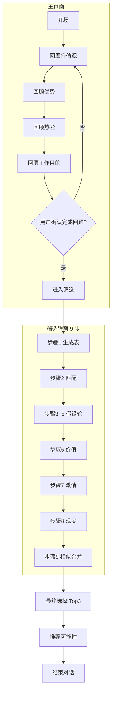
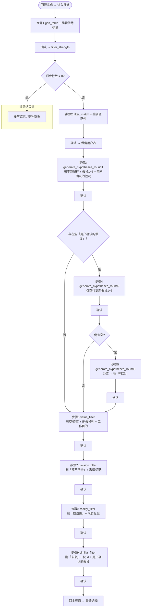

# Rumination 流程图与表格规格（依据 `uidesign/prompt/rumination_prompt.md`）

> 文档日期：2026-03-29  
> 范围：**主页面** + **筛选弹窗九步**；含分支条件、每步表格列、可编辑项与示例行。

---

## 一、总览：两大块

---

## 二、主页面子流程（对话驱动，非表格）

| 阶段 | 内容要点 | 分支 |
|------|----------|------|
| 开场 | 祝贺、说明目标、是否准备好 | 用户可表示未准备好 → 继续引导 |
| 回顾×4 | 价值观 / 优势 / 热爱 / 工作目的；可微调 | 每项确认后进入下一项；第四项确认后 **弹出筛选** |
| 最终选择 | 展示筛选后「用户确认的假设」 | 多轮对话直到 **明确 3 个方向并确认** |
| 推荐 | 针对 Top3 给发展可能性 | — |
| 结束 | 自我认知、是否确定、行动计划 | 确定/不确定不同结束语；`end_conversation()` |

**说明**：主页面「一次一问」由咨询师话术约束；**无统一表格**，直到进入筛选。

---

## 三、筛选弹窗：步骤—函数—分支 总图

**补充提前结束（文档隐含）**  
- 步骤 6 后若 `value_filter` 结果 0 行 → 无有效假设可填价值 → 流程难以继续（实现上需定义：提示回到前面或结束筛选）。  
- 步骤 7 / 8 / 9 每步函数都会删行，**行数可为 0**，同样需产品定义是「结束筛选」还是「禁止确认」。

---

## 四、每一步：表格列、可编辑、系统处理、示例

以下为 **逻辑列**（实现时可加 `_meta`、`_stepConfirmed` 等，此处不展开）。

---

### 步骤 1 — 生成并确认表格

| 列名 | 只读/可编辑 | 控件 | 说明 |
|------|-------------|------|------|
| id | 只读 | — | 行号 |
| 热爱 | 只读 | — | 来自 prior 热忱 |
| 优势 | 只读 | — | 来自 prior 禀赋 |
| 优势标记 | **可编辑** | 下拉 | 有充实感，与成功有关 / 有充实感 / **不确定** |

**系统处理（确认后）**：`filter_strength` → 删除「不确定」行。

**示例（确认前）**

| id | 热爱 | 优势 | 优势标记 |
|----|------|------|----------|
| 1 | 教育公益 | 共情倾听 | 有充实感 |
| 2 | 产品设计 | 视觉表达 | 不确定 |
| 3 | 写作 | 结构化表达 | 有充实感，与成功有关 |

**确认后**（逻辑上）：行 2 被删除，进入步骤 2 时仅余 1、3。

---

### 步骤 2 — 匹配过滤

| 列名 | 只读/可编辑 | 控件 | 说明 |
|------|-------------|------|------|
| id, 热爱, 优势 | 只读 | — | 继承上一步 |
| 匹配性 | **可编辑** | 下拉 | 匹配 / 不匹配 |
| 匹配原因 | 只读（或 AI 预填） | 文本展示 | `filter_match` 生成 |

**确认后**：不删行；进入步骤 3 时由 `generate_hypotheses_round1` **删除匹配性=不匹配** 的行。

**示例**

| id | 热爱 | 优势 | 匹配性 | 匹配原因 |
|----|------|------|--------|----------|
| 1 | 教育公益 | 共情倾听 | 匹配 | 热情与倾听结合紧密 |
| 3 | 写作 | 结构化表达 | 不匹配 | 当前组合偏执行弱于创作 |

---

### 步骤 3 — 假设生成第一轮

| 列名 | 只读/可编辑 | 控件 | 说明 |
|------|-------------|------|------|
| id, 热爱, 优势, 匹配性 | 只读 | — | 不匹配行已删 |
| 假设1, 假设2, 假设3 | 只读 | — | LLM/规则生成 |
| 用户确认的假设 | **可编辑** | 文本或「选假设+其他」 | 可空 |

**确认后**：若有空 → 步骤 4；否则 `value_filter` → 步骤 6 列形态。

**示例**

| id | 热爱 | 优势 | 假设1 | 假设2 | 假设3 | 用户确认的假设 |
|----|------|------|-------|-------|-------|----------------|
| 1 | 教育公益 | 共情倾听 | 青少年生涯教练 | 公益项目运营 | 社区家长课堂讲师 | 青少年生涯教练 |

---

### 步骤 4 — 假设第二轮（仅当有未确认行）

| 列名 | 同步骤 3 | 可编辑仍为「用户确认的假设」 |
|------|----------|------------------------------|

**系统**：仅对**空确认**行刷新 假设1~3。

**示例**（行 1 已填，行 4 仍空，仅行 4 假设更新）

| id | … | 假设1 | 假设2 | 假设3 | 用户确认的假设 |
|----|---|-------|-------|-------|----------------|
| 1 | … | … | … | … | 青少年生涯教练 |
| 4 | … | **新A** | **新B** | **新C** | （空） |

---

### 步骤 5 — 假设第三轮

**系统**：最后一轮假设；确认后仍空 → 自动填「待定」。

---

### 步骤 6 — 价值过滤

| 列名 | 说明 |
|------|------|
| id, 用户确认的假设 | 只读；已删空/待定行 |
| 工作目的 | **可编辑** 下拉：价值观关键词… + **都不符合** |

**确认后**：`passion_filter` 删「工作目的=都不符合」。

**示例**

| id | 用户确认的假设 | 工作目的 |
|----|----------------|----------|
| 1 | 青少年生涯教练 | 诚信 |
| 5 | 独立撰稿 | 都不符合 |

---

### 步骤 7 — 激情过滤

| 列名 | 可编辑 |
|------|--------|
| 激情标记 | **下拉**：忍不住想做 / 应该做 |

**确认后**：`reality_filter` 删「应该做」。

---

### 步骤 8 — 现实过滤

| 列名 | 可编辑 |
|------|--------|
| 现实标记 | **下拉**：现在 / 未来 |

**确认后**：`similar_filter` 删「未来」，并进入步骤 9 列裁剪。

---

### 步骤 9 — 相似过滤

| 列名 | 可编辑 |
|------|--------|
| id | 只读 |
| 用户确认的假设 | **可编辑**；允许合并文案、（若 UI 支持）删行 |

**确认后**：回主页面「最终选择」。

**示例**

| id | 用户确认的假设 |
|----|----------------|
| 1 | 青少年生涯与公益教育结合方向 |
| 2 | 深度写作与知识产品 |

---

## 五、分支条件速查表

| 节点 | 条件 | 下一状态 |
|------|------|----------|
| 步骤1 确认后 | 无非不确定行 | 步骤2 |
| 步骤1 确认后 | 0 行 | 提前结束 |
| 步骤3 确认后 | 无空确认 | 步骤6（经 value_filter） |
| 步骤3 确认后 | 有空 | 步骤4 |
| 步骤4 确认后 | 无空 | 步骤6 |
| 步骤4 确认后 | 有空 | 步骤5 |
| 步骤5 确认后 | — | 步骤6 |
| 步骤6~8 确认后 | 函数删行后 0 行 | 需产品定义 |
| 步骤9 确认后 | — | 主页面最终选择 |

---

## 六、与「新版交互」对齐时的列编辑粒度（设计备注）

产品设想：**每个 Step 只开放特定列**；确认 Step → 状态机前进。  
上表已列出 **md 规定的每步可编辑列**；若改为「按列批量确认」，需把一步拆成多个 **子状态**（例如步骤 3 先只确认「选假设」列，再确认别的），**已超出纯 md 原文**，应在产品稿中单独定义子步骤编号。

---

*本文档仅描述流程与数据形态，不涉及代码实现。*
