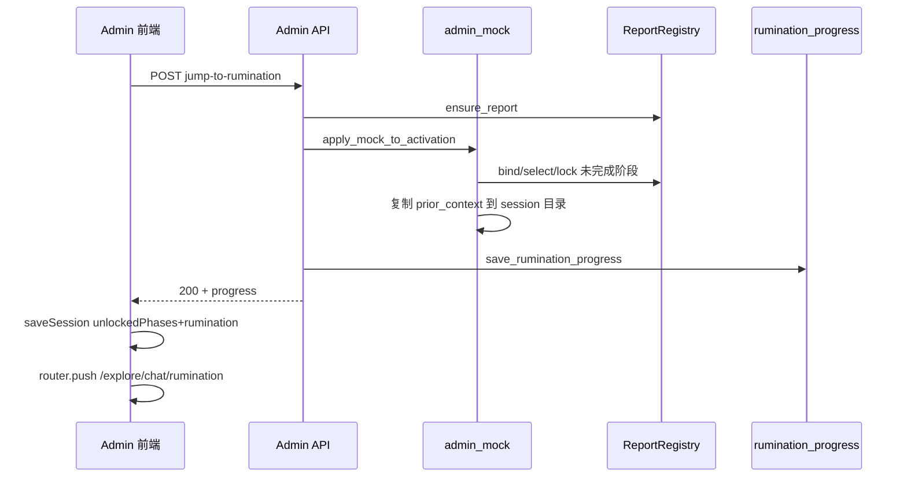
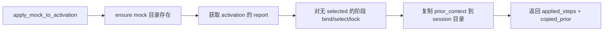
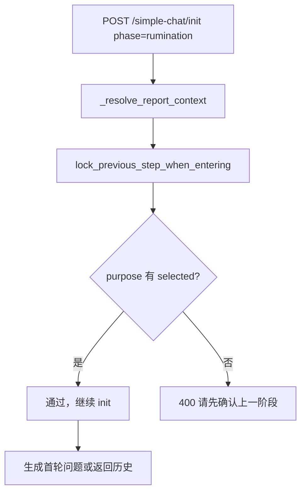

# 2025-03-19 探索流程与 Admin Mock 增强 · 变更汇总

## 一、架构设计变更

### 1.1 聊天页头部布局

**变更前**：标题与按钮在白色顶栏，描述和 hint 在下方独立区域。

**变更后**：标题、描述、hint 统一置于白色顶栏内。

```
┌─────────────────────────────────────────────────────────────────┐
│ 01 信念                                    [完成并继续 →]       │
│ 探索你最深层的信念。什么对你最重要？... 这一步帮你发现5个...   │
│ [Rumination 进度条]（仅 rumination 阶段）                        │
└─────────────────────────────────────────────────────────────────┘
```

**涉及文件**：`src/frontend/app/(main)/explore/chat/[phase]/page.tsx`

### 1.2 探索流程 i18n 架构

探索对话页及侧边栏文案接入 i18n，支持中英文切换。

**新增 i18n 键**（`zh.ts` / `en.ts`）：

| 键路径 | 用途 |
|--------|------|
| `explore.chat.phaseLabels.{phase}` | 阶段名（信念/禀赋/热忱/使命/沉淀） |
| `explore.chat.phaseMeta.{phase}.desc` | 阶段描述 |
| `explore.chat.phaseMeta.{phase}.hint` | 阶段提示 |
| `explore.chat.completeAndContinue` | 完成并继续按钮 |
| `explore.chat.selectCompletedHint` | 禁用按钮提示 |
| `explore.chat.exploringWithDim` | 正在探索 · {dim} |
| `explore.chat.sidebar*` | 侧边栏（新建、删除、状态等） |
| `explore.chat.todayAt` / `daysAgo` / `monthDay` | 时间格式 |

**涉及文件**：
- `src/frontend/lib/i18n/locales/zh.ts`
- `src/frontend/lib/i18n/locales/en.ts`
- `src/frontend/app/(main)/explore/chat/[phase]/page.tsx`
- `src/frontend/components/explore/ChatPhaseSidebar.tsx`

### 1.3 Admin Mock 数据架构

```
data/admin_mock/
├── record_template.json      # report 模板（前四阶段 selected_session_id = admin_mock）
└── prior_context/
    ├── prior_context_values.txt
    ├── prior_context_strengths.txt
    ├── prior_context_interests.txt
    └── prior_context_purpose.txt
```

**设计要点**：
- Mock 用于满足 `lock_previous_step_when_entering` 的前置条件
- 跳步到 Rumination 时自动应用 mock
- 可将 data 中任意 report 的 prior 保存为 mock 复用

**涉及文件**：`src/backend/app/utils/admin_mock.py`

---

## 二、新增功能

### 2.1 Admin Mock 数据管理

| 功能 | 说明 |
|------|------|
| 初始化 Mock | 强制生成/覆盖默认 mock 模板 |
| 应用 Mock 到激活码 | 将 mock 写入指定激活码的 report + prior |
| 保存为 Mock | 用指定 report/激活码的历史数据替换 mock |
| 跳步时自动应用 | 跳步到 Rumination 时自动调用 apply_mock |

**前端入口**：Admin → 会话记录 → Mock 数据管理

### 2.2 跳步到 Rumination 流程优化

**原问题**：进入 rumination 时 `lock_previous_step_when_entering` 报错「请先确认上一阶段的最终对话」。

**优化**：
1. 跳步时先调用 `apply_mock_to_activation` 预填未完成阶段
2. 仅对无 `selected_session_id` 的阶段写入，避免覆盖已有进度
3. 复制 prior_context 到激活码的 session 目录，供 rumination 使用

### 2.3 探索页 i18n

- 阶段标题、描述、hint 随 locale 切换
- 侧边栏、输入占位符、时间格式等支持英文

---

## 三、新增接口与函数

### 3.1 Admin API（`/api/v1/admin/`）

| 方法 | 路径 | 说明 |
|------|------|------|
| GET | `/conversations/mock-info` | 获取 mock 数据信息 |
| POST | `/conversations/init-mock` | 强制初始化 mock（覆盖默认） |
| POST | `/conversations/apply-mock-to-activation` | 应用 mock 到指定激活码 |
| POST | `/conversations/save-as-mock` | 将 report/激活码数据保存为 mock |

### 3.2 前端 API（`lib/api/admin.ts`）

```typescript
getMockInfo(): Promise<{ exists, record_template_path, prior_files }>
initMock(): Promise<{ exists, record_template_path, prior_files }>
applyMockToActivation(activationCode: string): Promise<{ ... }>
saveAsMock(payload: { activation_code?: string; report_id?: string }): Promise<{ ... }>
```

### 3.3 后端工具函数（`admin_mock.py`）

| 函数 | 说明 |
|------|------|
| `get_admin_mock_dir()` | 返回 `data/admin_mock/` 路径 |
| `get_mock_prior_dir()` | 返回 prior_context 目录 |
| `_ensure_mock_structure(force_overwrite=False)` | 确保 mock 目录与文件存在 |
| `init_mock_force()` | 强制初始化/重置 mock |
| `get_mock_info()` | 返回 mock 元信息 |
| `load_mock_record_template()` | 加载 record 模板 |
| `apply_mock_to_activation(activation_code, registry)` | 应用 mock 到激活码 |
| `save_report_as_mock(activation_code?, report_id?, registry?)` | 保存 report 为 mock |

---

## 四、Bug 修复

### 4.1 init 400：请先确认上一阶段

**原因**：进入 rumination 时 purpose 等阶段无 `selected_session_id`，`lock_previous_step_when_entering` 抛错。

**修复**：跳步时通过 mock 预填未完成阶段；`apply_mock` 为无选中阶段的 step 设置 `admin_mock` 并锁定。

### 4.2 rumination-progress 500

**原因 1**：`_load_record` 返回的 record 可能缺少 `report_id`（旧格式）。

**修复**：`report_registry._load_record` 中增加 `rec.setdefault("report_id", report_id)`。

**原因 2**：`ensure_report` 抛出 `ValueError` 时未被捕获。

**修复**：在 `get_rumination_progress` 中捕获 `ValueError`，返回 400 而非 500。

### 4.3 跳步时 select_session 冲突

**原因**：对已有 `selected_session_id` 的阶段再次 select 会触发「该阶段已锁定，不能切换会话」。

**修复**：仅对无 `selected_session_id` 的阶段执行 bind/select/lock。

### 4.4 init 500 错误信息

**修复**：`simple_init` 外层 try/except，将未捕获异常转为带类型的 500 响应，便于排查。

---

## 五、流程说明

### 5.1 管理员跳步到 Rumination 流程



### 5.2 Mock 应用流程



### 5.3 用户进入 Rumination 页（init）



**通过跳步 + mock**：跳步时已预填 purpose 等阶段，init 时 C 通过。

---

## 六、其他变更

### 6.1 DimensionConclusionCard 支持 rumination

- `phase` 类型新增 `'rumination'`
- `phaseBorderClass` 增加 rumination 样式

**涉及文件**：`src/frontend/components/explore/DimensionConclusionCard.tsx`

### 6.2 admin.soulhappylab.com 403 排查文档

新增 `docs/ADMIN_403_TROUBLESHOOTING.md`，说明：
- 反向代理未配置导致 403
- root 目录为空
- API 403 与超级管理员配置

### 6.3 跳步弹窗说明文案

在跳步到 Rumination 弹窗中增加说明：跳步时会自动应用 mock，可在 Mock 数据管理中用历史数据替换 mock。

---

## 七、文件变更清单

| 类型 | 路径 |
|------|------|
| 新增 | `src/backend/app/utils/admin_mock.py` |
| 新增 | `docs/ADMIN_403_TROUBLESHOOTING.md` |
| 修改 | `src/backend/app/api/v1/admin.py` |
| 修改 | `src/backend/app/api/v1/simple_chat.py` |
| 修改 | `src/backend/app/utils/report_registry.py` |
| 修改 | `src/frontend/lib/i18n/locales/zh.ts` |
| 修改 | `src/frontend/lib/i18n/locales/en.ts` |
| 修改 | `src/frontend/lib/api/admin.ts` |
| 修改 | `src/frontend/app/(main)/explore/chat/[phase]/page.tsx` |
| 修改 | `src/frontend/components/explore/ChatPhaseSidebar.tsx` |
| 修改 | `src/frontend/components/explore/DimensionConclusionCard.tsx` |
| 修改 | `src/frontend/app/(main)/admin/conversations/page.tsx` |

---

## 八、使用指南

### 8.1 Rumination 测试流程

1. 登录 Admin（超级管理员）
2. 进入 会话记录 → Mock 数据管理
3. 点击「初始化 Mock」
4. 在会话列表点击某条会话「查看详情」
5. 点击「跳步到 Rumination」，输入激活码，确认
6. 跳转到 rumination 页面，开始对话测试

### 8.2 用历史数据替换 Mock

1. 在 Mock 数据管理中，在「用历史数据替换 Mock」输入**激活码**或 **report_id**
2. 点击「保存为 Mock」
3. 后续跳步将使用更新后的 mock 数据
