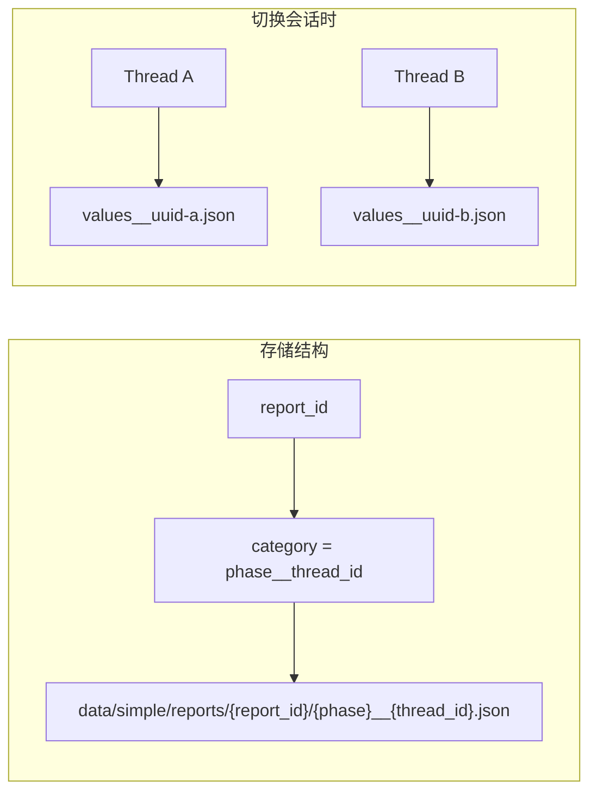
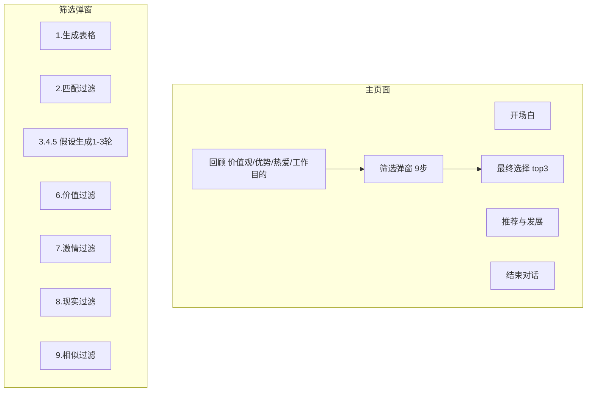

# Rumination 与探索流程增强 · 实施计划

## 一、现状与结论

### 1.1 上下文隔离（已正确）




- **结论**：`category = _storage_category(phase_step, logical_session_id)`，不同 thread 对应不同 JSON 文件。
- 切换 session 时，`conv_manager.get_messages(session_id, category)` 会读取对应 thread 的文件，大模型上下文已正确隔离。

### 1.2 厂商缓存（可保留）

- 当前未传递 prompt cache 相关参数，厂商可能对相同前缀做缓存。
- **结论**：缓存命中通常有利（更快、更省 token），无需刻意规避。当前上下文随用户输入变化，缓存收益有限但无负面影响。

### 1.3 响应变慢的可能原因

- 历史消息未截断，长对话时每次发送全部历史。
- `system_prompt` + `prior_context` + `question_bank` 体积较大。
- 无并发优化或首 token 延迟优化。

---

## 二、Rumination 第五步：Section 级进度

### 2.1 流程结构（来自 rumination_prompt.md）




Rumination 需要「section 级进度」：主页面 5 个 section + 筛选弹窗 9 个 step，共约 14 个可记录节点。

### 2.2 复用 StepProgress 的思路

- 现有 `StepProgress`（[question_progress.py](src/backend/app/domain/question_progress.py)）适用于「题目列表 + 当前索引」。
- Rumination 更适合用 **RuminationSectionProgress**：
  - `current_main_section`: 0~5（开场/回顾/最终选择/推荐/结束）
  - `current_filter_step`: 0~9（0 表示未进入筛选）
  - `filter_table_state`: 当前表格数据（JSON），用于步骤间传递。

建议设计：


| 存储位置 | 格式                                                                                                       |
| ---- | -------------------------------------------------------------------------------------------------------- |
| 后端   | `data/simple/reports/{report_id}/rumination_progress.json` 或 `record.json` 的 `steps.rumination.metadata` |
| 前端   | `ExploreSession` 扩展 或 独立的 `ruminationProgressStore`                                                      |


关键字段示例：

```json
{
  "main_section": "review",  // opening | review | filter | final_choice | recommend | end
  "review_sub_index": 2,     // 0=价值观 1=优势 2=热爱 3=工作目的
  "filter_step": 0,          // 0=未进入 1~9=筛选步骤
  "filter_table": null       // 当前表格数据，步骤间传递
}
```

### 2.3 实施要点

1. 新增 `RuminationProgress` 模型（后端 Pydantic + 前端 TypeScript）。
2. 后端 API：`GET/POST /api/v1/simple-chat/rumination-progress` 读写进度。
3. 在 `simple_chat` 的 rumination 分支中，根据 `current_main_section` / `current_filter_step` 注入对应提示词片段，实现确定性交互。
4. 前端在 `/explore/chat/rumination` 中展示 section 进度条（类似 StepProgressBar），并驱动「下一步」逻辑。

---

## 三、确定性组件与 Widget 体系

### 3.1 是否固定 Widget？

**建议：是，建立可复用 Widget 体系。**

Rumination 和后续报告需要：

- 可编辑表格（列配置、下拉、确认按钮）
- 筛选弹窗（模态 + 表格）
- 结论卡（已有 `DimensionConclusionCard`）

若只靠 LLM 输出 Markdown 表格，无法保证：

- 列结构一致、可编辑、可提交。
- 与后端函数 `gen_table`、`filter_match` 等对接。

### 3.2 建议的 Widget 清单


| Widget                    | 用途              | 触发方式                                                                      |
| ------------------------- | --------------- | ------------------------------------------------------------------------- |
| `RuminationTableWidget`   | 筛选弹窗内表格，可编辑列、确认 | 后端返回 `role: table_widget`，`card_payload: { columns, rows, editableCols }` |
| `RuminationFilterModal`   | 包裹表格的弹窗         | 前端根据 `main_section === 'filter'` 显示                                       |
| `DimensionConclusionCard` | 已存在，可复用于回顾展示    | 沿用                                                                        |
| `Top3ChoiceCard`          | 最终选择 top3 展示    | 新建，与报告展示共用                                                                |


### 3.3 消息协议扩展

当前 `conclusion_card` 已支持 `card_payload`。扩展为通用 structured message：

```typescript
interface StructuredMessage {
  role: 'assistant' | 'conclusion_card' | 'table_widget' | 'top3_card';
  content?: string;
  card_payload?: Record<string, unknown>;
  widget_type?: 'rumination_table' | 'dimension_conclusion' | 'top3_choice';
}
```

前端渲染逻辑：

- `FlowAiMessage`：仅处理纯文本 / Markdown。
- `DimensionConclusionCard`：`role === 'conclusion_card'` 且 `widget_type === 'dimension_conclusion'`。
- `RuminationTableWidget`：`role === 'table_widget'` 且 `widget_type === 'rumination_table'`。

### 3.4 实施顺序

1. 定义 `table_widget` 消息格式与 `RuminationTableWidget` 组件（列配置、编辑、确认回调）。
2. 后端 rumination 分支中，在对应 step 返回 `table_widget` 消息，而非纯文本表格。
3. 将表格渲染进对话流（非弹窗时也可内嵌），弹窗作为可选展示方式。

---

## 四、Admin 调试入口：对话复刻 / 跳步

### 4.1 目标

管理员能够：

1. **复刻对话**：将某 session 的对话内容复制到另一 session，用于从中间步骤继续测试。
2. **跳步**：不必从 values 开始完整走完，可直接跳到 rumination 某 section 进行调试。

### 4.2 方案对比


| 方案               | 优点                 | 缺点          |
| ---------------- | ------------------ | ----------- |
| A. Admin 页「克隆会话」 | 全量复制，还原真实历史        | 需选源/目标，稍重   |
| B. 「载入种子数据」      | 灵活，可自定义 JSON       | 需手编数据，易出错   |
| C. 「从模板跳步」       | 一步到位，适合 rumination | 依赖预设模板，维护成本 |


推荐：**A + C 组合** —— 日常用 A 复刻，rumination 调试用 C 跳步。

### 4.3 设计草案

#### 4.3.1 克隆会话 API

```
POST /api/v1/admin/conversations/clone
Body: {
  source_report_id: string;
  source_phase: string;
  source_thread_id: string;
  target_activation_code: string;
  target_phase: string;
  target_thread_id?: string;  // 可选，不传则新建
}
```

- 读取 `data/simple/reports/{source_report_id}/{source_phase}__{source_thread_id}.json`。
- 写入目标 activation 对应 report 的 `{target_phase}__{target_thread_id}.json`。
- 权限：仅 `super_admin`。

#### 4.3.2 跳步到 Rumination API

```
POST /api/v1/admin/conversations/jump-to-rumination
Body: {
  activation_code: string;
  target_section: 'opening' | 'review' | 'filter' | 'final_choice' | 'recommend' | 'end';
  target_filter_step?: number;  // 1~9
  seed_table?: object;  // 可选，预填筛选表格
}
```

- 创建或更新 rumination 的 progress。
- 若需要，可注入几条种子消息（如「已完成回顾」），使对话状态与 `target_section` 一致。
- 权限：仅 `super_admin`。

#### 4.3.3 Admin 前端入口

- 在 [admin/conversations/page.tsx](src/frontend/app/(main)/admin/conversations/page.tsx) 会话详情中增加：
  - 「克隆到...」：选择目标 activation / phase / thread，调用 clone API。
  - 「跳步到 Rumination」：选择 section / filter_step，调用 jump API，并跳转到 `/explore/chat/rumination`。

---

## 五、响应速度优化

### 5.1 历史消息截断

在 [simple_chat.py](src/backend/app/api/v1/simple_chat.py) 的 `simple_chat_stream` 中，对 `history_messages` 做截断：

```python
# 仅保留最近 N 轮，减少 token
MAX_HISTORY_TURNS = 20  # 可配置
# 按 user+assistant 配对计数，保留最后 MAX_HISTORY_TURNS 轮
```

可考虑保留 system 消息前的少量「锚点」消息（如开场、结论卡），避免重要信息被截掉。

### 5.2 Prior context 精简

- `prior_context` 可能较长，建议限制长度（例如 2000 字符）或做摘要。
- 在 [survey_storage.py](src/backend/app/utils/survey_storage.py) 的 `load_prior_context` 中增加截断或摘要逻辑。

### 5.3 可选：Prompt Caching（厂商能力）

- 若使用支持 prompt cache 的厂商（如 OpenAI、部分云厂商），可将 `system_prompt` 设为可缓存前缀。
- 需要根据实际使用的 LLM 提供方文档接入，可作为后续优化项。

---

## 六、实施优先级建议


| 优先级 | 任务                                            | 预估    |
| --- | --------------------------------------------- | ----- |
| P0  | 前端/后端接入 rumination phase（session、路由、后端分支）     | 1~2 天 |
| P0  | Rumination section 进度模型与 API                  | 1 天   |
| P1  | `RuminationTableWidget` + `table_widget` 消息协议 | 2~3 天 |
| P1  | Rumination 后端逻辑与 prompt 集成（主流程 + 筛选 9 步）      | 2~3 天 |
| P2  | Admin 克隆会话 API + 前端入口                         | 1 天   |
| P2  | Admin 跳步到 Rumination API + 前端入口               | 1 天   |
| P3  | 历史消息截断与 prior_context 精简                      | 0.5 天 |


---

## 七、需要确认的点

1. **Rumination 是否支持多线程**：当前 values/strengths 等每阶段最多 5 个 thread，rumination 是否也允许多个 thread，还是单线程即可？
2. **筛选弹窗 vs 内嵌表格**：提示词要求「筛选弹窗」，是否必须模态弹窗，还是允许在对话流内嵌可编辑表格？
3. **后端函数**：`gen_table`、`filter_match`、`generate_hypotheses_round1` 等，计划用 Python 实现还是通过 LLM function calling？这会影响 Widget 与后端的对接方式。

