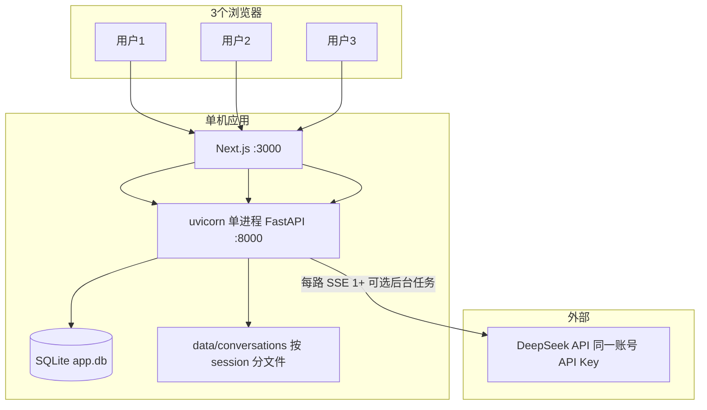

# 三人并发访问能力分析（程序 + DeepSeek API）

## 结论（先给答案）

| 场景 | 能否支撑 3 人 | 说明 |
|------|----------------|------|
| 仅浏览（登录、仪表盘、静态页） | **可以** | 单进程 Next + FastAPI 对 3 个 HTTP 连接压力极小 |
| 3 人同时在探索页发消息（SSE 流式对话） | **基本可以** | 异步 I/O + 不同 session 文件锁粒度，3 路并行无结构性障碍 |
| 3 人同时触发「结论卡 / 锚点提炼」等重 LLM 路径 | **可以，但可能变慢** | 每人除主对话外还可能多出 1～2 次后台 LLM，瞬时并发约 3～9 次，仍远低于 DeepSeek 账号并发上限 |

**一句话**：从架构和 [DeepSeek 限速文档](https://api-docs.deepseek.com/zh-cn/quick_start/rate_limit) 看，**3 人同时使用是合理预期负载**；需要关注的是**体验（首字延迟、长回复耗时）和账单**，而不是「系统会不会立刻崩」。

---

## 当前运行形态（与并发相关）

依据：

- 部署脚本 [`start.sh`](start.sh) / [`deploy/systemd/beingdoing-backend.service`](deploy/systemd/beingdoing-backend.service)：**单 worker 的 uvicorn**，无 gunicorn 多进程。
- [`.env`](.env)：`ARCHITECTURE_MODE=simple`，`DATABASE_URL=sqlite+aiosqlite:///./app.db`。
- 主业务路由：[`main.py`](src/backend/app/main.py) 注册 `simple_chat`（简单模式对话），非完整 LangGraph 多节点图为主路径。

---

## 一、程序侧：3 人同时用会怎样？

### 1. Web / API 层（足够）

- FastAPI + `async`：3 个并发 SSE（[`simple_chat_stream`](src/backend/app/api/v1/simple_chat_routes.py)）在**同一事件循环**里并行等待 I/O，属于设计内场景。
- 前端 Next.js：3 人访问页面、调 REST，无特殊瓶颈。

### 2. 数据与文件（3 人通常互不抢锁）

- **SQLite**（[`database.py`](src/backend/app/models/database.py)）：未显式配置连接池/WAL；3 人低频写用户/会话元数据一般可接受。风险在「高并发写同一库」而非 3 人。
- **对话 JSON**（[`conversation_file_manager.py`](src/backend/app/utils/conversation_file_manager.py)）：按 `(session_id, category)` **文件级 FileLock**；3 个不同用户 → 不同 report/session 目录 → **几乎无写锁竞争**。

### 3. 应用内 LLM 并发控制（当前偏「放开」）

- [`settings.py`](src/backend/app/config/settings.py)：`LLM_MAX_CONCURRENT = 0` 表示**不启用** `asyncio.Semaphore`（[`_get_llm_semaphore`](src/backend/app/api/v1/simple_chat_routes.py)）。
- 含义：3 人同时聊天 → **最多 3 路（或更多）同时打 DeepSeek**，不会被应用主动排队；对 3 人这是好事（低延迟），对更大规模需另设限流。

### 4. 单次用户操作可能不止 1 次 LLM

主路径是 `message/stream` 里一次 `llm.chat_stream`，但还有：

- `asyncio.create_task` 的 **锚点提炼** [`_trigger_anchor_refiner`](src/backend/app/api/v1/simple_chat_routes.py)（后台，不阻塞 SSE）。
- 结论相关路径上的 **`check_dimension_complete`**（`reasoning_llm`，非流式）。

因此「3 人同时点发送」时，服务端对 DeepSeek 的**实际并发**可能是 **3～9+**（仍很小），主要影响是**服务器内存/CPU**和**API 费用**，不是 3 人就触发平台 429。

### 5. 已知弱点（3 人时多半无感，但应知晓）

来自 [`claude-codereview架构演进.md`](claude-codereview架构演进.md) 等文档的归纳：

- **无全局限流 / 无按用户 LLM 配额** → 3 个正常用户无问题；恶意刷接口会烧额度。
- **单实例后端** → 进程挂则全员不可用；3 人不需要水平扩展。
- **GraphCache 若走 full 模式** 用 `threading.Lock` 可能拖慢事件循环；你们当前主路径是 **simple_chat**，影响较小。
- **开发模式 `--reload`** 不适合作为「生产并发」评估环境。

### 6. 模型配置与文档的差异（影响延迟/计费，不影响「能不能 3 人」）

- `.env` 中 `LLM_MODEL=deepseek-v4-pro`。
- VIP1 用户走 [`factory.py`](src/backend/app/core/llmapi/factory.py) 时，若**未设置** `LLM_VIP1_MODEL`，默认是 **`deepseek-reasoner`**，不一定等于 `LLM_MODEL`。
- [DeepSeek 文档](https://api-docs.deepseek.com/zh-cn/) 说明 `deepseek-chat` / `deepseek-reasoner` 将弃用，分别对应 v4-flash 的非思考/思考模式；你们若实际打到 **v4-pro**，属于更强、更慢、更贵一档。
- 代码未向 DeepSeek 传 `user_id`（文档支持的业务侧用户隔离）；3 人共享**同一账号并发池**（见下一节），对 3 人无影响。

---

## 二、DeepSeek API 侧：3 人是否超限？

依据官方 [限速与隔离](https://api-docs.deepseek.com/zh-cn/quick_start/rate_limit)：

| 模型 | 账号级并发上限 |
|------|----------------|
| **deepseek-v4-pro** | **500** |
| deepseek-v4-flash | 2500 |

要点：

- **并发**定义：请求发出到模型**响应完成**算 1 个并发；流式对话在整个 stream 期间占 1 个槽位。
- 超限返回 **HTTP 429**；与 API Key 个数无关，与**账号**有关。
- 3 人若各 1 条流式对话 ≈ **3/500**；即使每人再加 2 个后台任务 ≈ **9/500**，仍远低于上限。

其他 API 行为（与体验相关）：

- 请求排队过久时，**10 分钟未开始推理**会断连（低负载下 3 人几乎不会遇到）。
- 非流式会发 keep-alive 空行；你们是 SSE，属正常长连接场景。
- 客户端 [`OpenAIProvider`](src/backend/app/core/llmapi/openai_provider.py)：`timeout=60s`，`max_retries=3` — 单路失败会重试，可能略拉长占用并发槽位的时间。

**账单 / TPM**：文档页未在抓取片段中列出具体 TPM；3 人同时长对话主要成本是 **token 用量 × 模型单价**（v4-pro + 思考模式更贵），不是并发名额。

---

## 三、分场景建议预期

### 场景 A：3 人逛站、偶尔发一句

- **程序**：轻松。
- **API**：轻松。

### 场景 B：3 人同时在探索页连续对话（最常见「同时用」）

- **程序**：可支撑；偶发 SQLite 写等待或磁盘 I/O 导致百毫秒级抖动，一般不如 LLM 延迟明显。
- **API**：并发名额充足；**体感瓶颈**更可能是：
  - 模型推理慢（长 system prompt、长历史、结论判定额外调用）；
  - 单机 CPU 做 JSON/文件读写；
  - 同一时刻 3 路流式 + 后台任务叠加时的**排队感**（应用未设 `LLM_MAX_CONCURRENT`，不会主动排队，但 OS/网络仍会竞争）。

### 场景 C：3 人同时进结论确认 / 生成结论卡

- 主对话流结束后可能再触发 **`check_dimension_complete`**（有 `CONCLUSION_GEN_TIMEOUT_SECONDS` 超时保护）。
- 可能出现：前端已显示「后台处理中」，实际仍在等第二次 LLM — **功能可用，延迟更明显**。

---

## 四、与「3 人」相关的风险边界（非必须改代码，仅供决策）

| 风险 | 3 人严重性 | 说明 |
|------|------------|------|
| DeepSeek 429 | 极低 | 需远超 500 并发或账号配额被降 |
| SQLite 写锁 | 低 | 3 人可接受；几十人同时写需 PostgreSQL |
| 单进程崩溃 | 中 | 运维层面：systemd/docker restart |
| API 费用飙升 | 中 | 无应用层 rate limit；3 人正常使用可控 |
| 回复变慢 | 中 | 模型与 prompt 长度主导，非架构硬上限 |

---

## 五、若只做观测、不改架构（可选）

上线或压测前可观察：

1. 三人同时发消息后，后端日志是否出现 `429` / `OpenAI API调用失败`。
2. 浏览器 Network：3 条 `/api/v1/simple-chat/message/stream` 是否均持续收到 SSE。
3. DeepSeek 控制台：并发曲线是否长期个位数。
4. 确认 VIP1 实际模型名（`LLM_VIP1_MODEL` 未设时可能是 `deepseek-reasoner` 而非 `deepseek-v4-pro`）。

---

## 总结判断

- **能不能支撑 3 人同时访问？** → **能**（页面 + API）。
- **能不能支撑 3 人同时对话？** → **能**；程序与 DeepSeek 并发限额均远大于 3。
- **需要担心的不是「人数上限」，而是**：单机上多路 LLM 带来的**延迟与费用**、结论/锚点等**额外调用**、以及生产环境应用 **SQLite + 单进程** 在规模扩大后的上限（3 人不在此列）。

参考文档：

- [DeepSeek 首次调用 API](https://api-docs.deepseek.com/zh-cn/)
- [DeepSeek 限速与隔离](https://api-docs.deepseek.com/zh-cn/quick_start/rate_limit)

---

## 附录：DeepSeek `user_id` 是否值得加？（评估，未实施）

### 结论摘要

| 问题 | 答案 |
|------|------|
| 不传 `user_id` 会导致两个用户的**对话内容串线**吗？ | **不会**（应用层每次请求自带完整 `messages`，LLM 无状态） |
| 不传会导致 DeepSeek **KV Cache 把 A 的话喂给 B** 吗？ | **不会**（缓存只影响前缀 token 计费/加速，输出仍按本次请求的 messages 推理） |
| 是否有**提供商侧**隔离/合规收益？ | **有**，`user_id` 用于内容安全、KVCache 隐私隔离、高配额账号下的调度隔离 |
| 是否建议做「仅 DeepSeek 传 `user_id`」？ | **可做、低风险**；对 3 人场景**非必须**，规模变大或重视隐私时更有价值 |
| 其他厂商 API 会不会被搞坏？ | **按 provider 分支 + `extra_body` 即可避免**；不要对所有兼容接口无脑传 |

### `user_id` 在 DeepSeek 侧做什么（与「session」的区别）

依据 [限速与隔离](https://api-docs.deepseek.com/zh-cn/quick_start/rate_limit)：

- **内容安全隔离**：区分业务侧用户身份
- **KVCache 隔离**：按 `user_id` 做缓存隐私分区（普通账号所有 `user_id` 仍**合并计并发**）
- **调度隔离**：仅「提升了并发配额」的账号才按 `user_id` 单独限 500/2500；普通用户所有 `user_id` 合并算总并发

这与寻录里的 **session / thread / report_id** 不是同一层概念：

- **你们系统的 session**：JWT + `report_id` + `data/conversations/{id}/` 文件锁 → 决定谁能读写哪份对话
- **DeepSeek 的 `user_id`**：提供商侧的**账号内用户标签**，不替代 `messages` 内容

### 当前代码事实

- [`openai_provider.py`](src/backend/app/core/llmapi/openai_provider.py) 的 `chat` / `chat_stream` **未传** `user_id` 或 `extra_body.user_id`
- 简单对话路由已有 `current_user["user_id"]`（UUID 字符串，符合 DeepSeek 正则 `[a-zA-Z0-9\-_]+`），但**未下沉到 LLM 调用**
- 部分后台任务（锚点提炼、`check_dimension_complete`）可能只有 `vip_level`、无 `user_id` 入参，若要做需从调用链补传

### 不传 `user_id` 时，两个用户会「混乱」吗？

**应用 session：不会串。**

每次调用都是：`messages = [system, ...历史, user]` 整包发送。用户 B 的请求里不会带上用户 A 的私有 history，除非你们业务代码写错（当前是按 `report_id` + category 读文件，不同用户不同 report）。

**DeepSeek KV Cache：可能共享前缀，但不等于串话。**

依据 [上下文硬盘缓存](https://api-docs.deepseek.com/zh-cn/guides/kv_cache)：

- 命中规则是**请求体 messages 的前缀完全一致**
- 所有用户共用同一份 `simple_chat_system.yaml` 时，**system 前缀很可能相同** → 可能共享「公共 system 前缀」的缓存命中（省钱、略提速）
- **用户各自的对话正文在历史里不同** → 不会误把 A 的 user/assistant 内容当作 B 的输入
- 文档明确：缓存只作用于输入前缀；**输出仍按本次请求独立推理**，效果与不使用缓存相同

未传 `user_id` 时，DeepSeek 在提供商侧**不按用户分区 KV**；若合规要求「不同终端用户的缓存存储也要隔离」，才更需要传 `user_id`。

### 分 provider 支持的可行性与风险

**推荐做法（将来若做）：**

- 仅在 `provider == "deepseek"`（或 `base_url` 含 `api.deepseek.com`）时：`extra_body={"user_id": str(db_user_id)}`
- OpenAI 官方有独立字段 `user`（滥用追踪），**不要混用** DeepSeek 的 `user_id` 字段名
- Kimi / Qwen 兼容接口：默认**不传**；若实测某家忽略未知字段可再评估

**风险清单：**

| 风险 | 级别 | 说明 |
|------|------|------|
| 非 DeepSeek 接口 400 | 低 | 用分支可避免 |
| 后台任务无 user_id | 中 | 需审计所有 `llm.chat*` 调用链 |
| 用 email 当 user_id | 中 | 文档要求勿放隐私；应用已有 UUID `users.id` 更合适 |
| 调试/回放脚本 | 低 | 可传固定占位如 `system` 或跳过 |
| 普通账号期望「每用户 500 并发」 | 误解 | 文档写明普通用户仍**合并**计并发 |

### 必要性判断（是否现在就要改）

- **3 人试点 / 功能正确性**：**不必**为防串 session 而改
- **降本**（共享 system 前缀缓存）：不传 `user_id` 反而可能让更多用户共享同一 system 前缀命中；传了则按用户隔离缓存，**可能略减跨用户前缀复用**
- **隐私/合规/多租户**：用户量上来后**值得做**
- **高配额账号 + 单用户突发流量**：`user_id` 调度隔离才有意义

### 建议决策

1. **短期（3 人）**：可维持现状；优先确认业务 session 隔离（已具备）即可。
2. **中期**：若加，采用 **DeepSeek-only + `users.id` + `extra_body`**，并给 `OpenAIProvider.chat*` 增加可选 `end_user_id` 参数，由上层从 `current_user` 传入。
3. **实施前**：用 2 个测试账号各发一轮，对比 `usage.prompt_cache_hit_tokens`（代码已读 `_last_stream_usage`），验证传/不传 `user_id` 的差异。
