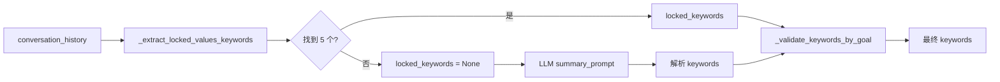
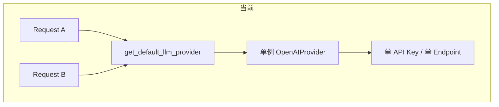
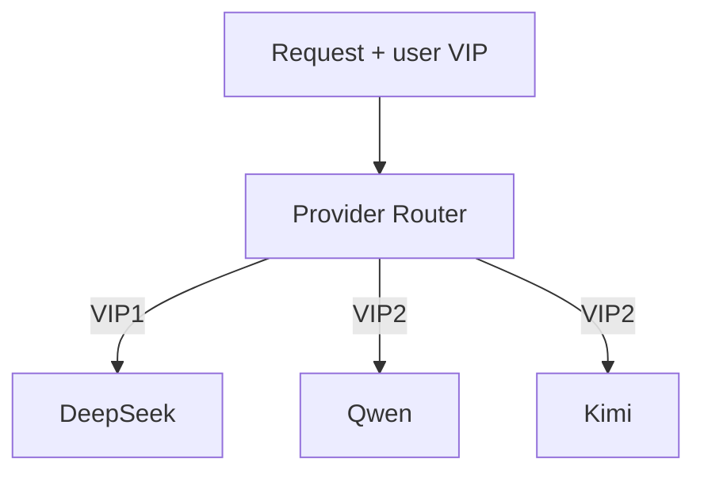

# 历史提炼、关键词提取与并发架构 · 分析与规划

## 0. Python 实现 vs LLM Function Calling（已确认）

| 维度         | Python 直接实现                                                                                                                                      | LLM Function Calling                                                         |
| ---------- | ------------------------------------------------------------------------------------------------------------------------------------------------ | ---------------------------------------------------------------------------- |
| **调用方式**   | 后端 API 收到请求后直接调用 Python 函数（如 `gen_table`、`filter_match`）                                                                                         | 将函数定义为 tools 传给 LLM，LLM 推理后返回 `tool_calls`，后端再执行                             |
| **当前使用位置** | [rumination_ops.py](src/backend/app/utils/rumination_ops.py)、[simple_chat.py](src/backend/app/api/v1/simple_chat.py) 的 `rumination-table-submit` | Full 模式的 [tools/](src/backend/app/core/agent/tools/)（SearchTool、GuideTool 等） |
| **适用场景**   | 步骤确定、逻辑清晰、需与前端「确认」动作强绑定（如表格提交）                                                                                                                   | 需要 LLM 根据上下文**选择**调用哪个工具、传什么参数                                               |
| **优缺点**    | 确定性、低成本、无额外 round-trip；但逻辑固定                                                                                                                     | 灵活、可多步推理；但延迟和 token 消耗高                                                      |

**结论**：Rumination 表格生成/筛选步骤固定，用 **Python 实现** 合适；结论卡关键词提取改为 **LLM 输出 JSON**，后端解析，不再用正则。

## 一、历史消息截断 vs 后台 Agent 提炼

### 1.1 现状

- **Simple 模式**：[simple_chat.py](src/backend/app/api/v1/simple_chat.py) 使用粗暴截断：`MAX_HISTORY_TURNS = 20`，按 user 轮次从后往前保留，超出则丢弃。
- **Full 模式**：[context_manager.py](src/backend/app/core/agent/context_manager.py) 的 `SimpleContextManager.maybe_compress` 在 `inner_messages` 超过 40 条时，将早期消息拼接为 `[Summary of earlier conversation]\n{snippet}`，**不调用 LLM**，只是截断拼接（最多 2000 字符）。

### 1.2 结论与建议

- Full 模式的「压缩」本质是**截断 + 简单拼接**，并没有 LLM 提炼。
- 若要**真正按 goals 提炼关键信息**，需要：
  - 引入后台任务（如 `BackgroundTasks` 或 Celery），在每轮对话后异步调用 LLM 做摘要；
  - 将提炼结果写入 `record.json` 的 `steps.{phase}.summary` 或单独文件；
  - 下次构建 `llm_messages` 时，用「锚点摘要 + 最近 N 轮」代替「纯截断」。

**推荐路线**（已确认）：

1. **锚点摘要 + 最近 N 轮**：N = 20。锚点内容包含：
  - **goals**：来自 `conclusion_card_goals` 的 `must_capture`
  - **可扩展锚点字段**（可配置）：用户性格、文字表达风格、冲突矛盾点等
  - 存储格式建议：`steps.{phase}.anchor_summary` 含 `{goals, personality, style, conflicts, ...}` 等键
2. **写入时机**：
  - 至少展示结论卡后**第一次**开始写入
  - 之后每次弹出结论卡 → 后台异步摘要（提示词：若变化不大则不必过度摘要）
  - step 提交到下一 step 时 → 再进行一次摘要
  - **每 20 轮**也触发一次后台摘要
3. **构建 llm_messages**：若有锚点摘要，开头插入 `[此前对话要点] {summary}`，再拼接最近 20 轮。

---

## 二、Values 结论卡关键词提取错误的原因分析

### 2.1 流程概览

### 2.2 根因分析

| 环节                      | 现象                                          | 可能原因                                                                                                                                                                  |
| ----------------------- | ------------------------------------------- | --------------------------------------------------------------------------------------------------------------------------------------------------------------------- |
| **locked_keywords 未命中** | `_extract_locked_values_keywords` 返回 `None` | 1) 用户未用「逗号分隔」或「1. xxx 2. yyy」格式确认；2) 正则 `_extract_delimited_keywords` 过滤过严，如 `focus_match` 没命中；3) 只查 `conversation_history[-30:]`，若确认在更早则漏掉                           |
| **LLM 输出格式不稳定**         | `summary_text` 中 `---` 分隔不清晰                | 1) 模型有时用 `---` 有时用 `----`；2) 第二部分可能是「关键词：」而非纯逗号列表；3) `re.findall(r"\*\*([^*]+)\*\*")` 可能匹配到非关键词（如「诚实」外的修饰词）                                                           |
| **prompt 与 goal 脱节**    | 模型自由发挥                                      | `summary_prompt` 的 `goal_hint` 来自 `get_goal_prompt_hint`，但 `must_capture` 是英文键名，模型可能忽略；values 要求 `strict_match_user_confirmed_keywords`，若 locked 为 None 则完全依赖 LLM，易偏差 |

### 2.3 具体问题定位

1. `**_extract_delimited_keywords`**
  - `focus_match` 正则：`(?:就是|是|我的价值观是|关键词是)\s*(.+?)(?:这就是|不用探索|我很明确|。|$)` 要求用户说「我的价值观是 xxx」或「关键词是 xxx」，否则 `cleaned` 不会被缩小，整句会进入 `re.split(r"[,\n，、；;|/]+")`，容易混入无关词。
  - 过滤词列表可能漏掉「对」「嗯」「OK」等确认语，被误当关键词。
2. `**_extract_enum_keywords`**
  - 正则 `(?:^|\n)\s*\d+[\.、]\s*\**([^*\n]+?)\**\s*(?=$|\n)` 要求「数字. 内容」格式，若助手用「一、二、」或「(1)」则无法匹配。
3. **LLM 输出**
  - 模型可能返回「诚实、成长、家庭、自由、助人」但夹杂空格/换行，或把同义词改写（如「成长」→「持续成长」），与用户原词不一致。

### 2.4 改进方案（已确认：弃用正则，改为 AI JSON）

1. **不再用正则提取**：`_extract_delimited_keywords`、`_extract_enum_keywords` 风险高，易误判。
2. **改为 LLM 输出 JSON**：
  - 明确让 AI 从用户对话中寻找 5 个核心价值观词
  - 优先使用用户亲口提到的原词，实在没有再同义词改写
  - 尽量是精准的 2~4 字词语
  - **输出格式**：后台直接要求 JSON，如 `{"keywords": ["词1", "词2", ...], "summary": "..."}`，后端解析
3. **conclusion_card 从 AI 的 JSON 提取**：不再依赖 `---` 分隔或 Markdown `**x`** 解析。
4. **保留「用户亲口确认」提示词**：在 prompt 中强调「若用户已明确确认 5 个词，必须严格使用用户原词」。

---

## 三、多用户并发与 API 池架构

### 3.1 当前架构

- **隔离**：`category = phase__thread_id`，每个 thread 独立 JSON 文件；`get_messages(session_id, category)` 按文件读取，**请求级隔离正确**。
- **LLM**：`get_default_llm_provider()` 每次创建新实例（`create_llm_provider()` 无缓存），但共享同一 `api_key`、`base_url`。
- **并发**：无文件锁；`append_message` 先 read 再 write，**高并发下可能写丢失**。场景：同一用户同一 step 同一 session（如 values__uuid1）收到多个并发请求（双点击、多 tab、网络重试），多个请求同时 read 同一文件、各自 append 后 write，后者覆盖前者，导致消息丢失。

### 3.2 问题与风险

| 问题           | 影响                            | 优先级 |
| ------------ | ----------------------------- | --- |
| 文件并发写        | 同一 thread 多请求同时写 → 消息丢失       | 高   |
| 单 API Key 限流 | 多用户同时调用 → 429 / 超时            | 中   |
| 无请求队列        | 突发流量无法平滑                      | 中   |
| 无会话级 API 绑定  | 无法实现「用户 A 用 Key1，用户 B 用 Key2」 | 低   |

### 3.3 推荐架构

#### 3.3.1 文件并发写与锁粒度（已确认）

- **锁粒度**：按 `(report_id, category)` 即**按文件**加锁，不按整个 report 目录。
  - 原因：若锁整个 report，用户 A 写 thread1 时会阻塞其 thread2；且不同用户不同 report 本就不同文件，互不影响。
  - 按文件锁：`report_A/values__uuid1.json` 与 `report_A/values__uuid2.json` 各自独立锁；`report_B/xxx` 不受影响。满足「一个人写时，其他人的 report 可正常写入」。
- 实现：使用 `filelock` 或 `fcntl.flock` 包裹 `append_message`、`update_metadata` 的 read-modify-write。
- 输出：[conversation_file_manager.py](src/backend/app/utils/conversation_file_manager.py)。

#### 3.3.2 Redis / MQ 消息队列

- **结论**：现阶段**不需要** Redis 或 MQ。文件锁即可解决同一 thread 并发写问题。
- 任务队列（Celery + Redis）在日均请求量达数百以上、需要削峰填谷时再考虑。

#### 3.3.3 API 池与 VIP 模型（已确认）

- **模型与 VIP**：DeepSeek = VIP1（基础）；Kimi、Qwen = VIP2（更高级）。
- **API 池来源**：可来自不同厂商（DeepSeek、Qwen、Kimi），也可同一厂商多 key。
- **实现**：新增 `vip_level` 或类似字段，按用户/激活码映射；`get_llm_provider(user_vip=...)` 选择对应厂商与 key。需整体改造 [factory.py](src/backend/app/core/llmapi/factory.py) 和配置。

---

## 四、已确认的设计约定

- **Session / Thread**：每个激活码/报告**单线程**（用户一次只在一个 session 对话）；但系统层面存在**多用户并发**。
- **表格展示**：在对话流内**内嵌可编辑表格**，通过「确认」提交前端修改到后端，再同步给大模型。
- **Rumination 表格**：继续用 **Python 实现**（gen_table、filter_match 等），前端确认后后端执行；不用 LLM function calling。

---

## 五、实施优先级与输出位置

| 优先级 | 任务                                                            | 预估    | 输出                                      |
| --- | ------------------------------------------------------------- | ----- | --------------------------------------- |
| P0  | 文件并发锁（按文件，即 report_id+category）                               | 0.5 天 | `conversation_file_manager.py`          |
| P1  | 锚点摘要：可扩展字段（goals + 性格/风格/冲突等）、写入时机（结论卡首次/每次弹出/step 提交/每 20 轮） | 2 天   | `context_refiner.py` + `simple_chat.py` |
| P1  | 构建 llm_messages 使用锚点摘要 + 最近 20 轮                              | 0.5 天 | `simple_chat.py`                        |
| P2  | Values 结论卡改为 AI JSON 输出、解析提取（弃用正则）                            | 1 天   | `dimension_completion_checker.py`       |
| P2  | API 池 + VIP（DeepSeek=VIP1，Kimi/Qwen=VIP2）                     | 1.5 天 | `factory.py` + settings + 用户/激活码映射      |
| P3  | asyncio.Semaphore 限制并发 LLM 调用（可选）                             | 0.5 天 | `simple_chat.py`                        |

