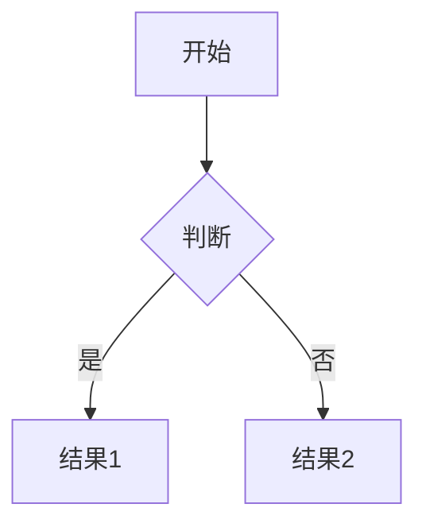

# Mermaid 流程图渲染指南

## 📋 问题说明

如果您的 Markdown 编辑器无法渲染 Mermaid 流程图，这是因为某些编辑器默认不支持 Mermaid 语法。

## ✅ 已修复的问题

我已经修复了以下语法问题，使流程图更兼容：

1. ✅ **移除了中文引号中的特殊字符**
   - 将 `"工作目的"` 改为 `工作目的`
   - 移除了可能导致解析错误的引号

2. ✅ **将特殊符号改为文字描述**
   - 将 `⭐` 改为 `星号`
   - 保留了 `×` 符号（Mermaid 支持）

3. ✅ **优化了 subgraph 标签格式**
   - 使用引号包裹中文标签：`subgraph Step1["第一步: 找到重要的事"]`

4. ✅ **简化了节点标签**
   - 移除了不必要的引号
   - 优化了换行符的使用

## 🔧 如何让流程图正常渲染

### 方法1: 安装 Mermaid 扩展（推荐）

#### VS Code
1. 打开扩展市场（Ctrl+Shift+X）
2. 搜索 "Mermaid Preview" 或 "Markdown Preview Mermaid Support"
3. 安装扩展
4. 重新打开 Markdown 文件

#### 其他编辑器
- **Typora**: 原生支持，无需安装
- **Obsidian**: 原生支持，无需安装
- **GitHub/GitLab**: 原生支持，直接查看

### 方法2: 使用在线工具

1. 访问 https://mermaid.live/
2. 复制流程图代码（```mermaid 和 ``` 之间的内容）
3. 粘贴到在线编辑器
4. 即可查看和编辑流程图

### 方法3: 使用 Mermaid CLI

```bash
# 安装 Mermaid CLI
npm install -g @mermaid-js/mermaid-cli

# 将 Mermaid 代码转换为图片
mmdc -i flowchart.mmd -o flowchart.png
```

## 📝 测试流程图是否正常

### 简单测试图

复制以下代码到您的 Markdown 文件，如果能显示流程图，说明支持 Mermaid：

````markdown

````

### 如果显示为代码块

如果流程图显示为代码块而不是图形，说明：
- 您的编辑器不支持 Mermaid
- 需要安装扩展或使用在线工具

## 🎯 支持的编辑器列表

### 原生支持（无需安装）
- ✅ GitHub
- ✅ GitLab
- ✅ Typora
- ✅ Obsidian
- ✅ Notion（部分支持）

### 需要扩展
- ⚙️ VS Code（需要安装扩展）
- ⚙️ Atom（需要安装扩展）
- ⚙️ Sublime Text（需要安装扩展）

### 不支持
- ❌ 普通文本编辑器
- ❌ 某些 Markdown 预览工具

## 💡 建议

1. **开发时**: 使用 VS Code + Mermaid 扩展
2. **查看时**: 使用 GitHub 或在线工具
3. **分享时**: 可以导出为图片格式

## 🔗 相关资源

- Mermaid 官方文档: https://mermaid.js.org/
- Mermaid Live Editor: https://mermaid.live/
- VS Code Mermaid 扩展: https://marketplace.visualstudio.com/items?itemName=bierner.markdown-mermaid
