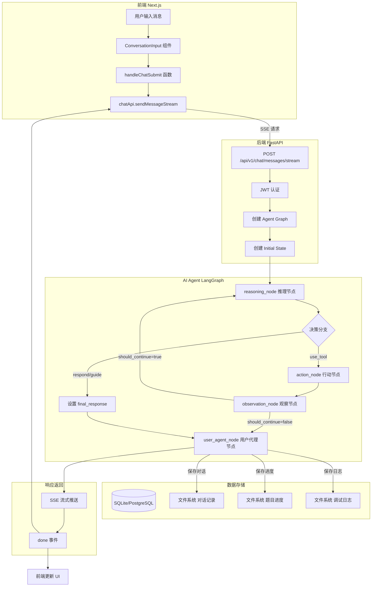
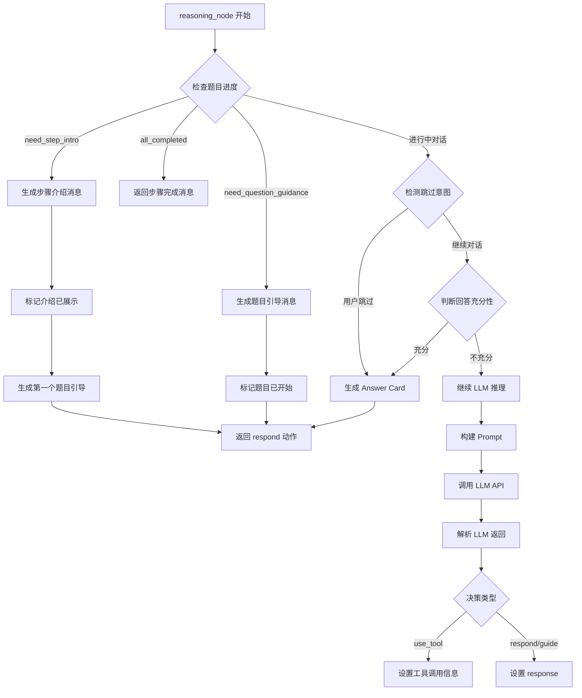
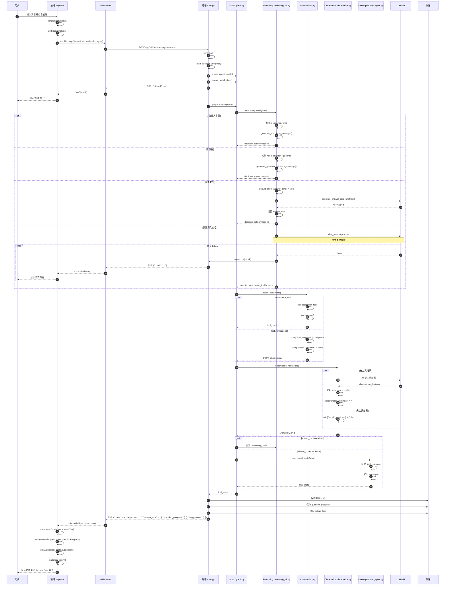
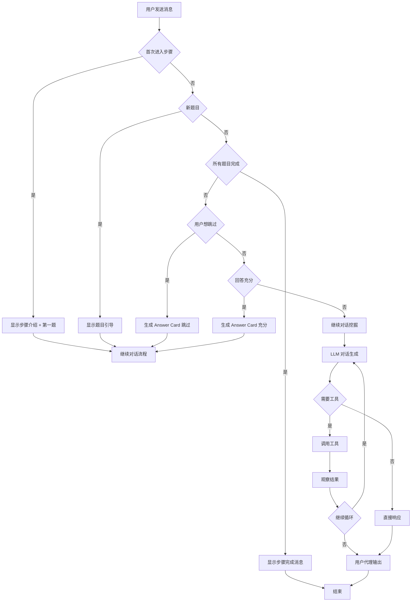

# 前后端请求调用流程文档

> BeingDoing 项目完整的前后端交互流程、底层逻辑调用链路说明

> **提示**：本文档包含 Mermaid 流程图。推荐使用以下工具查看：
> - GitHub：安装 [Mermaid Markdown 插件](https://github.com/marketplace/actions/mermaid-chart) 或使用 [Mermaid Live Editor](https://mermaid.live/)
> - VS Code：安装 "Markdown Preview Mermaid Support" 插件
> - 在线预览：[Mermaid Live Editor](https://mermaid.live/)

## 目录

1. [概述](#概述)
2. [架构图](#架构图)
3. [前端触发流程](#前端触发流程)
4. [后端处理流程](#后端处理流程)
5. [AI Agent 处理流程](#ai-agent-处理流程)
6. [完整调用序列图](#完整调用序列图)
7. [数据持久化](#数据持久化)
8. [关键文件索引](#关键文件索引)

---

## 概述

BeingDoing 采用 **前后端分离 + AI Agent** 的架构：

| 层级 | 技术栈 | 职责 |
|------|--------|------|
| 🔵 **前端 (Frontend)** | Next.js 14 + React | 用户交互界面、状态管理、SSE 流式接收 |
| 🟢 **后端 API (Backend)** | FastAPI | RESTful API、用户认证、会话管理 |
| 🟣 **AI Agent (LLM)** | LangGraph + OpenAI | 思考链推理、工具调用、响应生成 |

---

## 架构图

### 系统整体架构



### 层级颜色说明

- 🔵 **蓝色** - 前端 (Frontend)
- 🟢 **绿色** - 后端 API (Backend)
- 🟣 **紫色** - AI Agent (LLM)
- 🟠 **橙色** - 数据存储 (Storage)
- 🔴 **粉色** - 外部服务 (LLM API)

---

## 前端触发流程

### 1. 用户输入

**文件**: `src/frontend/app/(main)/explore/flow/page.tsx`

```typescript
// 用户在 ConversationInput 组件中输入消息
// 点击发送按钮触发 onSubmit 回调
```

### 2. 提交处理函数

**文件**: `src/frontend/app/(main)/explore/flow/page.tsx:148-224`

```typescript
const handleChatSubmit = async (content: string) => {
  // 1. 设置流式状态
  setStreaming(true);
  setStreamingContent('');

  // 2. 检查是否需要重新生成 Answer Card
  const isDiscussing = shouldRegenerateAnswerCard();
  if (isDiscussing) {
    setAnswerCard(null);
  }

  // 3. 添加用户消息到界面
  if (content.trim()) {
    setChatMessages((prev) => [...prev, {
      id: `temp-user-${Date.now()}`,
      role: 'user',
      content,
      created_at: new Date().toISOString()
    }]);
  }

  // 4. 创建 AbortController 用于中断请求
  const controller = new AbortController();

  // 5. 调用流式 API
  await chatApi.sendMessageStream(
    {
      session_id: currentSession.session_id,
      message: content,
      current_step: currentStep,
      category: 'main_flow',
      force_regenerate_card: isDiscussing,
    },
    {
      onStarted: () => setStreamingContent('思考中…'),
      onChunk: (chunk) => setStreamingContent(prev => prev + chunk),
      onDone: async (_full, meta) => {
        // 处理完成后的数据
        if (meta?.answerCard) setAnswerCard(meta.answerCard);
        if (meta?.questionProgress) setQuestionProgress(meta.questionProgress);
        setSuggestions(meta?.suggestions || []);
        await loadChatHistory();
      },
      onError: (err) => setError(err),
      onStop: async (partialContent) => { /* 处理中断 */ }
    },
    controller.signal
  );
};
```

### 3. API 调用层

**文件**: `src/frontend/lib/api/chat.ts:91-170`

```typescript
sendMessageStream: async (data, callbacks, signal) => {
  // 1. 构造请求
  const url = `${baseURL}/api/v1/chat/messages/stream`;

  // 2. 发送 POST 请求（使用原生 fetch 支持 SSE）
  const res = await fetch(url, {
    method: 'POST',
    headers: {
      'Content-Type': 'application/json',
      Authorization: `Bearer ${token}`,
    },
    body: JSON.stringify(data),
    signal, // 用于中断
  });

  // 3. 创建流式读取器
  const reader = res.body?.getReader();
  const decoder = new TextDecoder();

  // 4. 读取流式数据
  while (true) {
    const { done, value } = await reader.read();
    if (done) break;

    // 5. 解析 SSE 数据
    buffer += decoder.decode(value, { stream: true });
    const lines = buffer.split('\n');

    for (const line of lines) {
      if (line.startsWith('data: ')) {
        const payload = JSON.parse(line.slice(6));

        // 6. 触发回调
        if (payload.started) callbacks.onStarted?.();
        if (payload.chunk) callbacks.onChunk(payload.chunk);
        if (payload.done) callbacks.onDone(payload.response, {
          answerCard: payload.answer_card,
          questionProgress: payload.question_progress,
          suggestions: payload.suggestions,
        });
      }
    }
  }
};
```

---

## 后端处理流程

### 1. API 端点入口

**文件**: `src/backend/app/api/v1/chat.py:331-466`

```python
@router.post("/messages/stream")
async def send_message_stream(
    request: SendMessageRequest,
    current_user: Optional[dict] = Depends(get_current_user),
):
    async def event_stream():
        # 1. 发送 started 事件
        yield f"data: {json.dumps({'started': True})}\n\n"

        # 2. 保存用户消息
        if request.message.strip():
            await conversation_manager.append_message(...)

        # 3. 加载题目进度
        saved_qp = _load_question_progress(request.session_id)

        # 4. 创建 Agent Graph
        run_config = AgentRunConfig(use_user_agent_node=True)
        graph = create_agent_graph(run_config)

        # 5. 创建初始状态
        queue = asyncio.Queue()
        initial_state = create_initial_state(
            user_input=request.message,
            current_step=request.current_step,
            user_id=current_user["user_id"],
            session_id=request.session_id,
            stream_queue=queue,
            question_progress=saved_qp,
            force_regenerate_card=request.force_regenerate_card,
        )

        # 6. 运行图（后台任务）
        task = asyncio.create_task(run_graph())

        # 7. 流式输出
        while True:
            chunk = await queue.get()
            if chunk is None: break
            yield f"data: {json.dumps({'chunk': chunk})}\n\n"

        await task

        # 8. 发送完成事件
        final_state = final_holder.get("state")
        yield f"data: {json.dumps({'done': True, 'response': response, ...})}\n\n"

    return StreamingResponse(event_stream(), media_type="text/event-stream")
```

### 2. Graph 创建

**文件**: `src/backend/app/core/agent/graph.py:40-87`

```python
def create_agent_graph(config: Optional[AgentRunConfig] = None):
    """创建智能体状态图"""
    graph = StateGraph(AgentState)

    # 添加节点
    graph.add_node("reasoning", reasoning_node)
    graph.add_node("action", action_node)
    graph.add_node("observation", observation_node)
    graph.add_node("user_agent", user_agent_node)

    # 设置入口
    graph.set_entry_point("reasoning")

    # 添加边
    graph.add_edge("reasoning", "action")
    graph.add_edge("action", "observation")
    graph.add_conditional_edges(
        "observation",
        should_continue,
        {"continue": "reasoning", "end": "user_agent"}
    )
    graph.add_edge("user_agent", END)

    return graph.compile()
```

### 3. 初始状态创建

**文件**: `src/backend/app/core/agent/graph.py:90-134`

```python
def create_initial_state(
    user_input: str,
    current_step: Optional[str] = None,
    user_id: Optional[str] = None,
    session_id: Optional[str] = None,
    stream_queue: Optional[Any] = None,
    question_progress: Optional[Dict] = None,
    force_regenerate_card: bool = False,
) -> AgentState:
    """创建初始状态（双轨 messages/inner_messages）"""

    state = AgentState(
        messages=[],           # 🔵 用户可见消息
        inner_messages=[],      # 🟣 内部思考链消息
        logs=[],               # 过程日志
        context={},
        current_step=current_step,
        tools_used=[],
        tool_results=[],
        user_input=user_input,
        user_id=user_id,
        session_id=session_id,
        should_continue=True,
    )

    if stream_queue:
        state["stream_queue"] = stream_queue
    if question_progress:
        state["question_progress"] = question_progress
    if force_regenerate_card:
        state["force_regenerate_card"] = force_regenerate_card

    return state
```

---

## AI Agent 处理流程

### 状态结构

**文件**: `src/backend/app/core/agent/state.py`

```python
class AgentState(TypedDict, total=False):
    # 🔵 用户可见（前端展示）
    messages: List[LLMMessage]

    # 🟣 内部消息（思考链使用，不直接给用户）
    inner_messages: List[LLMMessage]

    # 过程日志（前端可做进度条/调试）
    logs: List[Dict[str, Any]]

    # 上下文与步骤
    context: Dict[str, Any]
    current_step: str

    # 工具
    tools_used: List[str]
    tool_results: List[Dict[str, Any]]

    # 输入与身份
    user_input: Optional[str]
    user_id: Optional[str]
    session_id: Optional[str]

    # 循环控制
    iteration_count: int
    should_continue: bool

    # 思考链输出
    final_response: Optional[str]
    error: Optional[str]

    # 答题卡元信息
    answer_card: Dict[str, Any]

    # 建议标签
    suggestions: List[str]

    # 题目进度管理
    question_progress: Dict[str, Any]

    # 流式 SSE 推送队列
    stream_queue: Any
```

### Agent 节点处理流程



### Reasoning Node (推理节点)

**文件**: `src/backend/app/core/agent/nodes/reasoning_v2.py`

**关键逻辑**:

1. **步骤介绍场景** (lines 77-107)
   - 首次进入步骤时，展示理论介绍
   - 同时生成第一个题目引导

2. **题目引导场景** (lines 109-129)
   - 切换到新题目时，展示题目引导语

3. **跳过意图检测** (lines 154-190)
   - 用户想跳过时，强制生成 Answer Card

4. **回答充分性判断** (lines 192-242)
   - 判断是否收集到足够信息
   - 充分则生成 Answer Card 并进入下一题

5. **正常 LLM 推理** (lines 250-384)
   - 使用 YAML Prompt 模板
   - 流式输出到 SSE 队列
   - 返回结构化决策

### Action Node (行动节点)

**文件**: `src/backend/app/core/agent/nodes/action.py`

```python
async def action_node(state: AgentState) -> AgentState:
    """根据推理结果调用工具或设置 final_response"""

    reasoning = state.get("context", {}).get("reasoning", {})
    action = reasoning.get("action", "respond")

    if action == "use_tool":
        # 1. 获取工具
        tool = ToolRegistry.get_tool(tool_name)

        # 2. 执行工具
        tool_result = await tool.execute(tool_input, state)

        # 3. 记录结果
        state["tools_used"].append(tool_name)
        state["tool_results"].append({...})

    elif action in ("respond", "guide"):
        # 直接设置最终响应
        state["final_response"] = reasoning.get("response", "")
        state["should_continue"] = False

    return state
```

**工具类型**:
- `SearchTool`: 搜索知识库（价值观/才能/兴趣）
- `GuideTool`: 生成引导性回复
- `ExampleTool`: 获取示例问题

### Observation Node (观察节点)

**文件**: `src/backend/app/core/agent/nodes/observation.py`

```python
async def observation_node(state: AgentState) -> AgentState:
    """处理工具结果，决定是否继续"""

    tool_results = state.get("tool_results", [])
    if not tool_results:
        state["should_continue"] = False
        return state

    # 1. 分析工具结果
    last_result = tool_results[-1]

    # 2. 调用 LLM 分析
    observation_result = await llm.chat(...)

    # 3. 更新状态
    state["should_continue"] = observation_result.should_continue

    # 4. 维护步骤摘要、profile、矛盾检测
    # ... 更新 summaries, profile, contradictions 等

    return state
```

### User Agent Node (用户代理节点)

**文件**: `src/backend/app/core/agent/nodes/user_agent.py`

```python
async def user_agent_node(state: AgentState) -> AgentState:
    """将思考链结果转为用户可见的 messages"""

    messages = state.get("messages", [])
    final_response = state.get("final_response")

    # 1. 构造用户可见消息
    if error:
        content = f"抱歉，处理时遇到问题：{error}"
    elif final_response:
        content = final_response
    else:
        content = "抱歉，我暂时无法给出回复，请再试一次。"

    # 2. 写入 messages（前端可见）
    messages.append(LLMMessage(role="assistant", content=content))
    state["messages"] = messages

    return state
```

---

## 完整调用序列图



---

## 数据持久化

### 1. 对话记录

**路径**: `data/conversations/{session_id}/{category}.jsonl`

```json
{"role": "user", "content": "我觉得帮助别人很重要", "context": {"current_step": "values_exploration"}, "created_at": "2024-02-12T10:00:00Z"}
{"role": "assistant", "content": "很好的回答，能具体说说...", "context": {"current_step": "values_exploration"}, "created_at": "2024-02-12T10:00:01Z"}
```

### 2. 题目进度

**路径**: `data/question_progress/{session_id}.json`

```json
{
  "values_exploration": {
    "category": "values",
    "current_question_index": 2,
    "is_intro_shown": true,
    "questions": [
      {"question_id": 1, "status": "completed", "turn_count": 3},
      {"question_id": 2, "status": "in_progress", "turn_count": 1}
    ]
  }
}
```

### 3. 调试日志

**路径**: `data/debug_logs/{session_id}.jsonl`

```json
{"timestamp": "2024-02-12T10:00:00Z", "user_id": "123", "session_id": "abc", "user_input": "...", "response_preview": "...", "logs": [...], "tools_used": []}
```

### 4. 数据库 (SQLite/PostgreSQL)

- `users`: 用户信息
- `sessions`: 会话信息
- `answers`: 用户回答 (历史兼容)

---

## 关键文件索引

| 文件 | 说明 | 层级 |
|------|------|------|
| `src/frontend/app/(main)/explore/flow/page.tsx` | 前端主页面，用户交互入口 | 🔵 |
| `src/frontend/lib/api/chat.ts` | 前端 API 调用层，SSE 处理 | 🔵 |
| `src/backend/app/api/v1/chat.py` | 后端 API 端点，流式响应 | 🟢 |
| `src/backend/app/core/agent/graph.py` | LangGraph 图定义 | 🟣 |
| `src/backend/app/core/agent/state.py` | Agent 状态定义 | 🟣 |
| `src/backend/app/core/agent/nodes/reasoning_v2.py` | 推理节点（核心逻辑） | 🟣 |
| `src/backend/app/core/agent/nodes/action.py` | 行动节点（工具调用） | 🟣 |
| `src/backend/app/core/agent/nodes/observation.py` | 观察节点（结果分析） | 🟣 |
| `src/backend/app/core/agent/nodes/user_agent.py` | 用户代理节点（输出转换） | 🟣 |
| `src/backend/app/domain/steps.py` | 探索步骤定义 | 🟣 |
| `src/backend/app/domain/question_flow.py` | 题目流程管理 | 🟣 |
| `src/backend/app/utils/conversation_file_manager.py` | 对话记录管理 | 🟠 |

---

## 流程决策树



---

## 总结

BeingDoing 的请求调用流程可以概括为以下核心步骤：

1. 🔵 **前端**：用户输入 → `handleChatSubmit` → SSE 请求
2. 🟢 **后端**：认证 → 创建 Graph → 创建初始状态
3. 🟣 **Agent**：
   - `reasoning_node`: 分析状态，决定行动
   - `action_node`: 执行工具或设置响应
   - `observation_node`: 分析结果，决定是否继续
   - 循环直到 `should_continue=false`
4. 🟣 **UserAgent**：将思考链结果转为用户可见消息
5. 🟠 **存储**：保存对话、进度、日志
6. 🔴 **响应**：SSE 推送到前端，更新 UI

这种架构实现了：
- ✅ 双轨消息系统（用户可见/内部思考）
- ✅ 真正的流式输出体验
- ✅ 灵活的题目进度管理
- ✅ 可扩展的工具系统
- ✅ 完整的调试日志支持
