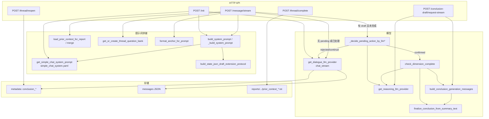

# Simple Chat V2：全提示词流程、数据流与函数索引

> 本文档仅基于当前代码阅读整理，**不修改任何业务代码**。  
> 路径以仓库根目录 `BeingDoing/` 为基准。

---

## 一、先回答你列出的具体问题

### 3）「引导语」= 前端直接给用户看、通常不经 LLM

按你的产品语义，**引导语**建议拆成三类（避免和「咨询师系统提示词」混淆）：

| 类型 | 含义 | 主要来源 | 是否 LLM |
|------|------|-----------|----------|
| **阶段壳文案** | 进入/完成某阶段时，产品层展示的欢迎、过渡句 | `src/backend/app/domain/prompts/templates/step_copy.yaml`（`intro` / `outro`） | 否 |
| **沉淀子步右侧引导** | Rumination 1–7 步进入时的说明（可含 `{row_count}` 等占位符） | `src/backend/app/domain/rumination_step_guidance.py` 中 `STEP_OPENING_FIXED_ZH`；第 4 步可走 LLM（`STEP_OPENING_MODE`） | 多数否；步 4 可 LLM |
| **表格/控件旁固定句** | 如「点确认后…」类 | `src/backend/app/utils/rumination_table_widgets.py` 等 | 否 |

**不属于「纯前端引导语」但用户也会看到：**

- **首轮咨询师开口**：`/init` 或首条 `/message/stream` 里 **assistant 的可见正文** 来自 **对话模型**（失败时用 `prompt_builder.build_fallback_opening_question` 的**本地固定句**，此时才是「无 LLM」）。

---

### 4）Rumination 里「多行」模板是什么逻辑？全选？随机一行？

**都不是。** 逻辑是：

1. 当前子步编号 `filter_step` ∈ [1, 7]。
2. 用 **`STEP_OPENING_FIXED_ZH[filter_step]`** 取**唯一一段**字符串模板（该模板在源码里为了可读性写成括号拼接的多行字符串，**运行时拼成一整段**）。
3. `render_fixed_opening_zh(step, ctx)` 用 `ctx.row_count`、`values_keywords`、`table_json` 做 `str.format`。
4. **没有**「从多句里随机挑一句」的分支；**没有**「多句并列全展示」的列表 UI——就是**一步一模板**。

补充：`STEP_OPENING_MODE` 决定该步是 `fixed` 还是 `llm`。默认仅 **第 4 步**为 `llm`，走 `build_4_opening_llm_messages`（注意：函数名带 `6` 是历史命名，实际在 `filter_step == 4` 时调用）。

---

### 5）`build_conclusion_generation_messages` 有没有被用？为何 values 额外一段？重复是否过多？

**有被使用。** 调用点包括：

- `check_dimension_complete`（生成结论 JSON 前组装消息）  
- `request_conclusion_draft_stream`（用户主动「确认稿」流式接口内）

**为何单独给 `values` 加 `values_extra`：**  
代码里仅在 `phase == "values"` 时追加「5 个核心价值观、优先原词、2–4 字」等说明（`dimension_completion_checker.py`）。其它阶段依赖：

- 通用的 `anti_fabrication`、`tone_tight`、`get_conclusion_rules(phase)`  
- 以及 `CONCLUSION_RULES["strengths"|"interests"|"purpose"]` 里已写的条数/形式要求  

历史原因通常是：**values 曾更容易被模型「编词」或拉长短语**，因此在生成链路里再加固一层；**确实存在与 `CONCLUSION_RULES["values"]` + `anti_fabrication` 的语义重复**，后续若重构可合并为单一「阶段生成规范」配置，**当前行为以代码为准**。

---

### 6）`CONCLUSION_CARD_GOALS` 是否还在使用？

**在使用。** 通过 `get_conclusion_card_goal(phase)` 被引用，例如：

- `conclusion_card_payload.build_pending_main_dialogue_system_addon`（pending 时 system 追加）  
- `dimension_completion_checker._validate_keywords_by_goal`、`_build_goal_fallback_summary`  
- `simple_chat_routes._pending_judge_goal_blurb`（pending 判定器里注入一行目标）  
- `context_refiner`（锚点提炼）

同文件中的 **`get_conclusion_rules_and_goals`**：当前 **仓库内无其它模块调用**（属可复用拼接函数，**未接线**）。

---

### 7）`DIMENSION_COMPLETION_CONFIG` 与三个函数的分工

| 函数 | 文件 | 是否调用 LLM | 作用 |
|------|------|----------------|------|
| **`check_dimension_complete`** | `dimension_completion_checker.py` | 是（通常 2 次：完成判定 + 生成 JSON） | 默认先问模型 `complete true/false`；若完成（或 `prior_conclusion` / `skip_completion_check` 跳过门闸），再 `build_conclusion_generation_messages` → 生成 raw 文本 → **`finalize_conclusion_from_summary_text`** |
| **`build_conclusion_generation_messages`** | 同上 | 否（只拼消息） | 拼「结论卡专用」`[system, user]`，**不含**主对话里的 STATE_JSON |
| **`finalize_conclusion_from_summary_text`** | 同上 | 否 | 把模型返回的字符串 **解析/纠错** 成结构化 `dict`（`merge_conclusion_payload`），供 API 与存储 |

**`DIMENSION_COMPLETION_CONFIG`** 提供：`label`、`goal`、`completion_criteria`、`summary_prompt_hint` ——  
用于 **完成判定 prompt** 与 **生成 user prompt** 里的「维度目标/收口提示」；与 `get_conclusion_card_goal` 的 `objective`、`validation` 是**另一套配置**，在流程里**叠加使用**（这也是你觉得「乱」的来源之一）。

---

### 8）`REJECTED_DRAFT_SUPERSESSION_LINE` 的语义：「再考虑」≠「不认同」？

原文意图（结合 `format_rejected_conclusion_injection` 的用法）更接近：

> 旧 **pending 草案** 不再作数；请主对话模型以**最新多轮对话**为准继续引导；当**再次**具备可确认收口时，在回复末输出 `pending_ready`。

其中「与当前总结一致并明确认可」应理解为：**与用户当下在对话里逐步形成、并口头认可的那份总结一致**——不是「必须认同被折叠掉的那张旧卡」。  
若产品文案让你联想到「卡死旧结论」，属于**措辞容易被误读**；从状态机看，用户「再聊聊」后 **`draft` 会清空**，模型应重新引导并**可以再次**输出 `STATE_JSON`（`pending_ready`）。

**实现细节：** `thread/reopen` 在仅有 pending 时，会把 `REJECTED_DRAFT_SUPERSESSION_LINE` **写进 metadata 的 `conclusion_feedback`** 前缀；随后某轮 `message/stream` 里 `format_rejected_conclusion_injection(rejected_feedback)` 又会**再拼一遍**同一常量 +「用户侧说明摘录：…」。因此 **feedback 里可能重复出现两行相同策略句**——属当前实现上的冗余，非业务必需。

---

### 9）`format_rejected_conclusion_injection` 的输入、示例、400 字截断

**签名：** `format_rejected_conclusion_injection(feedback_excerpt: str, *, max_len: int = 400) -> str`

**输入来源（真数据）：**

1. **用户在 pending 判定流里被判 `rejected`**：`rejected_feedback = user_content`，即用户**本轮输入的原始字符串**（例如：「不太对，我想改第三个词」）。  
2. **`POST /thread/reopen`（再聊聊）**：`feedback` 为后端拼好的长串（含 `[再聊聊]`、草案摘录等），之后也会进入 `conclusion_feedback`，下轮对话作为 `rejected_feedback` 读出。

**输出形态示例（路径 1，用户短句）：**

```text
上一版结论草案用户未采纳，以最新对话为准；请据此继续引导，待用户与当前总结一致并明确认可后，再在回复末输出 pending_ready（STATE_JSON）。
用户侧说明摘录：不太对，第三个词我想换成「自主」而不是「自由」。
```

**400 字截断：** 仅截 **`feedback_excerpt` 本体**；**常量策略行不截断**。若用户写极长说明，**可能丢失后半段**，模型看不到完整异议；若担心关键信息丢失，需产品侧限制输入长度或提高 `max_len`（改代码，本文档不动代码）。

---

## 二、「前端引导语」清单（可编辑文件）

| 文件 | 变量/结构 | 可编辑内容 |
|------|-----------|------------|
| `domain/prompts/templates/step_copy.yaml` | 各 `phase` 的 `intro` / `outro` | 阶段进入/完成展示文案 |
| `domain/rumination_step_guidance.py` | `STEP_OPENING_FIXED_ZH`, `STEP_OPENING_MODE`, `STEP_4_OPENING_*` | 沉淀子步引导；第 4 步是否 LLM |
| `utils/rumination_table_widgets.py` | 各步说明字符串 | 表格控件旁提示 |
| `api/v1/simple_chat/prompt_builder.py` | `build_fallback_opening_question` 内 `fallback_map` | **仅 LLM 失败时**可见的兜底开场 |

---

## 三、核心函数表（Simple Chat 相关）

### 3.1 `simple_chat_routes.py`（节选：建议优先对照源码行号）

| 函数 / 端点 | 关键变量 / 配置 | 功能 |
|-------------|------------------|------|
| `_build_system_prompt`（**本文件内 `def`，约 2428 行**） | `template_override`, `extra_goal_hint`, `prior_context` → `prior_block`；末尾 **protocol** | 拼主对话 system（YAML + STATE_JSON 协议）。**注意**：文件顶部虽 `import build_system_prompt as _build_system_prompt`，但被此后同名 `def` **遮蔽**，运行时以**本文件内实现**为准；与 `prompt_builder.build_system_prompt` 需人工对齐。 |
| `simple_chat_stream` | `CONCLUSION_REJECT_*`, `PENDING_*`, `cmeta` | SSE 主链路：pending 判定 → 主对话流 → 解析 STATE_JSON |
| `_decide_pending_action_by_llm` / `_streaming` | 内联 prompt 字符串 | 推理模型：confirmed / rejected / continue |
| `_read_conclusion_meta` / `_build_conclusion_meta_update` | `conclusion_state`, `conclusion_draft`, `conclusion_final`, `conclusion_feedback` | 结论状态读写 |
| `mark_thread_complete` | `next_phase` → `save_prior_context_for_report` | 阶段收尾、写 `prior_context_{下一阶段}.txt` |
| `reopen_thread` | `feedback` 拼接 | 「再聊聊」清 draft / 写 rejected 反馈 |
| `request_conclusion_draft` / `request_conclusion_draft_stream` | `build_conclusion_generation_messages`, `finalize_*` | 主动拉草案（含流式） |
| `rumination_step_opening` / `_stream` | `STEP_OPENING_*` | 沉淀引导语 GET/流式 |
| `rumination_table_submit` / `rumination_get_table` | progress 快照 | 表格数据与子步推进 |

**模块级常量（可编辑）：**  
`CONCLUSION_REJECT_SYSTEM_NUDGE`、`CONCLUSION_REJECT_NUDGE_USER_TURNS`、`MAX_HISTORY_TURNS`、`SIMPLE_QUESTION_SAMPLE_SIZE`（部分与 `prompt_builder` 重复定义，以各自引用为准）。

### 3.2 `api/v1/simple_chat/prompt_builder.py`

| 函数 | 变量 | 功能 |
|------|------|------|
| `get_random_questions_for_phase` | `SIMPLE_QUESTION_SAMPLE_SIZE`, `question.md` | 题库抽样 |
| `get_or_create_thread_question_bank` | metadata `question_bank` | 同线程固定题库 |
| `build_system_prompt` | 同 `_build_system_prompt` | 与路由内函数并行存在，供统一引用 |
| `build_fallback_opening_question` | `fallback_map` | LLM 失败兜底可见句 |

### 3.3 `api/v1/simple_chat/context_resolver.py`

| 函数 | 功能 |
|------|------|
| `resolve_report_context` | 激活码 + phase + thread → report、category、conv_manager |
| `load_prior_context_from_activation` | 读 `prior_context_{phase}.txt` 或合并规则 |
| `storage_category` | `{phase}__{thread_id}` 存储键 |

### 3.4 `api/v1/simple_chat/stream_utils.py`

| 函数 | 功能 |
|------|------|
| `split_visible_reply_and_state` | 从完整回复拆 `[STATE_JSON]` |
| `strip_hidden_blocks_for_stream` / `build_stream_hidden_block_filter` | 流式隐藏协议块 |
| `extract_json_object` / `extract_state_content_tokens` | pending 判定器解析备用 |

### 3.5 `api/v1/simple_chat/llm_providers.py`

| 函数 | 功能 |
|------|------|
| `get_dialogue_llm_provider` | 主对话（非 reasoner） |
| `get_reasoning_llm_provider` | pending 判定、结论 JSON 生成 |

### 3.6 `utils/survey_storage.py`

| 函数 | 变量 | 功能 |
|------|------|------|
| `load_prior_context_for_report` | `PRIOR_CONTEXT_MAX_CHARS` | 按 report 读 prior；purpose/rumination 合并 |
| `save_prior_context_for_report` | `prior_context_{phase}.txt` | 写入单文件 |

### 3.7 `domain/conclusion_card_payload.py`

| 符号 | 功能 |
|------|------|
| `REJECTED_DRAFT_SUPERSESSION_LINE` | 注入模型的策略句（见上文语义说明） |
| `build_state_json_draft_extension_protocol` | STATE_JSON 里各 phase 扩展字段说明 |
| `sanitize_pending_conclusion_draft` | pending 落库前清洗 |
| `build_pending_main_dialogue_system_addon` | pending + continue 时 system 追加 |
| `format_rejected_conclusion_injection` | 无 pending 时拼「备注」类 assistant 消息给模型看 |

### 3.8 `domain/conclusion_card_goals.py`

| 符号 | 功能 |
|------|------|
| `CONCLUSION_CARD_GOALS` | objective、validation、must_capture |
| `CONCLUSION_RULES` | 生成结论时的长规则串 |
| `get_conclusion_rules` | 被 `build_conclusion_generation_messages` 使用 |
| `get_goal_prompt_hint` | 生成 user prompt 内「目标+必须覆盖」 |
| `get_conclusion_rules_and_goals` | **当前无调用方** |

### 3.9 `domain/dimension_completion.py`

| 符号 | 功能 |
|------|------|
| `DIMENSION_COMPLETION_CONFIG` | 完成判定 + 生成段用的 label/goal/criteria/hint |

### 3.10 `core/dimension_completion_checker.py`

| 函数 | 功能 |
|------|------|
| `check_dimension_complete` | 门闸 + 生成 + finalize |
| `build_conclusion_generation_messages` | 仅拼消息 |
| `finalize_conclusion_from_summary_text` | 解析模型输出为 payload |

### 3.11 `domain/prompts/templates`（LLM 系统侧）

| 文件 | 状态 |
|------|------|
| `simple_chat_system.yaml` | **主对话**咨询师流程（Jinja：`phase`, `question_bank`, `basic_info`, `prior_block`） |
| `step_copy.yaml` | **仅 API 返回前端**，不进 LLM |
| `pending_conclusion_reply.yaml` | **未接线**（无调用） |

### 3.12 其它与 Simple Chat 相邻

| 模块 | 功能 |
|------|------|
| `utils/context_refiner.py` | 锚点 `[此前对话要点]` |
| `domain/rumination_step_guidance.py` | 沉淀引导语与步 4 LLM |
| `utils/rumination_*` | 表格生成、过滤、提交 |

---

## 四、主调用链路图（含分支）



**分支文字说明：**

1. **`simple_chat_stream` 入口**：解析 `activation_code`、`phase`、`thread_id` → `_resolve_report_context`。  
2. **若 `cmeta.draft` 存在且线程未完成**：先 **pending 判定器**（推理模型）；`confirmed` 则 **`check_dimension_complete`**（内部可能再两次 LLM）；否则合并用户话术后走主对话。  
3. **主对话**：对话模型流式输出 → 去掉 `[STATE_JSON]` 对用户可见 → 若解析到 `pending_ready` → 更新 `metadata` 并 SSE 推 `dimension_conclusion`（草案）。  
4. **`thread/complete`**：用户确认本阶段报告完成 → 写 **`prior_context_{下一阶段}.txt`**。  
5. **`thread/reopen`**：清 pending / 写 `rejected` + `feedback`。

---

## 五、输入输出「真数据」形态示例（非仅类型名）

### 5.1 对话文件 metadata（结论相关，简化）

```json
{
  "conclusion_state": "pending",
  "conclusion_draft": {
    "summary": "你目前最看重的是成长与自主，其次是在协作中被信任的感觉。",
    "keywords": ["成长", "自主", "信任", "意义感", "稳定"]
  },
  "conclusion_final": null,
  "conclusion_feedback": "",
  "conclusion_shown_at_turn": 12,
  "thread_completed": false,
  "question_bank": "1. …\n2. …",
  "question_bank_phase": "values"
}
```

`rejected` 后常见：

```json
{
  "conclusion_state": "rejected",
  "conclusion_draft": null,
  "conclusion_final": null,
  "conclusion_feedback": "上一版结论草案用户未采纳…\n[再聊聊] 用户折叠结论卡… 摘录：…",
  "conclusion_reject_baseline_user_count": 12
}
```

### 5.2 模型主对话末尾 STATE_JSON（用户不可见块）

```text
（前面是可见中文咨询段落）

[STATE_JSON]
{"state":"pending_ready","draft":{"summary":"……","keywords":["a","b"]}}
[/STATE_JSON]
```

### 5.3 `check_dimension_complete` 使用的 `conversation_history` 元素

```python
{"role": "user", "content": "我觉得成长和自主最重要。"}
{"role": "assistant", "content": "……"}
```

最近 **20 条**拼进 user prompt。

### 5.4 `prior_context_strengths.txt` 自动写入示例（values 完成后）

```text
【信念 阶段结果】
你确认了五个价值观：成长、自主、信任、意义感、稳定。
关键词：成长、自主、信任、意义感、稳定
```

（实际 `summary` 以模型/用户为准，此处仅示意。）

### 5.5 pending 判定器期望的模型输出（token 形式）

```text
<STATE>continue</STATE>
<CONTENT>我还不确定你是否确认，我们继续聊一聊更稳妥。</CONTENT>
```

---

## 六、刻意标注：当前「未使用 / 易混淆」项

| 项 | 说明 |
|----|------|
| `pending_conclusion_reply.yaml` + `get_pending_conclusion_injection` | **未接线** |
| `get_conclusion_rules_and_goals` | **无调用方** |
| `simple_chat_routes._build_system_prompt` vs `prompt_builder.build_system_prompt` | **两段重复实现**（路由内定义遮蔽 import），改 `[输出协议]` 时**两处都要检查** |
| `rumination_step_guidance.build_step_4_opening_llm_messages` | 仅在 **step==4** 调用，函数名遗留 |

---

## 七、文档版本

- 梳理范围：`simple_chat` 主链路、结论卡、prior 文件、rumination 引导语及相关模块。  
- 生成日期：以仓库当前代码为准；若后续重构函数名或合并 prompt，请同步更新本节与函数表。
