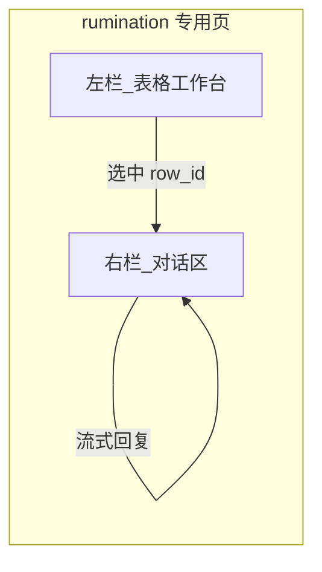

# Rumination（第 5 步）左右分栏布局 — 开发计划

> 文档版本：2026-04-02  
> 依据：`uidesign/prompt/new-rumination.md`、`wiki/rumination2.0改进方案.md`、`.cursor/20260329-rumination新版.md`、当前仓库实现。

---

## 1. 问题陈述：为什么现在「不对」

### 1.1 产品/设计期望（原始需求）

以下在多份文档中一致：

| 来源 | 要求 |
|------|------|
| [new-rumination.md](../uidesign/prompt/new-rumination.md) §2 页面概览 | **左侧**：可编辑表格（核心数据载体）；**右侧**：对话框（流程引导 Cue + 基于选中行的细节对话）。 |
| [wiki/rumination2.0改进方案.md](../wiki/rumination2.0改进方案.md) §2.1 | 左右分栏：**左 table panel / 右 chat panel**；表格与对话**同屏并行**；行点击高亮 + 行级对话。 |
| [wiki §4.2.1](../wiki/rumination2.0改进方案.md) | `phase === 'rumination'` 时**分支布局**，**隐藏通用 `ChatPhaseSidebar`**，主体 `flex row`：左表格工作台、右对话区。 |

### 1.2 当前实现（v1 / 现状）

文件：[src/frontend/app/(main)/explore/chat/[phase]/page.tsx](../src/frontend/app/(main)/explore/chat/[phase]/page.tsx)

- 与 values～purpose **相同骨架**：左侧 **`ChatPhaseSidebar`（线程列表）** + 右侧 **单列对话流**（`flow-chat-body`）。
- `RuminationTableWidget` 作为 **`messages` 里的一条 `table_widget` 消息**，插在**竖向滚动**的对话时间线中，与 AI/用户气泡混排。
- 结果：表格不在独立「左栏」，视觉上仍是「单栏聊天 + 中间/偏左大块表格」，与「左表右聊」的信息架构不一致；侧栏还被线程列表占用，进一步偏离设计稿。

**结论**：不是「rumination 格式坏了」，而是 **UI 布局从未按计划做成左右分栏**；后端 API、`rumination_progress`、`table_widget` payload 仍可复用，**首要缺口在前端页面结构**。

---

## 2. 目标架构（对齐设计）

- **仅 `phase === 'rumination'`** 启用该布局；前四维保持现有「侧栏 + 单栏对话」。
- **左栏**：固定展示当前步表格（`RuminationTableWidget` 或拆出的 `RuminationTableWorkbench`）；底部/表内 **Confirm**；可选 **进度条**（与 `RuminationSectionProgress` / 6 步对齐）。
- **右栏**：仅渲染 **文本消息流**（用户/助手气泡 + 流式输入），**不再**把 `table_widget` 当作一条「聊天消息」插在中间（表格永远在左栏同步更新）。
- **线程**：rumination 若仍需多线程，可改为 **左栏上方窄条** 或 **右栏顶部下拉**，避免再占一整条纵向 `ChatPhaseSidebar`（与 wiki「隐藏侧栏」一致）；若产品确认 rumination 单线程，可直接隐藏侧栏。

---

## 3. 分阶段任务

### 阶段 A — 布局壳（P0，纯前端）

| # | 任务 | 说明 |
|---|------|------|
| A1 | 在 `page.tsx` 对 `rumination` 分支渲染 | `if (phase === 'rumination')` 返回独立外层：无 `ChatPhaseSidebar`（或收缩为顶栏），主体 `flex flex-row gap-* min-h-0`。 |
| A2 | 左栏容器 | `flex-[0_0_42%]`～`50%`（按设计微调），`min-w-0`，内部 `overflow-auto`，毛玻璃卡片包 `RuminationTableWidget`。 |
| A3 | 右栏容器 | `flex-1 min-w-0`，复用 `flow-chat-body` / `FlowAiMessage` / 输入框逻辑，**宽度约束**与现有一致（`max-w-*` 可按右栏调整）。 |
| A4 | 背景 | 继续复用 `ChatPhaseBackground`；左右栏 z-index、边框与 [flow-chat-light.css](../src/frontend/styles/components/flow-chat-light.css) 协调。 |

验收：进入 rumination 即看到稳定左右分栏，无表格塞进消息流中间。

### 阶段 B — 数据流：表格与消息解耦（P0）

| # | 任务 | 说明 |
|---|------|------|
| B1 | 单一数据源 | 用 `useState`/`useRef` 保存 **当前表格 payload**（来自 `getTable` 或 `submitTable` 的 `next_table_widget`），**不依赖** `messages.find(table_widget)` 驱动左栏。 |
| B2 | 初始化 | 保留现有 `ruminationApi.getTable`；结果写入 `tablePayload` state，并可选把首条引导语写入 `messages`。 |
| B3 | 确认后更新 | `handleTableConfirm` 成功后用 `next_table_widget` **更新 `tablePayload`**，右栏可追加一条简短系统提示或依赖 AI 下一条流式回复（产品定）。 |
| B4 | 历史消息中的 `table_widget` | 从流式同步逻辑里 **停止** 往 `messages` 里 `push` 整块表格消息；若需兼容旧 localStorage，可做迁移：启动时若发现 `table_widget` 消息则提取 payload 到 state 并清掉该条。 |

验收：左栏表格随确认步骤变，右栏不再出现第二块重复表格消息。

### 阶段 C — 行选中与行级对话（P1）

| # | 任务 | 说明 |
|---|------|------|
| C1 | `RuminationTableWidget` | 增加 `selectedRowId`、`onRowSelect`；行 `tr` 点击高亮（设计稿蓝色选中态）。 |
| C2 | 发送消息时带上下文 | 在 `handleSend` / 构建 `message` 时拼接 **当前 step 主题 + 选中行字段**（与 new-rumination「对话主题限定于当前步骤与该行」一致）；若后端要结构化字段，再扩展 [rumination.ts](../src/frontend/lib/api/rumination.ts) 与 `simple_chat.py` 请求体。 |
| C3 | 未选中行时 | 右栏仍可模块引导；可选禁用输入或提示「请先选中一行」。 |

### 阶段 D — 视觉与体验（P1）

| # | 任务 | 说明 |
|---|------|------|
| D1 | 左栏磨砂玻璃 | 降低 `backdrop-blur` / 不透明度，对齐「更薄毛玻璃」与截图白色高级感（与之前 UI 反馈一致）。 |
| D2 | 右栏气泡边距 | 避免内容贴左：右栏内对话区保持 `pl/pr` 或 `max-w` 居中。 |
| D3 | 进度条 | 在「最终决策 / 卡牌」与表格之间或标题区下方，增加 **6 步渐变进度条**（蓝→红）；百分比 = 当前 `filter_step` 映射到 6 段（需与后端 step 编号对齐文档）。 |
| D4 | 确认按钮 | 明确放在左栏表格卡片内；随 `editable`/`disabled` 与后端 `guideText` 一致。 |

### 阶段 E — 后端与协议（按需）

| # | 任务 | 说明 |
|---|------|------|
| E1 | 若仅前端拼接行上下文 | 阶段 C 可不改 API。 |
| E2 | 若需 `row_id` + `filter_step` 正式字段 | 扩展 simple_chat rumination 请求模型 + prompt 模板变量。 |
| E3 | rumination2.0 流程差异 | 大改过滤步骤时同步 [rumination_progress.py](../src/backend/app/utils/rumination_progress.py)、[rumination_ops.py](../src/backend/app/utils/rumination_ops.py) 与 wiki §4.1；**与左右分栏可并行**，但产品上要分清「布局先行」还是「流程先行」。 |

---

## 4. 关键文件清单

| 路径 | 角色 |
|------|------|
| [page.tsx](../src/frontend/app/(main)/explore/chat/[phase]/page.tsx) | rumination 分支布局、state 拆分、确认与发送逻辑 |
| [RuminationTableWidget.tsx](../src/frontend/components/explore/RuminationTableWidget.tsx) | 表格 UI、行选中、Confirm |
| [RuminationSectionProgress.tsx](../src/frontend/components/explore/RuminationSectionProgress.tsx) | 可复用或扩展为 6 步渐变条 |
| [rumination.ts](../src/frontend/lib/api/rumination.ts) | API 类型与调用 |
| [flow-chat-light.css](../src/frontend/styles/components/flow-chat-light.css) | 右栏气泡与间距 |
| [simple_chat.py](../src/backend/app/api/v1/simple_chat.py) | 仅当扩展行上下文协议时修改 |

---

## 5. 风险与依赖

- **侧栏移除**：多线程用户习惯变化 — 需产品确认 rumination 是否多对话线程。
- **localStorage 旧数据**：`explore_threads_*` 与消息里嵌套表格并存时，需一次性迁移或兼容读取。
- **移动端**：左右分栏在小屏可降级为 **上表下聊**（`flex-col`），同一套 state。

---

## 6. 建议排期

1. **Sprint 1**：阶段 A + B（可演示「左表右聊、确认换表」）。  
2. **Sprint 2**：阶段 C + D。  
3. **Sprint 3**：阶段 E + rumination2.0 流程（若与布局拆分）。

---

## 7. 参考文档索引

- [uidesign/prompt/new-rumination.md](../uidesign/prompt/new-rumination.md) — 左右区域职责、每步表格/确认/行点击  
- [wiki/rumination2.0改进方案.md](../wiki/rumination2.0改进方案.md) — v1 现状、目标、§4.2 前端改造要点  
- [.cursor/20260329-rumination新版.md](../.cursor/20260329-rumination新版.md) — 表格为中心、步骤状态机  
- [.cursor/plans/rumination_与探索流程增强_1f73f7a4.plan.md](../.cursor/plans/rumination_与探索流程增强_1f73f7a4.plan.md) — 历史计划片段  

---

*本文档由仓库现状与上述历史需求整理而成，用于对齐「最初要的左右分开布局」与后续迭代任务拆分。*
