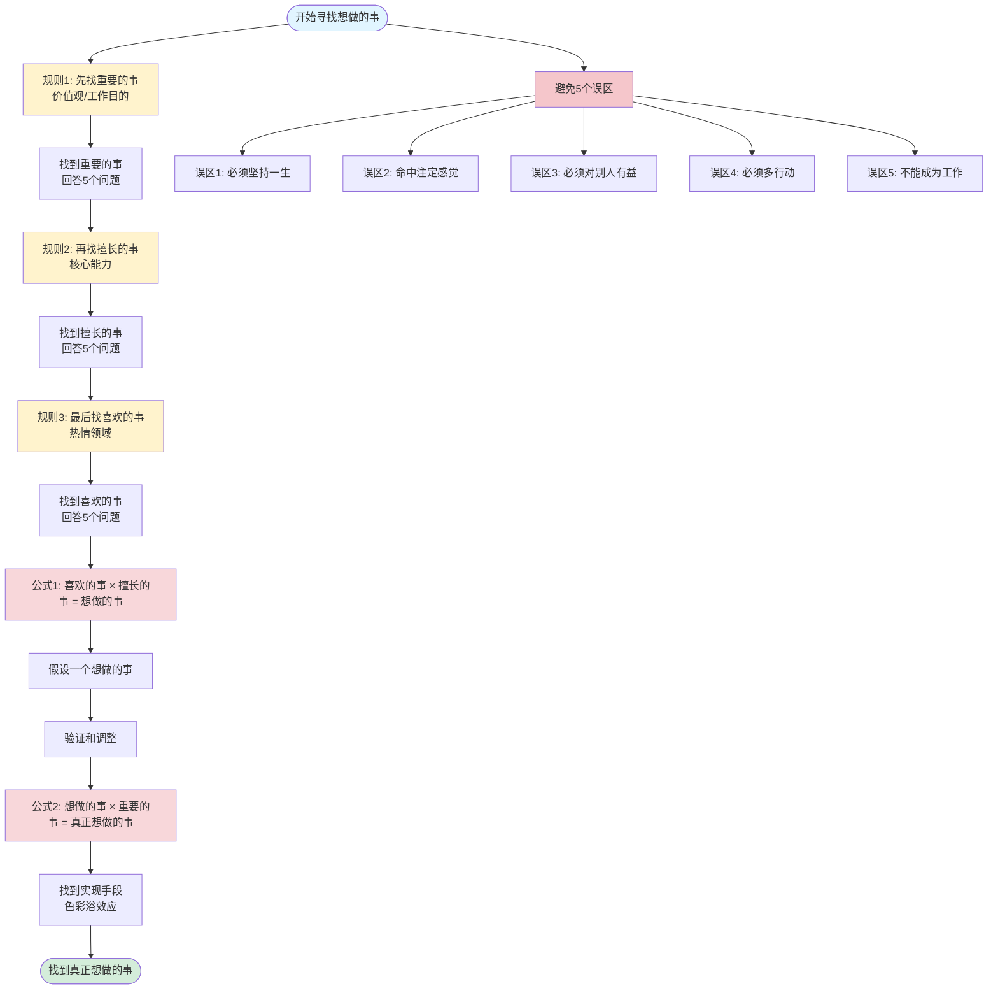
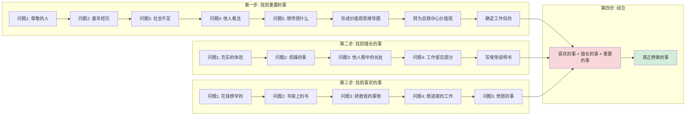

# 《如何找到想做的事》笔记整理

## 📌 核心公式

### 公式1：基础公式
```
喜欢的事 × 擅长的事 = 想做的事
```

### 公式2：完整公式
```
喜欢的事 × 擅长的事 × 重要的事 = 真正想做的事
```

### 公式解析
- **What（做什么）** = 喜欢的事
- **How（怎么做）** = 擅长的事
- **Why（为什么）** = 重要的事（价值观/工作目的）

---

## 🎯 核心结论类

### 核心概念定义

#### 1. 喜欢的事
- **定义**：指向"自己有热情的领域"
- **特征**：人在面对自己喜欢的领域的事情时，无法对其中产生的疑问置之不理，而是想把"不明白的事情"弄"明白"。想填补这种差距的心情就是"喜欢"（兴趣）
- **区分**："因为有用所以喜欢的事"不能作为工作，"因为兴趣所以喜欢的事"可以作为工作

#### 2. 擅长的事
- **定义**：自然而然就比别人做得好，做起来不觉得痛苦，令人心情舒畅的事
- **特征**：是思维习惯和心理习惯，对你来说是"无意识"的，所以很难捕捉到
- **与技能的区别**：
  - "擅长的事"是天生就会的，而"技能和知识"是后天学习掌握的
  - 只要学会使用"擅长的事"，就能应用到任何工作中，而"技能和知识"只能在特定的工作中使用
- **注意**：很多时候，"技能和知识"原本不过是充实人生的手段，不知不觉间却变成了目的

#### 3. 重要的事（价值观）
- **定义**：决定了自己的生活方式；面向他人或社会等外在时，就决定了工作目的
- **特征**：即使没有得到别人的共鸣，只要你自己认为"我想以这种方式生活！"，那就是真正的价值观
- **示例**："想自由地生活""想对人温柔地生活""想安心地生活""想稳定地生活""想充满热情地生活"等都是"重要的事"

### 核心原则

1. **成事公式**：成事=易力+毅力。易力是做自己热爱之事而产生的愉悦感，是你忍不住想要做一件事，是你做这件事时感到自己很强大。在这之后，才是毅力。

2. **判断标准**：不要把自己的判断标准建立在外部的"以他人为中心的坐标轴上"，必须切换到自己内心的"自我中心坐标轴"上。

3. **工作目的**：如果对于工作目的，你能从心底里说出"我是为此而工作的！"，那么工作目的是什么都可以。

4. **成功定义**：真正的幸福并不是得到金钱或名誉。如果对现在这一瞬间所做的事情感到充实才是幸福，才是人生的成功。

5. **失败观**：掌握自我认知法，今后再也不会失败。失败经历可以变成经验，帮助认识自己。

6. **动力保持**：自己不会厌倦是绝对条件。思考怎样用自己想做又不会厌倦的事给他人带去快乐，才是真正的工作。

---

## ⚠️ 误区类（5个常见误区）

### 误区1：必须是能坚持一生的事
- **错误观点**：找到"想做的事"必须是一生的事业
- **正确观点**：找到"想做的事"并不意味着把它作为一生的事业，而是当作"现在最想做的事"

### 误区2：找到想做的事时会有命中注定的感觉
- **错误观点**：找到想做的事会有"命中注定"的感觉
- **正确观点**：实际上大部分情况下即使找到"想做的事"，你开始也只会觉得"嗯？或许挺有趣的"，即仅处在感兴趣的阶段
- **类比**："双方因恋爱顺遂自然而然地结婚，婚后便不再为这段关系努力，导致对婚姻的满意度下降"。相亲结婚的情况则是"在不知道能否顺利进行的前提下开始接触，双方都在努力接近对方，因此满意度会上升"

### 误区3：必须是对别人有益的事
- **错误观点**：想做的事必须是受人称赞的、了不起的事
- **正确观点**：马上放弃"想做的事必须是受人称赞的、了不起的事"这样的想法。强行压抑自己，为别人而努力，只是自我牺牲。"想做的事"，不仅自己乐在其中，而且可以持续帮助别人，收获成长和别人的感谢，处于自利和利他的良性状态中

### 误区4：必须多行动才能找到
- **错误观点**：如果不知道自己想做的事是什么，就只能试着先行动了
- **正确观点**：如果没有明确的选择标准，你也许会被"现在这个很受欢迎""价格便宜"等与"自己想穿的衣服"不符的信息所影响。我们需要明确自己的"选择标准"。选择标准只存在于自己内心，所以为了明确选择标准，我们需要先了解自己

### 误区5：想做的事不能成为工作
- **错误观点**：想做的事无法成为工作
- **正确观点**：如果连实现手段都必须自己考虑的话，就很难找到"想做的事"了。所以在寻找"想做的事"的阶段，不需要将实现手段也考虑进去，那是之后要做的事

---

## 📋 方法类

### 自我认知法规则（3个）

#### 规则1：把"喜欢的事"作为工作的想法是错误的
- **原因**："凭借喜欢的事生活"这种说法有一个很大的问题，那就是想把"喜欢的事"作为工作的人，往往会因为迷失了"工作目的"而失败
- **正确做法**："喜欢的事"是手段，要先找到"重要的事"

#### 规则2：在寻找"喜欢的事"之前，先找到"擅长的事"
- **原因**：找不到"想做的事"的最大原因是"即使找到了也无法将其变成工作"的思考局限
- **方法**：思考"如果什么都能做到的话，我会做什么呢？"
- **目的**：让人有"只要用自己擅长的事，什么工作都可以做"的自信

#### 规则3：不要考虑"实现手段"
- **观点**：公司只是为了接近你人生目的的实现手段。如果觉得在那家公司无法实现自己的理想，就应该改变实现手段

### 找到"重要的事"（价值观）的方法

#### 步骤一：回答5个问题，找出价值观关键词
1. **问题1**：你尊敬的人、尊敬的朋友、喜欢的角色分别是谁？你尊敬或喜欢他们哪些地方？
   - 你尊敬的人是能反映出你价值观的人。如果尊敬的人有很多，请思考一下你尊敬他们的哪些特质。如果能在每个人身上找到共同的价值观，那它们对你来说就是非常重要的价值观

2. **问题2**：在小时候和青春期阶段的事情或经历，对现在的你影响最大的是什么？对你的价值观造成了什么影响？

3. **问题3**：你觉得现在的社会有什么不足？
   - 填补理想和现实之间差距的是你"想做的事"

4. **问题4**：问一下周围的人："你觉得我在人生中比较看重什么？"

5. **问题5**："培养孩子，或者给别人建议时你最想告诉他们的是什么？最不想告诉他们的是什么？"
   - 不想传授的内容也逐条写出来吧。比如"不愿想象能说出这种话的自己"，如果有这样的感受是最好的

#### 步骤二：形成价值观思维导图
- 将5个问题的答案整理成思维导图

#### 步骤三：从"以他人为中心"的价值观转变为"以自我为中心"的价值观
- **区分标准**：因为能否出名这件事自己无法控制，所以这是以他人为中心的价值观，但是跟随自己的好奇心生活是自己可以控制的，所以是以自我为中心的价值观
- **核心观点**：实际上，越是追求以自我为中心的价值观，就越容易实现以他人为中心的价值观
- **示例价值观**：
  1. 审美意识：过着美好的生活
  2. 热爱：热衷于想做的事
  3. 成果：追求成果，也给别人带去好的成果
  4. 好奇心：随兴趣行动
  5. 简单：过少有彷徨、潇洒的生活

#### 步骤四：辨别"真正的价值观"和"虚假的价值观"
- **方法**：即使没有得到别人的共鸣，只要你自己认为"我想以这种方式生活！"，那就是真正的价值观

#### 步骤五：确定工作目的
- **作用**：工作目的确定后，工作自然顺利进行
- **示例**：RIZAP集团的负责人迎先生说："RIZAP并不只是让人变瘦的减肥中心。我们的价值是通过RIZAP改变客户的人生，让他们散发光芒、充满自信、感受幸福。我认为提供这些价值是我们的工作。"

### 找到"擅长的事"的方法

#### 回答5个问题
1. **问题1**：在迄今为止的人生中，你觉得充实的体验是什么？
   - 做的时候感到充实的是"擅长的事"，相反，感到疲劳的就是"不擅长的事"

2. **问题2**：最近让你感到烦躁或是心慌的是什么事？

3. **问题3**：问身边亲近的人："你认为我的长处是什么？"

4. **问题4**：如果明天辞职了，之前的工作中有没有你留恋的部分呢？如果你现在没有工作，请思考之前工作中的细节

5. **问题5**：（需要补充）

#### 归纳方法
- **方法**：归纳自己的长处，写一份《自己的使用说明书》

#### 转换视角
- **方法**：由"努力改变自己"变成"努力发挥自己的长处"
- **示例**："正因为认生，我才能认真地和重要的人相处""正因为认生，我才能拥有独立思考的时间"，一瞬间就把缺点转换成优点了

### 找到"喜欢的事"的方法

#### 回答5个问题
1. **问题1**：你现在有即使花钱也想学习的事情吗？

2. **问题2**：在你的书架上摆放着什么类型的书？
   - 这时的重点不是关注"因为有用所以在意"的书，而是注意"不知为何很在意"的书

3. **问题3**：有没有遇到过让你产生"真是太好了！""它拯救了我！"这种感觉的领域或者事物？

4. **问题4**：在迄今为止的生活中，你"想道谢的工作"是什么？

5. **问题5**：迄今为止你会对社会中的什么事情感到愤怒？
   - 在你会感到愤怒的那个领域工作，自然就会产生动力，所以我非常推荐你回答这个问题

### 找到"想做的事"的方法

#### 步骤一：用喜欢的事×擅长的事的方法，先假设一个自己想做的事
- **观点**："想做的事"即使是"假设"也没关系

#### 步骤二：验证和调整
- **方法**：通过实践验证假设，如果不合适就调整

#### 找到实现手段的方法
- **色彩浴效应**：如果刻意关注一些事物，那么与之相关的事物就会很自然地映入你的眼帘
- **应用**：确定好"想做的事"之后，色彩浴效应开始发挥作用，实现"想做的事"所需的信息就会源源不断地冒出来。浏览信息时竖起"天线"，关注对自己想做的事有用的信息，从而不断地将它们收集起来

### 辅助方法

#### 无法很好地回答出问题时的两种应对方法
1. **书写冥想**
2. **提问对话**

---

## 💡 说明类

### 关于"想做的事"的本质

1. **组合性**："想做的事"是"做什么(What)×怎么做(How)"的组合。What=喜欢的事，How=擅长的事
   - 示例：What=时尚，How=做东西，What×How=做与时尚相关的东西

2. **不是职业名**：如果问"你想做的事是什么？"，有人会说"我想成为YouTuber"，但是，"我想成为YouTuber"正如其字面意思，是"想成为的人"，而不是"想做的事"。我不推荐以职业名来考虑自己"想做的事"

3. **灵活性**：考虑做让人发笑的工作时，会看到之前没想过的道路。而且，即使一条道路被封锁了，也能继续挑战其他道路

### 关于判断标准

1. **VUCA时代**：VUCA是由"易变性(Volatility)""不确定性(Uncertainty)""复杂性(Complexity)""模糊性(Ambiguity)"四个词对应英文的首字母组成的缩写

2. **危险思维**：最危险的是基于"走哪条路最有利？"这种思维来做判断。现在你认为"走这条路有利"的选择，在10年、20年后，很有可能就没有价值了

3. **逻辑vs直觉**：不是靠"直觉"，而是靠"逻辑"找到想做的事。有品位的人靠直觉选出的衣服会很时尚，但没有品位的人凭直觉只会选出俗气的衣服。没有品位的人想变得时尚，需要先学习如何变得时尚，再把单品一个个地配齐

### 关于工作选择

1. **就职和跳槽时的应用**：
   - 喜欢的事→为什么选择这个行业呢
   - 擅长的事→怎么在这份工作中取得成果
   - 重要的事→为什么选择这家公司

2. **工作目的的重要性**："重要的事"就决定了自己的生活方式；面向他人或社会等外在时，"重要的事"就决定了工作目的

### 关于长处

1. **哈罗效应**：哈罗效应是指想象"一个人如果某一点特别优秀，那其他方面也一定很棒"。比如，看到五官端正的人，会不会觉得他工作能力也不错呢？这就是哈罗效应。因此，即使你有缺点，如果你有一个突出的优点，周围的人也会认为你是优秀的人

2. **核心原则**："唯有长处才能产生成果。而抓住弱点，只会造成令人头痛的问题

---

## 📖 举例类

### 作者自身案例

1. **作者的工作**：
   - 擅长的事：构建体系并传授给别人
   - 喜欢的事：自我认知
   - 想做的事：构建自我认知体系并传授给别人
   - 真正想做的事：为了让更多的人热爱生活，构建自我认知体系并传授给别人

2. **失败经历**：我在便利店打工被炒鱿鱼的失败经历，让我意识到了自己不擅长按照别人的指示完成既定工作，这段经历变成了经验。我能开公司，只和自己喜欢的人打交道，过自由自在的生活，都是拜这段经历所赐

3. **价值观转变**：我跟随着自己的"好奇心"，不断学习并向外输出，自然而然地提高了知名度，逐渐实现了原本以他人为中心的价值观——"想出名！"。若是以"出名"为目的的话，估计我只会做一些看起来确实会成功的事情

### 他人案例

1. **追求成长的价值观**：在成长过程中，他的父母一直教育他"不进步是不行的"，灌输给他"追求成长"的价值观。受此影响，至今为止他都在以"能让自己获得成长"为标准来找工作，即使很累，他也为了追求成长而咬紧牙关。因为他认识到不重复做同样的事情，每天都有新的"觉察"（发现）是自己最开心的状态

2. **RIZAP案例**：RIZAP集团的负责人迎先生说："RIZAP并不只是让人变瘦的减肥中心。我们的价值是通过RIZAP改变客户的人生，让他们散发光芒、充满自信、感受幸福。我认为提供这些价值是我们的工作。"

3. **研讨会案例**：在举办研讨会的过程中，一开始我感觉很开心，但慢慢地又变得痛苦起来。原因是"每次研讨会上都要说同样的话"

4. **客户反馈**：一位听过自我认知法的客户对我说过这样的感想："我明明烦恼了半年，但是用了这张图后只花了一天时间就找到了自己的道路。"

5. **客户变化**：通过"自我认知法"找到自己"想做的事"的客户都像变了个人一样，和我最初见到他们的时候完全不同，不但变得容光焕发，生活也充实起来，可以自信地说出"这就是我想做的事！"

### 生活状态举例

1. **理想状态**：现在我早上醒来时，一想到"今天也要做想做的事"，就雀跃不已。白天一直专注于想做的事，到了晚上睡觉前，我就会带着"想做的事都做完了"的充实感入睡。我并没有发生改变，我只是找到了发挥能量的地方——"想做的事"

2. **恶性循环**：
   - 第一种恶性循环：通过花钱缓解工作带来的压力。比如出席可有可无的酒局，参加娱乐活动，买不必要的名牌衣服等，花钱的方式总是无穷无尽的
   - 第二种恶性循环：因为对工作没兴趣，也就没有学习动力，所以无法成长。一到家就拿着手机不停地刷YouTube，懒散度日。打发时间的娱乐活动有很多，如果没有明确"想做的事"，只会一直浪费时间

3. **不自由的状态**：随着年龄增长，人们会被来自外部期待的"应该做的事"所束缚。明确"想做的事"的人能够掌握自己所需的技能和知识，变得更加自由。相反，被"应该做的事"束缚的人，碍于情面和传统观念，变得越来越不自由，然后转头教育年轻人："学生时代是最快乐的时候，趁现在好好玩吧！"

---

## 🔄 流程图

### 📝 渲染说明

以下流程图使用 **Mermaid** 格式，支持 GitHub、GitLab、VS Code（需扩展）、Typora、Obsidian 等编辑器。

如果无法渲染，可以：
1. 安装 Mermaid 扩展插件
2. 使用在线工具查看：https://mermaid.live/
3. 参考下方的文本描述

### Mermaid流程图



### 详细步骤流程图



---

## 📝 实践建议

### 执行顺序
1. **第一步**：找到"重要的事"（价值观/工作目的）
2. **第二步**：找到"擅长的事"（核心能力）
3. **第三步**：找到"喜欢的事"（热情领域）
4. **第四步**：用公式组合，假设"想做的事"
5. **第五步**：验证和调整
6. **第六步**：找到实现手段

### 关键提醒
- 不要考虑实现手段（规则3）
- 避免5个常见误区
- 从"以他人为中心"转为"以自我为中心"
- "想做的事"即使是假设也没关系
- 不要以职业名来考虑"想做的事"
- 区分"擅长的事"和"技能知识"

---

## 📚 参考资源

- 书籍：《如何找到想做的事》[日]八木仁平
- 笔记来源：微信读书（131个笔记）

---

## 🔧 流程图修复说明

已修复的语法问题：
1. ✅ 移除了公式中的特殊字符（× 符号）
2. ✅ 优化了 subgraph 标签格式（使用引号包裹中文）
3. ✅ 简化了节点标签中的引号使用

如果仍然无法渲染，请检查：
- Markdown 编辑器是否支持 Mermaid
- 是否需要安装 Mermaid 扩展
- 语法是否符合 Mermaid 规范

### 在线查看工具

如果您的编辑器不支持 Mermaid，可以使用在线工具查看：
- **Mermaid Live Editor**: https://mermaid.live/
- 复制流程图代码到在线编辑器即可查看和编辑
