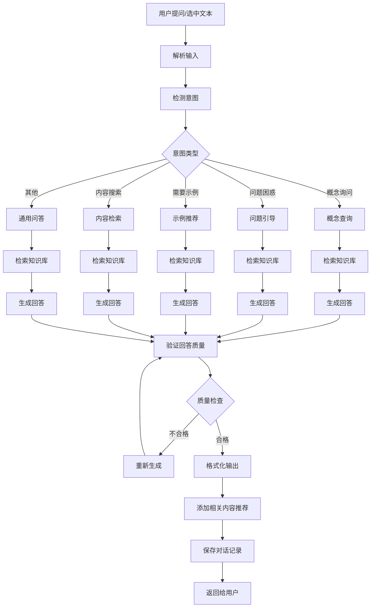
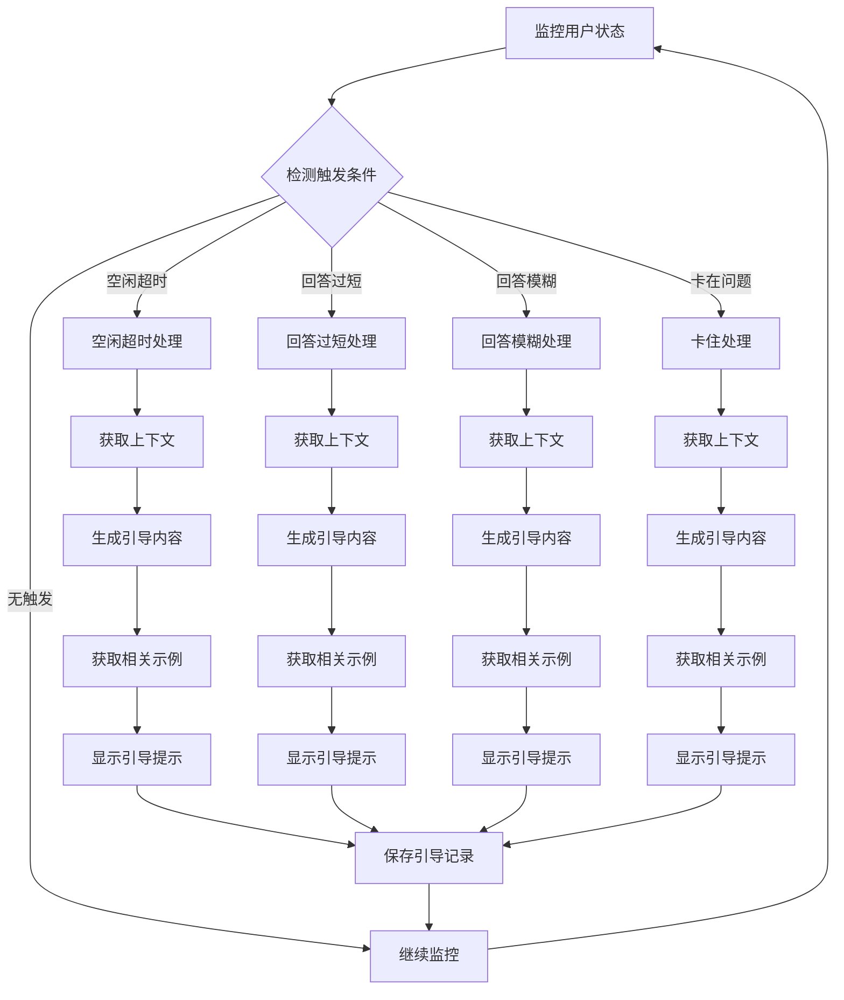
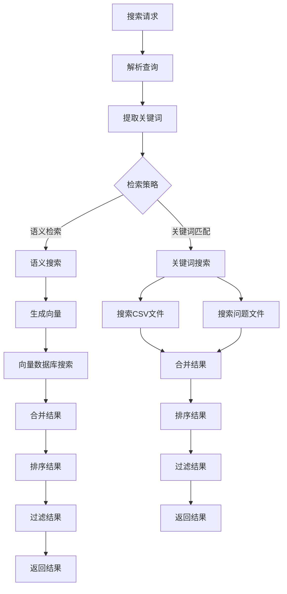
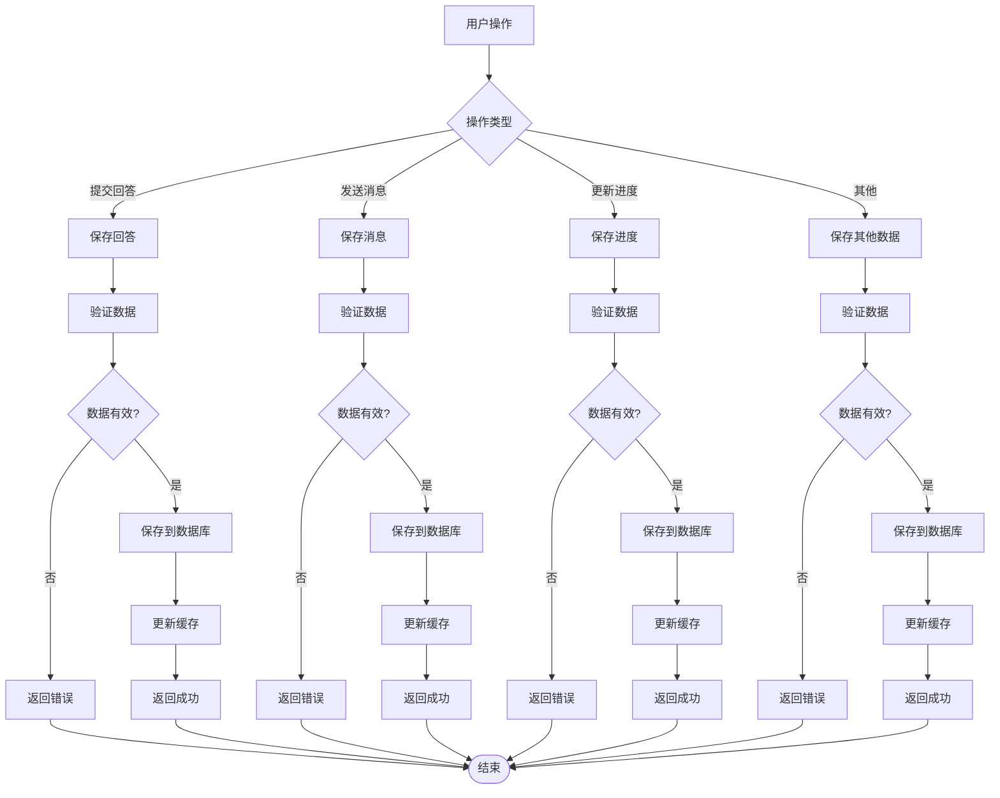
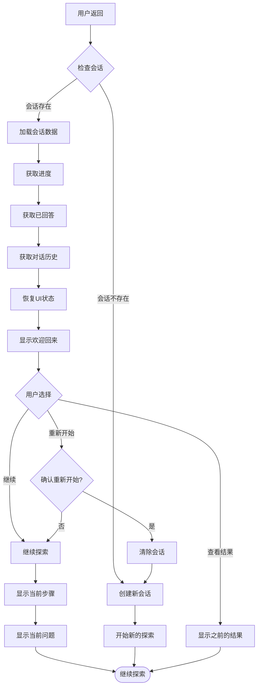
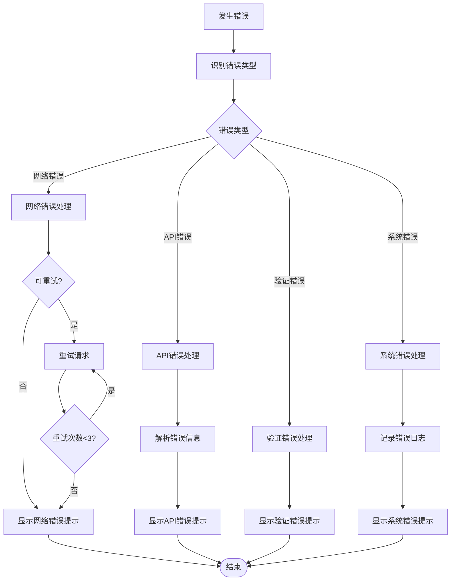
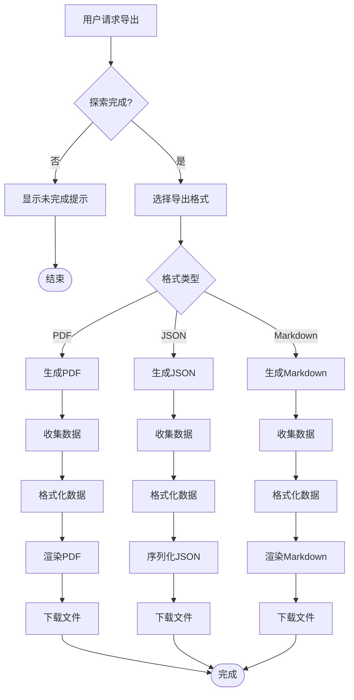

# 系统流程图

## 一、用户探索流程

```mermaid
flowchart TD
    Start([用户访问首页]) --> CreateSession[创建会话]
    CreateSession --> ShowWelcome[显示欢迎页面]
    ShowWelcome --> ExplainFormula[介绍核心公式]
    ExplainFormula --> StartExploration{开始探索?}
    
    StartExploration -->|是| Step1[步骤1: 寻找价值观]
    StartExploration -->|否| Wait[等待用户操作]
    Wait --> StartExploration
    
    Step1 --> ShowQuestion1[显示问题1]
    ShowQuestion1 --> UserInput1[用户输入回答]
    UserInput1 --> AutoSave1[自动保存]
    AutoSave1 --> CheckHelp1{需要帮助?}
    
    CheckHelp1 -->|是| ShowHelp1[显示帮助/问答]
    CheckHelp1 -->|否| Submit1[提交回答]
    ShowHelp1 --> UserInput1
    
    Submit1 --> CheckComplete1{完成30个问题?}
    CheckComplete1 -->|否| NextQuestion1[显示下一个问题]
    NextQuestion1 --> ShowQuestion1
    CheckComplete1 -->|是| Step2[步骤2: 寻找长处]
    
    Step2 --> ShowQuestion2[显示问题1]
    ShowQuestion2 --> UserInput2[用户输入回答]
    UserInput2 --> AutoSave2[自动保存]
    AutoSave2 --> CheckHelp2{需要帮助?}
    
    CheckHelp2 -->|是| ShowHelp2[显示帮助/问答]
    CheckHelp2 -->|否| Submit2[提交回答]
    ShowHelp2 --> UserInput2
    
    Submit2 --> CheckComplete2{完成30个问题?}
    CheckComplete2 -->|否| NextQuestion2[显示下一个问题]
    NextQuestion2 --> ShowQuestion2
    CheckComplete2 -->|是| Step3[步骤3: 寻找兴趣]
    
    Step3 --> ShowQuestion3[显示问题1]
    ShowQuestion3 --> UserInput3[用户输入回答]
    UserInput3 --> AutoSave3[自动保存]
    AutoSave3 --> CheckHelp3{需要帮助?}
    
    CheckHelp3 -->|是| ShowHelp3[显示帮助/问答]
    CheckHelp3 -->|否| Submit3[提交回答]
    ShowHelp3 --> UserInput3
    
    Submit3 --> CheckComplete3{完成30个问题?}
    CheckComplete3 -->|否| NextQuestion3[显示下一个问题]
    NextQuestion3 --> ShowQuestion3
    CheckComplete3 -->|是| Combine[组合: 喜欢×擅长]
    
    Combine --> ShowCombination[显示组合结果]
    ShowCombination --> UserConfirm{确认组合?}
    UserConfirm -->|否| Adjust[调整选择]
    Adjust --> Combine
    UserConfirm -->|是| Refine[提炼: 加入重要的事]
    
    Refine --> ShowResult[显示最终结果]
    ShowResult --> Export{导出结果?}
    Export -->|是| GenerateExport[生成导出文件]
    Export -->|否| End([完成])
    GenerateExport --> End
```

## 二、智能问答流程

```mermaid
flowchart TD
    UserQuery[用户提问/选中文本] --> ParseInput[解析输入]
    ParseInput --> DetectIntent[检测意图]
    
    DetectIntent --> IntentType{意图类型}
    
    IntentType -->|概念询问| ConceptQuery[概念查询]
    IntentType -->|问题困惑| QuestionGuide[问题引导]
    IntentType -->|需要示例| ExampleRecommend[示例推荐]
    IntentType -->|内容搜索| ContentSearch[内容检索]
    IntentType -->|其他| GeneralQA[通用问答]
    
    ConceptQuery --> SearchKnowledge1[检索知识库]
    QuestionGuide --> SearchKnowledge2[检索知识库]
    ExampleRecommend --> SearchKnowledge3[检索知识库]
    ContentSearch --> SearchKnowledge4[检索知识库]
    GeneralQA --> SearchKnowledge5[检索知识库]
    
    SearchKnowledge1 --> GenerateResponse1[生成回答]
    SearchKnowledge2 --> GenerateResponse2[生成回答]
    SearchKnowledge3 --> GenerateResponse3[生成回答]
    SearchKnowledge4 --> GenerateResponse4[生成回答]
    SearchKnowledge5 --> GenerateResponse5[生成回答]
    
    GenerateResponse1 --> ValidateResponse[验证回答质量]
    GenerateResponse2 --> ValidateResponse
    GenerateResponse3 --> ValidateResponse
    GenerateResponse4 --> ValidateResponse
    GenerateResponse5 --> ValidateResponse
    
    ValidateResponse --> CheckQuality{质量检查}
    CheckQuality -->|不合格| Regenerate[重新生成]
    Regenerate --> ValidateResponse
    CheckQuality -->|合格| FormatResponse[格式化输出]
    
    FormatResponse --> AddRelated[添加相关内容推荐]
    AddRelated --> SaveConversation[保存对话记录]
    SaveConversation --> ReturnResponse[返回给用户]
```

## 三、主动引导流程

```mermaid
flowchart TD
    Monitor[监控用户状态] --> CheckTrigger{检测触发条件}
    
    CheckTrigger -->|空闲超时| IdleTimeout[空闲超时处理]
    CheckTrigger -->|回答过短| ShortAnswer[回答过短处理]
    CheckTrigger -->|回答模糊| VagueAnswer[回答模糊处理]
    CheckTrigger -->|卡在问题| Stuck[卡住处理]
    CheckTrigger -->|无触发| Continue[继续监控]
    
    IdleTimeout --> GetContext1[获取上下文]
    ShortAnswer --> GetContext2[获取上下文]
    VagueAnswer --> GetContext3[获取上下文]
    Stuck --> GetContext4[获取上下文]
    
    GetContext1 --> GenerateGuidance1[生成引导内容]
    GetContext2 --> GenerateGuidance2[生成引导内容]
    GetContext3 --> GenerateGuidance3[生成引导内容]
    GetContext4 --> GenerateGuidance4[生成引导内容]
    
    GenerateGuidance1 --> GetExamples1[获取相关示例]
    GenerateGuidance2 --> GetExamples2[获取相关示例]
    GenerateGuidance3 --> GetExamples3[获取相关示例]
    GenerateGuidance4 --> GetExamples4[获取相关示例]
    
    GetExamples1 --> ShowGuidance1[显示引导提示]
    GetExamples2 --> ShowGuidance2[显示引导提示]
    GetExamples3 --> ShowGuidance3[显示引导提示]
    GetExamples4 --> ShowGuidance4[显示引导提示]
    
    ShowGuidance1 --> SaveGuidance[保存引导记录]
    ShowGuidance2 --> SaveGuidance
    ShowGuidance3 --> SaveGuidance
    ShowGuidance4 --> SaveGuidance
    
    SaveGuidance --> Continue
    Continue --> Monitor
```

## 四、内容检索流程

```mermaid
flowchart TD
    SearchRequest[搜索请求] --> ParseQuery[解析查询]
    ParseQuery --> ExtractKeywords[提取关键词]
    
    ExtractKeywords --> SearchStrategy{检索策略}
    
    SearchStrategy -->|关键词匹配| KeywordSearch[关键词搜索]
    SearchStrategy -->|语义检索| SemanticSearch[语义搜索]
    
    KeywordSearch --> SearchCSV1[搜索CSV文件]
    KeywordSearch --> SearchQuestions1[搜索问题文件]
    
    SemanticSearch --> GenerateEmbedding[生成向量]
    GenerateEmbedding --> VectorSearch[向量数据库搜索]
    
    SearchCSV1 --> MergeResults1[合并结果]
    SearchQuestions1 --> MergeResults1
    VectorSearch --> MergeResults2[合并结果]
    
    MergeResults1 --> RankResults1[排序结果]
    MergeResults2 --> RankResults2[排序结果]
    
    RankResults1 --> FilterResults1[过滤结果]
    RankResults2 --> FilterResults2[过滤结果]
    
    FilterResults1 --> ReturnResults1[返回结果]
    FilterResults2 --> ReturnResults2[返回结果]
```

## 五、数据保存流程

```mermaid
flowchart TD
    UserAction[用户操作] --> DetermineAction{操作类型}
    
    DetermineAction -->|提交回答| SaveAnswer[保存回答]
    DetermineAction -->|发送消息| SaveMessage[保存消息]
    DetermineAction -->|更新进度| SaveProgress[保存进度]
    DetermineAction -->|其他| SaveOther[保存其他数据]
    
    SaveAnswer --> ValidateData1[验证数据]
    SaveMessage --> ValidateData2[验证数据]
    SaveProgress --> ValidateData3[验证数据]
    SaveOther --> ValidateData4[验证数据]
    
    ValidateData1 --> CheckValid1{数据有效?}
    ValidateData2 --> CheckValid2{数据有效?}
    ValidateData3 --> CheckValid3{数据有效?}
    ValidateData4 --> CheckValid4{数据有效?}
    
    CheckValid1 -->|否| ReturnError1[返回错误]
    CheckValid2 -->|否| ReturnError2[返回错误]
    CheckValid3 -->|否| ReturnError3[返回错误]
    CheckValid4 -->|否| ReturnError4[返回错误]
    
    CheckValid1 -->|是| SaveToDB1[保存到数据库]
    CheckValid2 -->|是| SaveToDB2[保存到数据库]
    CheckValid3 -->|是| SaveToDB3[保存到数据库]
    CheckValid4 -->|是| SaveToDB4[保存到数据库]
    
    SaveToDB1 --> UpdateCache1[更新缓存]
    SaveToDB2 --> UpdateCache2[更新缓存]
    SaveToDB3 --> UpdateCache3[更新缓存]
    SaveToDB4 --> UpdateCache4[更新缓存]
    
    UpdateCache1 --> ReturnSuccess1[返回成功]
    UpdateCache2 --> ReturnSuccess2[返回成功]
    UpdateCache3 --> ReturnSuccess3[返回成功]
    UpdateCache4 --> ReturnSuccess4[返回成功]
    
    ReturnError1 --> End
    ReturnError2 --> End
    ReturnError3 --> End
    ReturnError4 --> End
    ReturnSuccess1 --> End
    ReturnSuccess2 --> End
    ReturnSuccess3 --> End
    ReturnSuccess4 --> End([结束])
```

## 六、会话恢复流程

```mermaid
flowchart TD
    UserReturn[用户返回] --> CheckSession{检查会话}
    
    CheckSession -->|会话存在| LoadSession[加载会话数据]
    CheckSession -->|会话不存在| CreateNew[创建新会话]
    
    LoadSession --> GetProgress[获取进度]
    GetProgress --> GetAnswers[获取已回答]
    GetAnswers --> GetConversations[获取对话历史]
    
    GetConversations --> RestoreUI[恢复UI状态]
    RestoreUI --> ShowWelcomeBack[显示欢迎回来]
    
    ShowWelcomeBack --> UserChoice{用户选择}
    UserChoice -->|继续| ResumeExploration[继续探索]
    UserChoice -->|重新开始| ConfirmRestart{确认重新开始?}
    UserChoice -->|查看结果| ShowPreviousResult[显示之前的结果]
    
    ConfirmRestart -->|是| ClearSession[清除会话]
    ConfirmRestart -->|否| ResumeExploration
    ClearSession --> CreateNew
    
    ResumeExploration --> ShowCurrentStep[显示当前步骤]
    ShowCurrentStep --> ShowCurrentQuestion[显示当前问题]
    ShowCurrentQuestion --> End([继续探索])
    
    CreateNew --> StartNew[开始新的探索]
    StartNew --> End
    
    ShowPreviousResult --> End
```

## 七、错误处理流程

```mermaid
flowchart TD
    ErrorOccurred[发生错误] --> IdentifyError[识别错误类型]
    
    IdentifyError --> ErrorType{错误类型}
    
    ErrorType -->|网络错误| NetworkError[网络错误处理]
    ErrorType -->|API错误| APIError[API错误处理]
    ErrorType -->|验证错误| ValidationError[验证错误处理]
    ErrorType -->|系统错误| SystemError[系统错误处理]
    
    NetworkError --> CheckRetry{可重试?}
    CheckRetry -->|是| RetryRequest[重试请求]
    CheckRetry -->|否| ShowNetworkError[显示网络错误提示]
    
    APIError --> ParseError[解析错误信息]
    ParseError --> ShowAPIError[显示API错误提示]
    
    ValidationError --> ShowValidationError[显示验证错误提示]
    
    SystemError --> LogError[记录错误日志]
    LogError --> ShowSystemError[显示系统错误提示]
    
    RetryRequest --> CheckRetryCount{重试次数<3?}
    CheckRetryCount -->|是| RetryRequest
    CheckRetryCount -->|否| ShowNetworkError
    
    ShowNetworkError --> End
    ShowAPIError --> End
    ShowValidationError --> End
    ShowSystemError --> End([结束])
```

## 八、导出流程

```mermaid
flowchart TD
    UserRequestExport[用户请求导出] --> CheckComplete{探索完成?}
    
    CheckComplete -->|否| ShowIncomplete[显示未完成提示]
    CheckComplete -->|是| SelectFormat[选择导出格式]
    
    ShowIncomplete --> End1([结束])
    
    SelectFormat --> FormatType{格式类型}
    
    FormatType -->|PDF| GeneratePDF[生成PDF]
    FormatType -->|JSON| GenerateJSON[生成JSON]
    FormatType -->|Markdown| GenerateMarkdown[生成Markdown]
    
    GeneratePDF --> CollectData1[收集数据]
    GenerateJSON --> CollectData2[收集数据]
    GenerateMarkdown --> CollectData3[收集数据]
    
    CollectData1 --> FormatData1[格式化数据]
    CollectData2 --> FormatData2[格式化数据]
    CollectData3 --> FormatData3[格式化数据]
    
    FormatData1 --> RenderPDF[渲染PDF]
    FormatData2 --> SerializeJSON[序列化JSON]
    FormatData3 --> RenderMarkdown[渲染Markdown]
    
    RenderPDF --> DownloadFile1[下载文件]
    SerializeJSON --> DownloadFile2[下载文件]
    RenderMarkdown --> DownloadFile3[下载文件]
    
    DownloadFile1 --> End2([完成])
    DownloadFile2 --> End2
    DownloadFile3 --> End2
```
