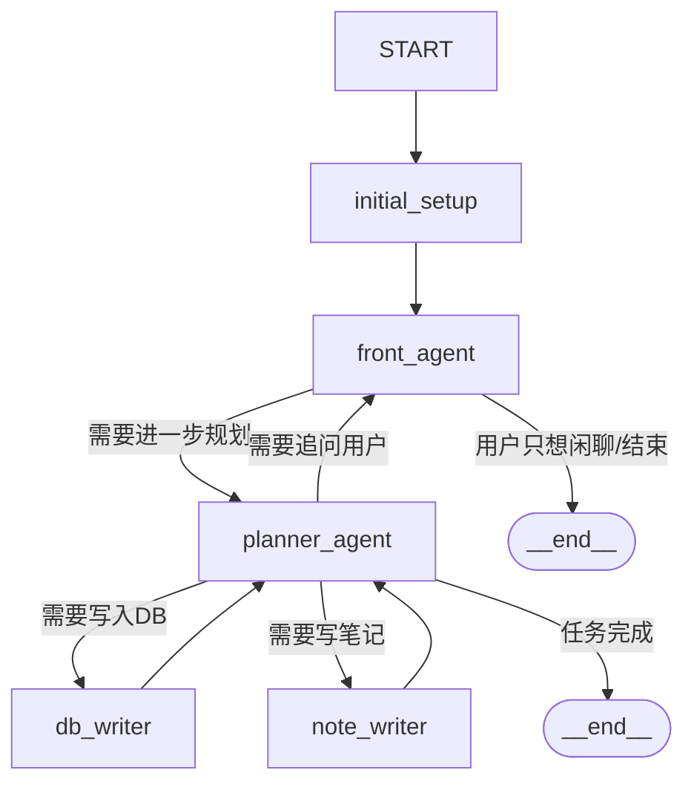

## 新咨询智能体框架（new_agent）设计草稿

目标：为「咨询 + 解决方案」场景提供一个 **轻量级、多智能体对话框架**，重点支持：

- 用户前端高频交互（用户可以随时打断、改需求）
- 一个面向用户应答的智能体（Front Agent）
- 一个在背后思考、梳理、规划对话的智能体（Planner Agent）
- 简单可靠的持久化：数据库记录 + 笔记文件写入

本目录下代码是从 JoinAI-Agent 中「抽薄」出来的最小可用骨架，去掉了 MCP/A2A/浏览器自动化等复杂能力，保留图结构和状态管理的优点。

---

### 1. 目录结构

```text
new_agent/
  README.md           # 本说明
  graph/
    state.py          # AgentState 定义与初始状态构造
    graph.py          # ConsultationGraph：图结构与各节点实现
  tools/
    db_tool.py        # 数据库记录工具（占位，可接真实 DB）
    note_tool.py      # 笔记文件写入工具
```

后续可以根据需要再增加：

- `prompts/`：把节点提示词抽成 YAML 模板
- `config.py`：新的独立配置系统，而不是重用 JoinAI 的 global_config

---

### 2. 核心思想概览

#### 2.1 状态 + 图（State + Graph）

- `AgentState`：封装一次会话的全部上下文：
  - `messages`：对用户可见的消息
  - `inner_messages`：供 LLM / Planner 使用的内部消息
  - `session_id`：会话 ID
  - `logs`：过程日志（便于前端展示进度）
  - `plan` / `current_step` / `context`：Planner 写入的结构化信息
  - `db_records`：需要写入数据库的待处理记录
  - `notes`：需要写入文件的笔记草稿
- `ConsultationGraph`：用 LangGraph 的 `StateGraph` 把不同职责的节点连接成一个小状态机。

#### 2.2 节点划分

当前版本包含以下几个节点：

- `initial_setup`：初始化会话状态（session_id、logs、空 plan 等）
- `front_agent`：与用户直接对话的节点
  - 根据用户输入，给出即时反馈
  - 把关键信息写回 `state`（例如当前话题、用户意图等）
- `planner_agent`：在背后思考、梳理、规划的节点
  - 不一定每轮都直接向用户说话
  - 负责：
    - 拆解问题为多个咨询步骤
    - 决定下一轮是「继续问用户」还是「记录到 DB / 写笔记」
    - 生成结构化记录，推入 `state["db_records"]` / `state["notes"]`
- `db_writer`：从 `state["db_records"]` 中取出一条记录，调用 `db_tool` 写入实际数据库（目前为占位实现）
- `note_writer`：从 `state["notes"]` 中取出一条笔记，调用 `note_tool` 写入指定路径的文件

节点之间的关系（简化）：



---

### 3. 工具层（DB / 笔记写入）

目前只提供两个非常轻量的工具文件，方便以后替换为真实实现：

- `tools/db_tool.py`
  - 提供一个 `record_event` 异步函数：
    - 输入：`state`、`config`、`payload: dict`
    - 当前实现：只是在日志中记录/print，并把记录附加到 `state["db_records_written"]`
    - 未来可以替换为真实的 ORM / SQL 调用
- `tools/note_tool.py`
  - 提供 `write_note` 异步函数：
    - 输入：`state`、`config`、`path: str`、`content: str`
    - 根据 `NOTE_BASE_DIR` 环境变量或默认路径，在本地安全目录下写入 `.md` 或 `.txt`

图节点 `db_writer` / `note_writer` 调用这些函数，而不是直接操作数据库或文件系统，从而保持「节点」和「IO 实现」的解耦。

---

### 4. 扩展方向

- 把当前在 `graph.py` 里的 prompt 文本抽取到 `prompts/templates/*.yaml` 中，用一个轻量的 loader 加载（可以参考 JoinAI 的 `PromptLoader`，但只保留简单功能）。
- 引入一个迷你版的「上下文压缩」逻辑：
  - 当对话轮次超过 N 时，把早期消息总结为一条总结消息，减少 token 压力。
- 为 `planner_agent` 引入结构化输出（Pydantic 模型），例如：
  ```json
  {
    "next": "front" | "db_writer" | "note_writer" | "FINISH",
    "ask_user": "下一轮需要问用户的问题",
    "db_record": {...},
    "note": {"path": "...", "content": "..."}
  }
  ```

---

### 5. 使用方式（概念性）

在后端应用中，你可以像 JoinAI 的 `api.py` 一样，创建并调用该图：

```python
from new_agent.graph.graph import consultation_graph
from new_agent.graph.state import AgentState

state = AgentState(messages=[HumanMessage(content="我想咨询……")], logs=[], ...)
result_state = await consultation_graph.ainvoke(state, config={})

final_messages = result_state["messages"]
```

前端只关心：

- `messages`：展示给用户的文本
- `logs`：用来做「步骤进度条」

内部 Planner 如何拆解、如何写 DB / 笔记，都隐藏在图逻辑中。

