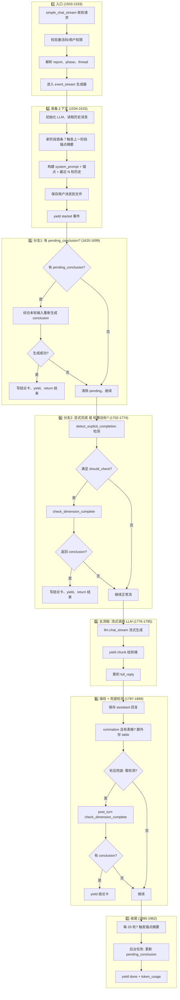

下面是 `/message/stream` 的流程图和代码分段说明，方便在断点或日志里对照。

---

## 一、整体流程图（Mermaid）



---

## 二、分段说明（按行号）

| 行号 | 模块 | 作用 |
|------|------|------|
| **1503-1533** | 入口 | 校验激活码、解析 report/phase/thread、构建 `event_stream` |
| **1534-1541** | LLM 初始化 | 获取 LLM、清空上次流式用量 |
| **1543-1547** | 读历史 | 从 `conv_manager` 读取当前 thread 的 messages |
| **1549-1561** | 新阶段锚点 | 若进入新阶段首条消息，触发上一阶段锚点摘要 |
| **1562-1575** | 构建 prompt | 题库 + basic_info + prior_context → system_prompt；有锚点则加「此前对话要点」 |
| **1576-1595** | 裁剪历史 | 只保留最近 `MAX_HISTORY_TURNS` 轮，拼成 `llm_messages` |
| **1597-1615** | 保存用户消息 | 把本次 user 消息写入历史并追加到 `llm_messages` |
| **1617-1618** | 发 started | 第一个流式事件：`{"started": true}` |
| **1621-1629** | 取元数据 | 读 `conv_data`、`metadata`、`user_count`、`conclusion_shown_at` |
| **1631-1699** | 分支1: pending | 若有 `pending_conclusion`：用 `check_dimension_complete(prior_conclusion=...)` 重生成；成功则写结论卡并 return；失败则清空 pending 继续 |
| **1702-1774** | 分支2: 同步检测 | 调用 `detect_explicit_completion` 和 `_should_run_completion_check`；若满足则 `check_dimension_complete`；若返回 conclusion 则写结论卡并 return |
| **1776-1795** | 主流程: 流式 | `llm.chat_stream`，逐块 yield `chunk`，并累加到 `full_reply` |
| **1797-1827** | 保存回复 | 将 `full_reply` 写入 assistant 消息；rumination 且像表格则额外存 table 消息 |
| **1832-1899** | 轮后兜底 | 再次读 `conv_data`，若满足轮数或 `_assistant_indicates_completion`，则 `check_dimension_complete`；有结论则 yield 结论卡 |
| **1895-1912** | 锚点摘要 | 每 20 轮触发一次锚点摘要 |
| **1914-1943** | 后台任务 | `_background_completion_check`：若本轮无结论，异步检测并更新 `pending_conclusion` |
| **1945-1961** | 结束 | 记录 analytics、yield `done` + `response` + `token_usage` |

---

## 三、逻辑分支简表

| 条件 | 行为 |
|------|------|
| 有 `pending_conclusion` | 优先用本轮输入 + 上轮结论重生成，成功则直接结束 |
| 显式完成（如「就这样」「可以了」） | 立刻 `check_dimension_complete`，有结论则结束 |
| 轮数满足（如 ≥5 轮） | 同上，同步 `check_dimension_complete` |
| 以上都不满足 | 走主流程：流式调用 LLM → 保存回复 → 做一轮兜底检测 → 可能异步更新 pending |
| 兜底检测命中 | 在流式结束后立即 yield 结论卡 |

---

## 四、事件流（给前端的 SSE）

```
data: {"started": true}
data: {"chunk": "..."}         ← 流式文本
data: {"dimension_conclusion": {...}}  ← 结论卡（如有）
data: {"error": "..."}         ← 错误（如有）
data: {"done": true, "response": "...", "token_usage": {...}}
```

---

## 五、总结

整体可以看成四块：

1. **准备**：历史 + system_prompt + 题库 → 构建 `llm_messages`  
2. **结论卡**：pending 重生成 / 显式完成 / 轮数达标 / 轮后兜底，任一触发则 yield 结论卡并结束  
3. **主流程**：`llm.chat_stream` 流式输出并保存  
4. **收尾**：锚点摘要、后台 pending 检测、analytics、`done` 事件  

在调试时可按上面行号打 `breakpoint()`，重点看：1620（pending）、1704（显式完成）、1716（同步结论检测）、1846（兜底检测）、1931（后台 pending）。