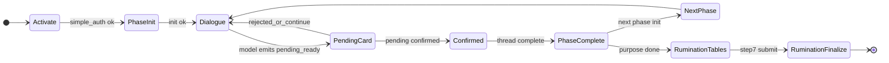

# LLM 对话主流程测试用例（存档点穿透）

本文档与以下机器可读资产配套使用：

| 资产 | 路径 |
|------|------|
| STATE_CODE ↔ API 映射 | [savepoint_state_map.json](./savepoint_state_map.json) |
| 批量回放用例（JSON） | [test/backend/fixtures/simple_chat_cases/batch_savepoints_general.json](../../../test/backend/fixtures/simple_chat_cases/batch_savepoints_general.json) |
| 覆盖率登记 | [savepoint_coverage_registry.json](./savepoint_coverage_registry.json) |
| 造数脚本 | [src/backend/scripts/generate_simple_chat_savepoints.py](../../../src/backend/scripts/generate_simple_chat_savepoints.py) |
| 回放脚本 | [src/backend/scripts/replay_simple_chat.py](../../../src/backend/scripts/replay_simple_chat.py) |

原始存档点枚举见：[所有环节穿透存档点.md](../5-1存档点测试/所有环节穿透存档点.md)。

---

## 1. 穿透完整性结论（简要）

- **已覆盖**：激活 → 五阶段 journey；每阶段「init → 对话 → 出卡 pending → 判定 → 提交」；rumination 的进度文件、表格提交、否定闸门、短链、假设重生成等在后端均有独立路由（见 `savepoint_state_map.json` 的 `api_index`）。
- **文档层缺口（需在人工/Playwright 层补）**：纯 UI 行为（动画只覆盖一行、hover 样式、表格单元格焦点、点赞颜色等）——与 `test/claude-test` 中 **U-*** 人工项同类。
- **自动化缺口**：rumination 多步表格强依赖行数据与 LLM 生成列，稳定 CI 推荐 **wiki/回归测试/scripts/run_rumination_regression.py** + 或 **mock 表格 API**；主对话流已可用 **假数据 + mock LLM**（本仓库 `batch_savepoints_general.json` 模式）。

---

## 2. 标准用例书写格式（模板）

每个用例建议包含下列小节（复制即用）：

```markdown
### [CaseID] 短标题

- **STATE_CODE 起点**：x-y（见存档点文档）
- **STATE_CODE 终点**：x-y
- **涉及 phase**：values | strengths | interests | purpose | rumination
- **LLM 依赖**：无 | 低 | 中 | 高（高=需 mock 或人工）
- **前置数据**：fixture 目录名 或「真实 report_id + generate_simple_chat_savepoints snapshot」
- **用户/决策动作**：逐步列出点击与输入
- **调用的关键 API**：从 savepoint_state_map 摘 1~5 条
- **期望（断言）**：
  - HTTP / SSE：…
  - record.json / metadata：…
  - rumination_progress.json：…（若适用）
- **失败表现**：…
- **稳定回放方式**：seed_fixture + mock.stream_reply / pending_decision / dimension_conclusion
```

### 2.1 JSON 用例扩展字段（与 `replay_simple_chat.py` 兼容）

在原有字段 `name`、`seed_fixture`、`phase`、`thread_id`、`message`、`mock` 基础上，可增加（**可选**，旧脚本忽略未知键）：

| 字段 | 说明 |
|------|------|
| `schema_version` | 用例集版本，当前 `1` |
| `start_state_code` | 存档点起点 |
| `end_state_code` | 执行本用例后期望到达的节点（单步用例可与起点相同） |
| `assertions` | 对象：如 `{"history_roles_contains": ["conclusion_card"]}`（pytest 可自行扩展消费） |

---

## 3. 主流程状态机（逻辑视图）



---

## 4. 按 STATE_CODE 的测试矩阵（主对话 + 关键 API）

下列表格中 **自动化** 指已列入 `batch_savepoints_general.json` 或由既有 pytest 覆盖；**半自动** 指需 mock/固定数据；**人工** 指 UI 或强视觉。

### 4.0 激活与账号

| CaseID | STATE | 场景 | 关键 API | LLM | 自动化 |
|--------|-------|------|----------|-----|--------|
| A-01 | 0-1 | 未登录/未激活访问探索 | POST simple-auth/activate | 低 | 半自动 |
| A-02 | 0-2 | 首次激活进入 values | activate + init | 中 | 半自动 |
| A-03 | — | 激活码归属非本人 | activate | 无 | pytest 见 test_activation_security |
| A-04 | — | 过期/吊销码 | activate | 无 | pytest |

### 4.1 Values（1-x）

| CaseID | STATE | 场景 | 关键 API | LLM | 自动化 |
|--------|-------|------|----------|-----|--------|
| V-01 | 1-1 | init 引导完毕 | init, history | 中 | 半自动 |
| V-02 | 1-2 | 正常多轮对话 | message/stream | 高 | **是**（sp_values_pending_continue_1_2） |
| V-03 | 1-3-a | 出卡 pending | message/stream | 高 | fixture mock_values_pending |
| V-04 | 1-3-b | 出卡否认 | message/stream + pending 判定 | 高 | 半自动 |
| V-05 | 1-3-c | 否认后继续聊 | message/stream | 高 | 半自动 |
| V-06 | 1-3-d | 二次出卡 | message/stream | 高 | 半自动 |
| V-07 | 1-4 | 阶段提交 | thread/complete | 低 | 半自动 |
| V-08 | — | thread reopen | thread/reopen | 低 | pytest journey 相关 |

### 4.2 Strengths / Interests / Purpose（2-x ~ 4-x）

与 **1-x 同构**（init → 对话 → pending 环 → complete）。差异点：

- **purpose**：prior 上下文注入，需断言「前序阶段摘要出现在 system 侧或后端日志」——建议 **半自动 + 日志断言** 或 snapshot 真数据。

| CaseID | STATE | 场景 | 备注 |
|--------|-------|------|------|
| S-01 | 2-1 | strengths init | 依赖 values locked |
| S-02 | 2-2 | strengths 对话 | **自动化** sp_strengths_dialogue_continue_2_2 |
| P-01 | 4-1 | purpose init | 校验 prior 注入 |
| P-04 | 4-4 | purpose 提交后 | 可进入 rumination |

（3-x interests 行与 2-x 完全类比，CaseID 前缀 I-01…）

### 4.3 Rumination（5-x）

| CaseID | STATE | 场景 | 关键 API | LLM | 自动化 |
|--------|-------|------|----------|-----|--------|
| R-01 | 5-1-a | 优势表可见 | rumination-get-table, progress | 中 | 半自动 |
| R-02 | 5-1-b | 选中行问答 | message/stream | 高 | **是**（sp_rumination_opening_chat_5_entry，纯文案 mock） |
| R-03 | 5-1-c | 本步提交 | rumination-table-submit | 低 | rumination_regression |
| R-04 | 5-2-c~g | 匹配性操作/否定/深聊/短链 | table-submit, neg-resolve | 中~高 | 见 wiki fixtures |
| R-05 | 5-3-e~j | 假设生成/重生成/短链跳过 | regenerate-hypotheses, table-submit | 高 | 人工+半自动 |
| R-06 | 5-4~5-6 | 价值/激情/现实过滤 | 同型 | 中 | 半自动 |
| R-07 | 5-7-d | 最终确认提交 | table-submit, finalize | 中 | 半自动 |

---

## 5. 兜底与非 LLM 路径（必须单列回归）

| CaseID | 场景 | 期望 |
|--------|------|------|
| D-01 | init 时 LLM 失败 | 回退到本地 `build_fallback_opening_question` 文案 |
| D-02 | rumination 入口合成失败 | `RUMINATION_INIT_FALLBACK_ZH` |
| D-03 | 短链收尾 | 固定结语分支（非 LLM） |
| D-04 | SSE 结束 | 最后一包 `done=true` |
| D-05 | 隐藏协议 | 可见 chunk **不**含 `[STATE_JSON]`（values 等阶段） |

---

## 6. 跨切场景（与「阶段」正交）

| CaseID | 场景 | 断言要点 |
|--------|------|----------|
| X-01 | 删除最后一个 thread 后再 init | 可创建新 thread（前端 autoInitGuard + 后端 delete） |
| X-02 | journey resume | `compute_explore_resume` 与 UI 一致 |
| X-03 | 已完成 phase 只读 | metadata.step_locked / API 400 |
| X-04 | 并发双开同 phase | 文件锁不损坏 JSON（pytest completion_flow 等） |

---

## 7. 持续「打存档」变测试数据（推荐工作流）

1. **真实使用过程中**：在关键操作后（提交表、确认卡、切换 phase）记下 `report_id`、`phase`、`thread_id`、`filter_step`（rumination）。
2. **快照**：  
   `python src/backend/scripts/generate_simple_chat_savepoints.py snapshot --report-id <UUID> --output-name my_snap_001 --apply`  
   默认 `--remap-ids` 会复制到 `test/backend/fixtures/simple_chat_reports/my_snap_001/` 并重映射 UUID，避免与生产冲突。
3. **生成回放用例骨架**：  
   `python src/backend/scripts/generate_simple_chat_savepoints.py emit-case --output-name my_snap_001 --phase values --message "你的回放触发语" --mock-stream "..."`  
   将 stdout 粘贴进 `batch_savepoints_general.json` 的 `cases` 数组。
4. **模板批量**：从内置模板克隆多份独立 ID：  
   `python src/backend/scripts/generate_simple_chat_savepoints.py template --template mock_values_pending --output-name gen_batch_01 --apply`
5. **跑批**：  
   `python src/backend/scripts/replay_simple_chat.py --cases-file test/backend/fixtures/simple_chat_cases/batch_savepoints_general.json`

### 7.1 ID 语义（写入 manifest 时务必一致）

| ID | 含义 |
|----|------|
| `activation_code` | 业务主键；fixture 中占位，seed 时由脚本覆盖 |
| `activation_session_id` | 激活存储命名空间；**不等于** thread_id |
| `report_id` | `reports/{report_id}/` 目录名 |
| `thread_id` | `{phase}__{thread_id}.json` 对话文件 |

---

## 8. 已落地自动化用例说明（batch_savepoints_general）

| name | 起点 STATE | 说明 |
|------|------------|------|
| sp_values_pending_continue_1_2 | 1-3-a | pending 态下继续对话（continue mock） |
| sp_values_pending_confirm_card_1_3 | 1-3-a | pending 确认 + 结论卡 mock |
| sp_strengths_dialogue_continue_2_2 | 2-2 | strengths 多轮之一（values 已锁） |
| sp_rumination_opening_chat_5_entry | 5-1-b | rumination 对话（无 STATE_JSON mock，因该路径可能不剥离隐藏块） |

pytest：`test/backend/test_savepoint_replay_batch.py`。

---

## 9. 与「所有环节穿透存档点.md」中命名约定的关系

文档建议激活码形如 `TEST + START_STATE + END_STATE`（数字补位）。**注意**：以 `TEST` 开头的码在后端会走 `data/test/simple` 双根逻辑（见 `get_activation_with_manager`）。若希望用该约定做**生产侧**数据，请改为不与 debug 前缀冲突的命名，或统一使用 **fixture seed**（本方案推荐）。

---

## 10. 后续扩展清单（可选优先级）

1. 为 **1-3-b/c/d**、**1-4** 各增加独立 fixture + mock 用例文件。  
2. purpose 专用 fixture（带 prior 文件片段）。  
3. 将 `run_rumination_regression.py` 的场景 ID 映射到 STATE_CODE 并写入 `savepoint_coverage_registry.json`。  
4. Playwright 只读覆盖：表格行选中、重新生成按钮、短链入口。

---

*文档版本：与 savepoint_state_map.json schema_version 对齐为 1。*
