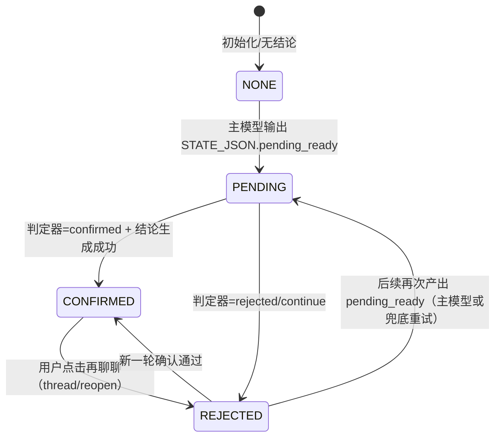

# 4-26 最新出卡链路（前后端双时间线）

> 口径约定：  
> - “出卡（pending）”= 前端出现待确认结论卡（`dimension_conclusion`，`conclusionConfirmed=false`）  
> - “最终出卡（confirmed）”= 进入确认链路并生成/落盘最终结论（`conclusion_final`）

---

## 1. 极简状态图（归类总览）

---

## 2. 关键状态字段（看日志/metadata 时用）

- `conclusion_state`: `none | pending | confirmed | rejected`
- `conclusion_draft`: 待确认草稿（仅 pending 态持有）
- `conclusion_final`: 最终结论（confirmed 时写入；rejected 时可保留历史 final）
- `conclusion_feedback`: 否定/再聊聊反馈（rejected 态持有）
- `thread_completed`: 线程完成标记（true=本线程完成）
- `conclusion_reject_baseline_user_count`: 否定后计轮基线，用于第 N 轮提醒

---

## 3. 全链路时间线（从初始化到“多次拒绝后最终提交”）

## A) 初始化阶段（NONE）

### 前端（用户感知）

- 进入某 phase，看到普通对话界面
- 无结论卡，输入框可用

### 后端（模型/状态）

- 主对话模型按 `system + anchor(可选) + trimmed history + 当前用户输入` 生成回复
- 若本轮还未满足结论条件，`conclusion_state` 维持 `none`

---

## B) 首次 pending 出卡（NONE -> PENDING）

### 前端

- 正常聊天后，突然出现一张可交互结论卡（待确认）
- 这时用户可点“确认”或“再聊聊”

### 后端

- 主模型在回复末尾输出隐藏块 `STATE_JSON`
- 当 `state=pending_ready` 且带 `draft` 时：
  - metadata 更新：`conclusion_state=pending`、写入 `conclusion_draft`
  - SSE 推送 `dimension_conclusion`（前端立即显示卡片）

---

## C) pending 后第一轮用户回复（关键分叉）

## 分叉 C1：用户表达“确认”

### 前端

- 用户发确认语后，看到“后台处理中/结论生成中”
- 随后出现最新结论卡（最终链路）

### 后端

1. 先走 pending 判定器（推理模型）：`confirmed | rejected | continue`
2. 若判为 `confirmed`：
   - 调 `check_dimension_complete(... prior_conclusion=pending_draft ...)`
   - 因有 `prior_conclusion`，跳过完成 gate，直接生成最终结论
   - 若生成失败，则降级回退为原 pending draft（保证可用）
3. metadata 更新为 `confirmed`，写入 `conclusion_final`，清空 `conclusion_draft`

---

## 分叉 C2：用户表示“不满意/再聊聊/继续补充”

### 前端

- pending 卡可折叠或继续聊
- 对话继续，不会强制立刻再出卡

### 后端

1. pending 判定器若给 `rejected` 或 `continue`  
   （当前实现两者都进入 rejected 分支）
2. metadata 更新为 `rejected`
3. `conclusion_draft` 被清空（state 非 pending 时自动清）
4. 记录 `conclusion_feedback` 与 `conclusion_reject_baseline_user_count=当前用户轮次`

---

## D) 拒绝后的第 1 / 2 / 3 轮（REJECTED 内循环）

> `CONCLUSION_REJECT_NUDGE_USER_TURNS = 3` 是“提醒阈值”，不是“强制出卡阈值”。

## 第 1 轮（用户仍未 ready）

### 前端

- 正常聊天，无强制弹卡

### 后端

- 把“上一版未采纳，以最新对话为准”的轻量备注注入上下文（仅模型可见）
- 主模型可能自行输出新的 `pending_ready`，也可能不输出

---

## 第 2 轮（仍未 ready）

### 前端

- 仍是普通聊天

### 后端

- 与第 1 轮类似；没有“必须出卡”逻辑

---

## 第 3 轮（达到 nudge 触发）

### 前端

- 用户仍看到普通聊天流；是否出卡取决于后端判定结果

### 后端

1. 满足 `user_count - baseline >= 3` 时，system 追加轻量 nudge：
   - “若信息已足够，请按协议输出 pending_ready”
2. 回合尾还会触发一次兜底重试：
   - `check_dimension_complete(... prior_conclusion=None)`
   - 若判定 `complete=false`：不出卡，继续聊
   - 若判定 `complete=true`：生成新 pending 并推送前端

---

## E) 多次拒绝循环（可重复）

可多次循环以下链路，直到最终确认：

1. 生成 pending
2. 用户否定 -> `rejected` + 清 draft
3. 聊若干轮（可能第 1 轮就重新 pending，也可能第 3 轮提醒后才 pending）
4. 再次判定用户态度（confirmed/rejected/continue）
5. confirmed 后进入最终生成并写入 final

---

## F) 已有最终结论后，用户再次点“再聊聊”（CONFIRMED -> REJECTED）

### 前端

- 用户在结论卡点击再聊聊
- 线程可继续编辑对话（从“已完成”回到“可继续完善”）

### 后端

- 调 `/thread/reopen`：
  - 状态改为 `rejected`
  - `thread_completed=false`
  - 若已有 `final`，通常保留为历史基线（不立刻清空）
  - 写入 feedback 供后续模型理解“为什么要改”
- 后续可以再次走 pending -> confirmed，覆盖为新版 final

---

## G) 最终提交（用户确认并完成线程）

### 前端

- 用户确认结论后触发完成动作
- 线程状态变 completed，可进入下一阶段

### 后端

- `/thread/complete`：
  - 将 `state=confirmed`、`thread_completed=true`
  - `conclusion_final` 持久化
  - 确保 `conclusion_card` 消息落盘（若此前没有会补写）
  - 写 note / anchor / prior_context 衍生数据

---

## 4. 特别说明（高频误区）

- `dimension_conclusion` 在前端是“消息追加”模型，旧卡会锁定，最新卡可交互
- 展示层可以看到历史卡，但交互只允许最新卡
- 主对话拼装时只取 `user/assistant/system` 角色；`conclusion_card` 角色不会直接进入主对话链路
- `continue` 在 pending 判定后目前并不“保留 draft 原地继续”，而是和 `rejected` 同分支处理（清 draft，回主对话）

---

## 5. 一句话总览

这套链路是“**先产草稿 pending -> 用户态度判定 -> 再产最终 confirmed**”的双阶段状态机；  
拒绝后不强推结论，而是允许继续补充，并通过“按轮提醒 + 兜底重试”在合适时机重新出卡，直到用户真正确认。
