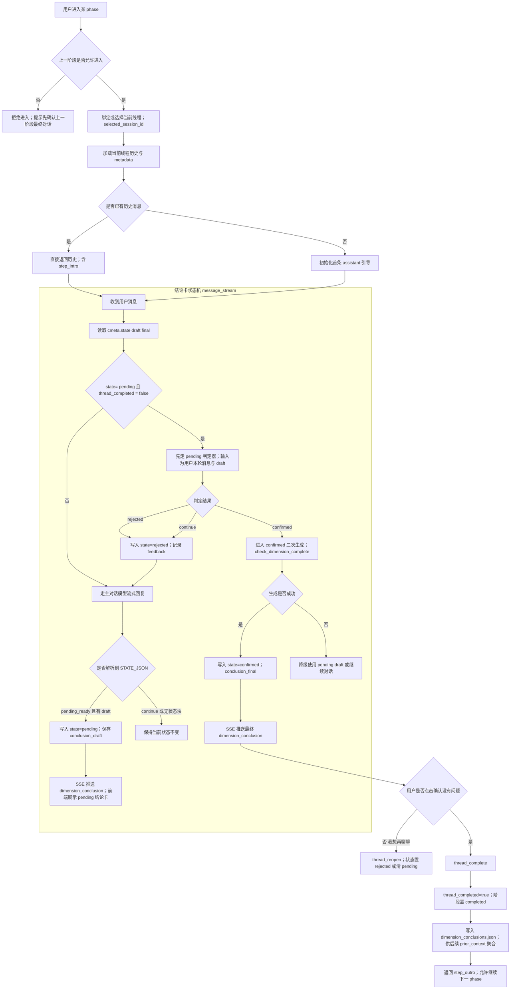

# 4.25 - simple_chat 提示词与引导语记录

本文档基于当前仓库源码梳理 `simple_chat` 模式下：

- 所有核心提示词（system prompt / 协议注入 / 子流程提示）
- 开始引导语、结束引导语的位置与内容来源
- `pending` / `conclusion` 的数据格式示例（接口协议 + 存储结构）

---

## 1. 主对话提示词（simple_chat 主链路）

### 1.1 主模板入口（按 phase 分支）

- **文件路径**：`src/backend/app/domain/prompts/templates/simple_chat_system.yaml`
- **用途**：`values / strengths / interests / purpose / rumination` 五阶段主 system prompt 模板。
- **内容特征**：
  - 每个阶段都有完整“咨询流程”“重要准则”
  - 含“开场提问”“结束对话”要求（例如 values 阶段第 1 步是开场提问，第 8 步是结束对话）
  - `purpose` 阶段会使用 `{{ values_info }}` 注入上一阶段关键词
  - `rumination` 阶段可注入 `{{ rumination_step_addon }}`（沉淀子步指引）
  - 所有阶段最终都要求“继续中文对话”

### 1.2 模板装配与协议拼接

- **文件路径**：`src/backend/app/api/v1/simple_chat_routes.py`
- **函数**：`_build_system_prompt(...)`
- **用途**：
  - 组装 `simple_chat_system` 主模板
  - 拼接 `prior_context` 到 `prior_block`
  - 在末尾统一追加隐藏协议 `[STATE_JSON]...[/STATE_JSON]`
- **关键协议内容（固定注入）**：
  - `state` 仅允许 `continue | pending_ready`
  - `state=continue` 时 `draft=null`
  - `state=pending_ready` 时要求 `draft.summary` 和 `draft.keywords`
  - 协议要求不得在用户可见正文中暴露协议细节

### 1.3 协议扩展字段说明（按阶段）

- **文件路径**：`src/backend/app/domain/conclusion_card_payload.py`
- **函数**：`build_state_json_draft_extension_protocol(phase)`
- **用途**：为 `[STATE_JSON]` 中 `draft` 增加阶段化扩展字段约束，例如：
  - values: `keyword_notes`
  - strengths: `strength_markers`
  - interests: `interest_reasons`
  - purpose: `mission_core/mission_detail/mission_aim/experience_value_rows`

### 1.4 模板加载器

- **文件路径**：`src/backend/app/domain/prompts/loader.py`
- **函数**：
  - `get_simple_chat_system_prompt(context)`
  - `get_step_copy(phase, position, locale)`
- **用途**：统一从 `templates/*.yaml` 读取并渲染提示词。

---

## 2. 开始引导语（Start）

## 2.1 普通阶段首次进入（values/strengths/interests/purpose）

- **文件路径**：`src/backend/app/api/v1/simple_chat_routes.py`
- **函数**：`_simple_init_impl(...)`
- **逻辑**：
  1. 调用 `_build_system_prompt(...)` 组装 system prompt
  2. 构造初始化 user 指令：
     - `我是来访者，你需要向我提问。以下是我的基本信息：暂无。请给出第一轮温柔而具体的引导问题，让我开始思考。`
  3. 调 LLM 生成首条 assistant 引导问题
  4. 失败时走 fallback 开场文案

### 2.2 fallback 开场文案（LLM 失败兜底）

- **文件路径**：`src/backend/app/api/v1/simple_chat/prompt_builder.py`
- **函数**：`build_fallback_opening_question(phase)`
- **内容来源**：`fallback_map`
  - values: `hi,我们先从价值观开始...`
  - strengths: `hi,我们先聊聊优势...`
  - interests: `hi,我们先聊热忱...`
  - purpose: `hi,我们先聊使命...`
  - rumination: `hi,恭喜你进入最后一轮...`

### 2.3 rumination 阶段“首次进入线程”开场白

- **文件路径**：`src/backend/app/services/rumination_init_greeting.py`
- **函数**：`synthesize_rumination_entry_greeting(...)`
- **模板来源**：
  - `src/backend/app/domain/rumination_prompt_strings.py`
    - `RUMINATION_ENTRY_INIT_SYSTEM_ZH`
    - `RUMINATION_ENTRY_INIT_USER_TEMPLATE_ZH`
- **fallback**：
  - `RUMINATION_INIT_FALLBACK_ZH`

### 2.4 rumination 子步开场引导（filter_step 1~7）

- **文件路径**：
  - `src/backend/app/domain/rumination_step_guidance.py`
  - `src/backend/app/domain/rumination_prompt_strings.py`
  - `src/backend/app/api/v1/simple_chat_routes.py`
- **关键点**：
  - `build_opening_context(...)`：收集表格上下文
  - `build_opening_llm_messages(...)`：按 step 组装 LLM 开场引导
  - `STEP_1_OPENING_SYSTEM_ZH ... STEP_7_OPENING_SYSTEM_ZH`：子步引导提示词正文
  - `OPENING_USER_WITH_TABLE_ZH` / `STEP_4_OPENING_USER_TEMPLATE_ZH`：附带表格 JSON 给模型
  - 路由：
    - `GET /simple-chat/rumination-step-opening`
    - `POST /simple-chat/rumination-step-opening-stream`

### 2.5 前端阶段开场展示文案（非 LLM，UI 文案）

- **文件路径**：`src/backend/app/domain/prompts/templates/step_copy.yaml`
- **读取位置**：
  - `src/backend/app/domain/prompts/loader.py` 的 `get_step_copy(...)`
  - `src/backend/app/api/v1/simple_chat_routes.py` 在 `/init` 返回 `step_intro`
- **内容**：`intro_zh / intro_en`（每阶段一段）

### 2.6 开场引导语原文摘录（当前可直接看到的主要文案）

#### A) fallback 开场（`prompt_builder.py`）

- values：`hi,我们先从价值观开始：最近一次让你“很有意义感”的事情是什么？为什么它对你重要？`
- strengths：`hi,我们先聊聊优势：在别人眼里，你最常被夸“做得自然且稳定”的一件事是什么？`
- interests：`hi,我们先聊热忱：哪类话题会让你不知不觉投入很久、并且越做越有能量？`
- purpose：`hi,我们先聊使命：如果你的工作能持续帮助一类人，你最希望他们发生什么改变？`
- rumination：`hi,恭喜你进入最后一轮！我们将综合你的价值观、优势、热爱和使命，帮你确定三个职业发展方向。准备好开始了吗？`

#### B) 阶段 intro（`step_copy.yaml`）

- values：`欢迎开始第一轮探索——价值观发现。我们将通过对话，帮你找到对职业发展最重要的 5 个价值观关键词。`
- strengths：`欢迎进入第二轮探索——优势发现。我们将一起挖掘你最突出的 5 个优势，并为每个优势做标记。`
- interests：`欢迎进入第三轮探索——热爱发现。我们将帮你找到 3 个你真正感兴趣、充满好奇的领域。`
- purpose：`欢迎进入第四轮探索——使命发现。我们将帮你发现你最希望为他人提供的核心价值。`
- rumination：`恭喜你进入最后一轮——沉淀与选择。我们将综合你的价值观、优势、热爱和使命，帮你确定三个可以尝试的职业方向。`

---

## 3. 结束引导语（End）

### 3.1 各阶段结论确认后的阶段结束文案

- **后端文案源**：`src/backend/app/domain/prompts/templates/step_copy.yaml`
  - `outro_zh / outro_en`
- **后端返回位置**：
  - `src/backend/app/api/v1/simple_chat_routes.py`
  - `thread_complete` 成功后返回：
    - `step_outro`
    - `step_outro_en`

### 3.2 前端实际展示结束弹窗文案（当前主展示）

- **文件路径**：
  - `src/frontend/lib/i18n/locales/zh.ts`
    - `explore.phaseComplete.outro.values/strengths/interests/purpose/rumination`
  - `src/frontend/lib/i18n/locales/en.ts`
    - 同结构英文文案
  - `src/frontend/app/(main)/explore/chat/[phase]/page.tsx`
    - `PhaseCompleteWarmModal` 通过 `t('explore.phaseComplete.outro.${phase}')` 展示

> 说明：后端 `step_copy.yaml` 与前端 i18n 文案目前内容基本一致，但前端弹窗走的是 i18n keys。

### 3.3 rumination 终步收束结语

- **文件路径**：`src/backend/app/services/rumination_finalize.py`
- **函数**：`append_post_table_finalize_message(...)`
- **两种结语路径**：
  1. 短链路固定结语：`RUMINATION_SHORTPATH_SKIP_CLOSING_FIXED_ZH`
  2. 常规 LLM 结语：
     - `build_rumination_closing_epilogue_messages(...)`
     - 其模板在 `src/backend/app/domain/rumination_prompt_strings.py`：
       - `RUMINATION_CLOSING_EPILOGUE_SYSTEM_ZH`
       - `RUMINATION_CLOSING_EPILOGUE_USER_TEMPLATE_ZH`

### 3.4 结束引导语原文摘录（当前可直接看到的主要文案）

#### A) 阶段 outro（`step_copy.yaml`）

- values：`恭喜你完成了第一轮价值观探索。下一轮我们将进入优势探索，帮助你发现你的核心能力。我们下次见。`
- strengths：`恭喜你完成了第二轮优势探索。下一轮我们将进入热爱探索，帮助你发现你的激情所在。我们下次见！`
- interests：`恭喜你完成了第三轮热爱探索。下一轮我们将进入使命探索，帮助你找到你的人生召唤。我们下次见！`
- purpose：`太棒了！你已经完成了使命探索。接下来我们将进行最后一轮对话——帮助你整合所有发现，找到具体的职业发展方向。我们下次见！`
- rumination：`恭喜你完成了全部探索！你的专属职业规划报告即将生成。`

#### B) rumination 终步短链路固定结语（`RUMINATION_SHORTPATH_SKIP_CLOSING_FIXED_ZH`）

- `本轮中部分筛选环节已无待选行，系统已为你自动跳过相应步骤，直接进入最终方向选择。若你有疑问，仍可在右侧与我交流。确认无误后，请点击页面右上角「完成并解锁报告」，生成并查看你的专属职业规划报告。`

---

## 4. pending / conclusion 数据格式示例

以下示例按源码真实协议字段整理（字段名与当前实现一致）。

### 4.1 模型隐藏协议输出（主对话回复尾部）

来源：

- 协议拼接：`src/backend/app/api/v1/simple_chat_routes.py` `_build_system_prompt`
- 解析位置：`src/backend/app/api/v1/simple_chat_routes.py`，`_split_visible_reply_and_state(...)` 调用链

```json
[STATE_JSON]
{"state":"continue","draft":null}
[/STATE_JSON]
```

或：

```json
[STATE_JSON]
{
  "state":"pending_ready",
  "draft":{
    "summary":"你重视成长、关系和身心平衡。",
    "keywords":["成长","关系","身心平衡"]
  }
}
[/STATE_JSON]
```

### 4.2 会话文件 metadata 中 pending 存储结构（真实 fixture）

来源文件：

- `test/backend/fixtures/simple_chat_reports/mock_values_pending/values__t_mock_pending_001.json`

```json
{
  "metadata": {
    "conclusion_state": "pending",
    "thread_completed": false,
    "conclusion_draft": {
      "summary": "你关注成长、关系和身心平衡。",
      "keywords": ["成长", "关系", "身心平衡"]
    }
  }
}
```

### 4.3 SSE 事件中的结论卡推送（pending 卡）

来源：

- `src/backend/app/api/v1/simple_chat_routes.py`（主流式 `/message/stream`）

当检测到 `state=pending_ready` 并落库后，后端会发送：

```json
{"conclusion_loading": true}
{"dimension_conclusion": {"summary":"...","keywords":["..."]}}
```

### 4.4 confirmed 后的 conclusion 示例（测试用例）

来源文件：

- `test/backend/fixtures/simple_chat_cases/batch_basic.json`

```json
{
  "summary": "你重视成长、关系和身心平衡，并追求长期稳定投入。",
  "keywords": ["成长", "关系", "平衡", "稳定投入"]
}
```

### 4.5 metadata 统一状态字段（新结构）

来源：

- 读取：`src/backend/app/api/v1/simple_chat_routes.py` `_read_conclusion_meta`
- 写入：`src/backend/app/api/v1/simple_chat_routes.py` `_build_conclusion_meta_update`

字段：

- `conclusion_state`: `none | pending | confirmed | rejected`
- `conclusion_draft`: 待确认草案（pending 时有值）
- `conclusion_final`: 最终结论（confirmed 时通常有值）
- `conclusion_feedback`: 否定反馈（rejected 时有值）
- `thread_completed`: 线程是否完成
- `conclusion_shown_at_turn`: 结论卡展示时对应用户轮次

---

## 5. 其它与 simple_chat 相关但当前未接入主链路的提示词

### pending_conclusion_reply 模板（可用但当前主流式链路未直接调用）

- **文件路径**：`src/backend/app/domain/prompts/templates/pending_conclusion_reply.yaml`
- **加载函数**：`src/backend/app/domain/prompts/loader.py` `get_pending_conclusion_injection(...)`
- **现状**：当前 `simple_chat_routes.py` 主链路主要使用 `[STATE_JSON]` 协议与 pending 判定逻辑，未直接调用该模板。

---

## 6. 速查索引（按“看哪里改哪里”）

- 改主阶段提示词：`src/backend/app/domain/prompts/templates/simple_chat_system.yaml`
- 改协议（STATE_JSON 规则）：`src/backend/app/api/v1/simple_chat_routes.py` + `src/backend/app/domain/conclusion_card_payload.py`
- 改普通阶段 fallback 开场：`src/backend/app/api/v1/simple_chat/prompt_builder.py`
- 改 rumination 首次开场：`src/backend/app/domain/rumination_prompt_strings.py` + `src/backend/app/services/rumination_init_greeting.py`
- 改 rumination 子步开场：`src/backend/app/domain/rumination_prompt_strings.py` + `src/backend/app/domain/rumination_step_guidance.py`
- 改阶段结束文案（后端）：`src/backend/app/domain/prompts/templates/step_copy.yaml`
- 改阶段结束弹窗（前端实际展示）：`src/frontend/lib/i18n/locales/zh.ts` / `src/frontend/lib/i18n/locales/en.ts`
- 看 pending 样例数据：`test/backend/fixtures/simple_chat_reports/mock_values_pending/values__t_mock_pending_001.json`
- 看 conclusion 样例数据：`test/backend/fixtures/simple_chat_cases/batch_basic.json`

---

## 7. 4.25 当日新增改动（已落地）

本节记录本次针对结论卡文风与上下文注入做的实际代码更新。

### 7.1 phase 级文风配置（新增字段）

- **文件路径**：`src/backend/app/domain/dimension_completion.py`
- **新增字段（按 values/strengths/interests/purpose 分别配置）**：
  - `summary_style_rules`
  - `summary_style_examples`
- **说明**：
  - `values / strengths / interests` 的示例已替换为业务确认文案（含名字、经历、温暖语气示例）
  - `purpose` 已补充同风格仿写示例
  - `summary_prompt_hint` 也同步改为“可归纳、有建议、但不杜撰”导向

### 7.2 confirmed 二次生成：上下文扩容 + 注入用户信息

- **文件路径**：`src/backend/app/core/dimension_completion_checker.py`
- **新增控制常量**：
  - `CONCLUSION_CONTEXT_MAX_MESSAGES = 60`
  - `CONCLUSION_CONTEXT_MAX_CHARS = 12000`
  - `CONCLUSION_BASIC_INFO_MAX_CHARS = 1200`
  - `CONCLUSION_PRIOR_CONTEXT_MAX_CHARS = 2200`
- **新增能力**：
  - `build_conclusion_generation_messages(...)` 支持 `basic_info`、`prior_context` 入参
  - 结论生成 prompt 中新增：
    - `【用户基础信息】`
    - `【前序阶段结论（供参考）】`
    - `【本阶段文风规则】`
    - `【本阶段文风示例（仅用于风格参考，不可照抄具体事实）】`
- **口径变化**：
  - summary 从“短句小结”调整为“2-4段自然段优先”，允许轻度洞察与行动建议
  - keywords 仍保持严格提取约束（不因文风放松）

### 7.3 路由接线：向 confirmed 生成传递上下文

- **文件路径**：`src/backend/app/api/v1/simple_chat_routes.py`
- **变更点**：
  - 两处 `check_dimension_complete(...)` 调用新增透传：
    - `basic_info=basic_info`
    - `prior_context=prior_context`
  - 覆盖分支：
    - pending 用户确认后的 confirmed 生成分支
    - rejected 后触发的 retrigger 生成分支

### 7.4 当前策略结论

- `pending`：仍是短草案（`summary + keywords`），用于快速出卡与交互分流
- `confirmed`：保留二次生成，并采用新文风与扩容上下文
- 维持“短 pending + 深 confirmed”的双层策略

---

## 8. 状态机流程图（阶段流转 + 结论卡状态流转）

以下流程图聚焦 `simple_chat` 实际关键状态机：  
- **A**：阶段进入与锁定逻辑（phase 层）  
- **B**：结论卡状态机（none/pending/rejected/confirmed）



### 8.1 图中关键变量对照

- **阶段/线程绑定**
  - `selected_session_id`
  - `step.locked`
  - `thread_completed`
- **结论卡状态**
  - `conclusion_state`: `none | pending | rejected | confirmed`
  - `conclusion_draft`
  - `conclusion_final`
  - `conclusion_feedback`
  - `conclusion_shown_at_turn`
- **二次生成上下文（confirmed）**
  - `basic_info`
  - `prior_context`
  - `conversation_history`（扩窗 + 截断预算）

### 8.2 主要跳转条件（文字版）

- `none -> pending`：主对话输出 `STATE_JSON.state = pending_ready`
- `pending -> confirmed`：pending 判定器返回 `confirmed`，并成功完成二次生成
- `pending -> rejected`：用户“再聊聊”或判定器返回 `rejected/continue`
- `rejected -> pending`：后续对话再次产出 `pending_ready`（或 retrigger 触发）
- `confirmed + thread_complete`：阶段完成并落盘到 `dimension_conclusions.json`，成为下一阶段 `prior_context` 聚合源

---

## 9. prior_context / anchor 注入与长度变量总表（4.26补充）

### 9.1 `CONCLUSION_PRIOR_CONTEXT_MAX_CHARS` 是否够？

- **变量位置**：`src/backend/app/core/dimension_completion_checker.py`
- **当前值**：`CONCLUSION_PRIOR_CONTEXT_MAX_CHARS = 2200`
- **作用范围**：仅用于“结论卡生成（confirmed 二次生成）”链路中对 `prior_context` 的裁剪，不影响普通主对话 system prompt。
- **工程判断**：
  - 若前序阶段结论是“摘要+关键词”风格，2200 通常可覆盖核心信息；
  - 若前序文本较长（尤其 rumination 聚合四阶段），会被截断。
- **注意**：当前 `_clip_text` 是“从开头截断保留前段”，不是“保留最新尾段”。当前序拼接顺序为 `values -> strengths -> interests -> purpose` 时，超长更容易丢失后面的 `purpose` 信息。

### 9.2 `prior_context` 到底是“上一阶段”还是“前几阶段全部”？

结论：**按当前 phase 注入“该 phase 之前的所有已完成维度结论”，不是仅上一阶段。**

- 实现位置：`src/backend/app/utils/survey_storage.py`
- 规则函数：`_prior_phases_before(phase)`
  - `strengths` -> `["values"]`
  - `interests` -> `["values", "strengths"]`
  - `purpose` -> `["values", "strengths", "interests"]`
  - `rumination` -> `["values", "strengths", "interests", "purpose"]`
- 聚合来源优先级：
  1. `dimension_conclusions.json`（优先）
  2. 旧 `prior_context_{phase}.txt`（回退）

### 9.3 anchor 摘要在哪里注入？有没有长度限制？

- **注入位置（主流式对话）**：
  - `src/backend/app/api/v1/simple_chat_routes.py`
  - `load_anchor_for_phase(...) -> format_anchor_for_prompt(...)`
  - 作为一条 assistant 上下文插入：`[此前对话要点] ...`
- **生成位置**：
  - `src/backend/app/utils/context_refiner.py` 的 `refine_and_save_anchor(...)`
  - 写入 `record.json -> steps.{phase}.anchor_summary`
- **硬限制现状**：
  - 注入前**没有独立常量做二次截断**；
  - 但生成时有输入窗口限制：
    - 仅取最近 `messages[-40:]`
    - 拼接后 `conv_text[:6000]` 送模型
    - JSON 解析失败兜底时 `goals` 截到 `text[:1000]`

### 9.4 相关长度变量总表（simple_chat / rumination / 结论卡）

| 变量名 | 当前值 | 文件路径 | 用途/影响链路 |
|---|---:|---|---|
| `MAX_HISTORY_TURNS` | 30 | `src/backend/app/api/v1/simple_chat_routes.py` | 主对话发送给 LLM 的历史“用户轮数”窗口（`_trim_history_messages_for_llm`） |
| `CONCLUSION_CONTEXT_MAX_MESSAGES` | 60 | `src/backend/app/core/dimension_completion_checker.py` | 结论卡生成时取最近消息条数上限 |
| `CONCLUSION_CONTEXT_MAX_CHARS` | 12000 | `src/backend/app/core/dimension_completion_checker.py` | 结论卡生成时当前阶段对话文本字符上限 |
| `CONCLUSION_BASIC_INFO_MAX_CHARS` | 1200 | `src/backend/app/core/dimension_completion_checker.py` | 结论卡生成时 `basic_info` 注入上限 |
| `CONCLUSION_PRIOR_CONTEXT_MAX_CHARS` | 2200 | `src/backend/app/core/dimension_completion_checker.py` | 结论卡生成时 `prior_context` 注入上限 |
| `PRIOR_UNIFIED_MAX_CHARS` | 4800 | `src/backend/app/utils/survey_storage.py` | report 维聚合前序结论（`dimension_conclusions.json`）总长度上限 |
| `PRIOR_CONTEXT_MAX_CHARS` | 2000 | `src/backend/app/utils/survey_storage.py` | legacy `load_prior_context(...)` 文本上限（session 维回退链路） |
| `max_chars`（`build_values_info_for_prompt` 参数） | 960（默认） | `src/backend/app/utils/survey_storage.py` | purpose 阶段注入 `values_info` 的长度上限 |
| `RUMINATION_OPENING_TABLE_JSON_MAX_LEN` | 12000 | `src/backend/app/domain/rumination_prompt_strings.py` | rumination 子步 opening 中表格 JSON 注入上限 |
| `RUMINATION_ENTRY_INIT_PRIOR_MAX_CHARS` | 8000 | `src/backend/app/domain/rumination_prompt_strings.py` | rumination 首次开场时 `prior_block` 注入上限 |
| `RUMINATION_CLOSING_SUMMARY_MAX_CHARS` | 2000 | `src/backend/app/domain/rumination_prompt_strings.py` | rumination 终步收束前选中方向摘要上限 |
| `RUMINATION_CLOSING_USER_SUMMARY_IN_PROMPT_MAX` | 4000 | `src/backend/app/domain/rumination_prompt_strings.py` | rumination 结语生成时 user prompt 摘要注入上限 |
| （非常量）`messages[-40:]` | 40 条 | `src/backend/app/utils/context_refiner.py` | anchor 提炼时取最近 40 条消息 |
| （非常量）`conv_text[:6000]` | 6000 字符 | `src/backend/app/utils/context_refiner.py` | anchor 提炼 prompt 注入对话上限 |
| （非常量）`text[:1000]` | 1000 字符 | `src/backend/app/utils/context_refiner.py` | anchor JSON 解析失败时 `goals` 兜底截断上限 |

