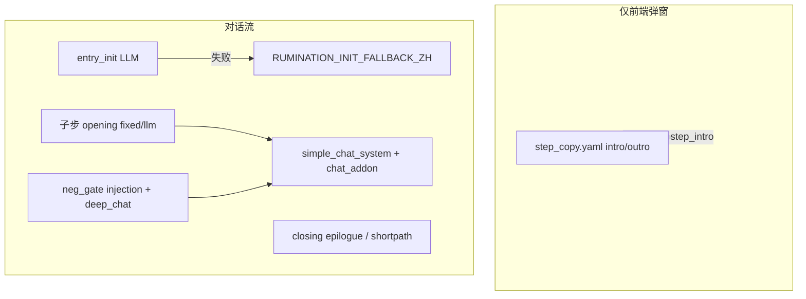

# Rumination（沉淀）提示词说明

> 快照时间：2026-06-02。用于对照排查「沉淀阶段有问题」时的文案与注入链路。  
> **改文案优先改源码**，本文档为导出说明，不自动同步代码。

---

## 阅读入口（按正常使用顺序 · 有主次）

**从这里开始即可。** 下面按用户真实走法排序：**主路径**（大多数人要对照的）→ **次路径**（只有踩到才打开）→ **备查**（改文案/全量索引）。

### 一句话地图

| 你看到的界面 | 属于哪类提示词 | 本文档章节 |
|--------------|----------------|------------|
| 进入沉淀时的欢迎弹窗 | 弹窗，不进对话 | **A** → §4.1 |
| 右侧第一条助手消息（刚进沉淀） | 首轮开场 | **B** → §5 |
| 每点完表格「确认」后右侧新引导 | 子步 opening | **C** → §6 |
| 右侧日常聊天回复风格 | 主对话 + 当前步 addon | **D** → §4.2 + §7 |
| 表格确认后弹出「深入讨论」 | neg gate | **E** → §8 |
| 终步选完方向、结论卡之后 | 收束结语 | **F** → §10 |

**源码唯一入口（要改字时）：** `rumination_prompt_strings.py`（主路径文案几乎都在这里）。

---

### 主路径（按时间顺序看，够覆盖 80% 问题）

```
进入沉淀 → 子步1 → … → 子步7 → 解锁报告
```

| 顺序 | 用户时刻 | 看什么 | 文档 | 可跳过？ |
|------|----------|--------|------|----------|
| **A** | 点进「沉淀」阶段，先看弹窗 | `step_copy` intro（**不是**对话里的那句话） | §4.1 | 弹窗文案没问题可跳过 |
| **B** | 弹窗关掉后，右侧**第一条**助手消息 | entry_init + 失败兜底 | §5 | 必看（和弹窗易混） |
| **C** | 每完成一子步表格点「确认」，右侧**新插入**的引导段 | 该子步 **opening**（步3=固定，其余多 LLM） | §6 + §3 模式表 | 只查**当前子步**那一行/那一段即可 |
| **D** | 同子步里持续聊天（点行提问、改表等） | `simple_chat_system` 沉淀骨架 + **chat_addon（仅当前步）** | §4.2 + §7 对应步 | 必看；**步3**另加 §7.3 内部行块 |
| **F** | 子步7 选 1–3 个方向并确认结论卡后 | closing 结语（或短路径固定） | §10 | 前面子步都正常、只有结尾不对时才看 |

> **C 和 D 不要混：** C = 进子步时「说明书」一条；D = 之后每条回复背后的 system 约束。  
> 子步 3 最容易乱：C 用 **固定** opening（§6.1 步3），D 用 **chat_addon 步3 + ROW_STATE**（§7 步3 + §12）。

---

### 次路径（踩到再开，不必顺序通读）

| 何时 | 看什么 | 文档 |
|------|--------|------|
| 表格确认后出现条带/弹窗：「深入讨论 / 进入下一步」 | neg gate 开场、bar、deep_chat 注入 | §8（整节） |
| 某子步过滤后**没有行**可继续（0 条） | zero_results 兜底 | §8.5 |
| 子步3 表格里「假设1/2」生成怪、点蓝钮重生成 | 假设列 LLM（**不是**右侧主对话） | §9 |
| 子步1/2 特殊：全不确定、全不匹配等 | `RUMINATION_GUIDE_*` | §11 |
| init 说「三个」、结尾个数不一致等 | 排查清单 | §13 |

---

### 备查（平时可不看）

| 内容 | 文档 | 用途 |
|------|------|------|
| 全文件路径表 | §1 | 改代码找文件 |
| Mermaid 总链路 | §2 | 理解弹窗/对话/neg 边界 |
| opening fixed vs llm 表 | §3 | 确认该子步走 GET 还是 stream |
| 机器协议 ROW_STATE / NEG_ITEM_DONE | §12 | 步3 不解锁、深入讨论不推进 |
| 英文 addon、结论卡 goals 等 | §7.2 等 | 非中文主流程 |
| 修改入口速查 | §14 | 已知要改哪类文案 |

---

### 按「症状」选章节（判断用）

| 症状 | 先看 | 再看 |
|------|------|------|
| 弹窗和第一条对话重复/矛盾 | **A** vs **B** | §2 边界 |
| 进子步后引导语不对 | **C**（当前步 §6） | §3 是否 fixed |
| 聊天语气/逻辑不对、不像咨询师 | **D**（§4.2 + §7 当前步） | 步3 → §7.3、§12 |
| 步3 填了假设但不进下一行 | **D** 步3 + | §12 ROW_STATE |
| 确认表格后弹出深入讨论 | **E** §8 | 勿和 **D** 混 |
| 只有最后结语/报告按钮文案不对 | **F** §10 | §13 第4条「三个」 |
| 左侧假设下拉怪 | §9 | 与 **D** 无关 |

---

### 管理端等价入口（可选）

不想翻本文档时：后端已组装 **Prompt Catalog** → 管理端选阶段 `rumination`，按上面 **A→F** 同名区块对照（`intro` / `entry_init` / 子步 `opening`+`chat_addon` / `closing`）。与本文 §1–§14 同源。

---

## 1. 源码索引

| 用途 | 文件 |
|------|------|
| 沉淀文案常量（opening / chat_addon / deep_chat / closing / entry_init） | `src/backend/app/domain/rumination_prompt_strings.py` |
| 引导语组装、opening_mode、LLM messages | `src/backend/app/domain/rumination_step_guidance.py` |
| 首轮开场白 LLM + 兜底 | `src/backend/app/services/rumination_init_greeting.py` |
| 终步结语（短路径固定 / LLM） | `src/backend/app/services/rumination_finalize.py` |
| 否定闸门、深入讨论、零结果兜底 | `src/backend/app/utils/rumination_neg_gate.py` |
| 假设列 LLM（假设1/2） | `src/backend/app/utils/rumination_hypothesis_service.py` |
| 子步3 行上下文注入块 | `src/backend/app/utils/rumination_row_context.py` |
| 主对话 system 模板（rumination 分支） | `src/backend/app/domain/prompts/templates/simple_chat_system.yaml` |
| 阶段欢迎弹窗（**不进对话流**） | `src/backend/app/domain/prompts/templates/step_copy.yaml` |
| 表格提交侧引导常量 | `src/backend/app/api/v1/simple_chat_routes.py`（`RUMINATION_GUIDE_*`） |
| 假设 LLM 失败占位 | `src/backend/app/utils/rumination_ops.py` · `fallback_hypotheses` |

## 2. 调用链路（勿混用）



**边界（常见 bug 来源）**

- `step_copy.yaml` 的 `rumination.intro_zh` **只**用于阶段进入弹窗，不应出现在对话 assistant 消息里。
- 子步 1–7 的「引导语」= `opening`（固定或 LLM），与 `chat_addon`（主对话 system 追加）是两套东西。
- 深入讨论 = `neg_gate` 在模板渲染**之后**再拼 `injection_zh`，不是 `chat_addon`。

## 3. 子步 opening 模式

`STEP_OPENING_MODE`（`rumination_step_guidance.py`）：

| 子步 | mode | 接口 |
|------|------|------|
| 1,2,4,5,6,7 | `llm` | `POST /rumination-step-opening-stream` |
| **3** | **`fixed`** | `GET /rumination-step-opening` → `STEP_OPENING_FIXED_ZH[3]` |

固定 opening 通用兜底（无模板时）：`请查看左侧表格，按提示完成本步选择后点击「确认」。`

子步 4 额外降级（`values_source == "none"`）会追加到 fixed 或 LLM user：

- 固定文案追加：`（当前未解析到您的价值观关键词，请在「工作目的」列选「其他」手动填写。）`
- LLM user 追加：`【重要】当前未解析到该用户的价值观关键词列表…不要编造不存在的关键词选项。`

---

## 4. 阶段级（弹窗 / 主对话骨架）

### 4.1 阶段欢迎弹窗 · `step_copy.yaml`

**intro_zh**

```
恭喜你进入最后一轮——**沉淀与选择**。
我们将综合你的价值观、优势、热爱和使命，帮你确定可以尝试的职业方向。不确定也没关系，我们一步步来。
```

**outro_zh**

```
恭喜你完成了全部探索！你的专属职业规划报告即将生成。
```

（另有 `intro_en` / `outro_en` 英文版。）

### 4.2 主对话 system · `simple_chat_system.yaml`（phase=rumination）

```
你是一名专业的职业规划咨询师，正在进行最后一轮咨询——沉淀阶段。
本轮目标：综合用户前序探索结果，协助其形成可执行的方向选择。

### 当前筛选子环节（对话指引）   ← 有 rumination_step_addon 时注入
{{ rumination_step_addon }}

要求：
- 每次只提一个问题
- 基于已确认信息推进；回顾与提问须围绕 prior_block 中四阶段结论…
- 未确认前不得结束
- 严禁提前透露"下一阶段"（本轮即最后阶段）
- 若对话已有历史，必须续写而非重启
- 【命名约束】提炼行动或方向时，每条须为单一概念…

来访者基本信息：{{ basic_info }}{{ prior_block }}
请直接用中文和用户继续这一轮对话。
```

深入讨论时：在上述模板渲染后，由 `rumination_neg_gate.build_injection_zh()` 再追加步骤专属 `deep_chat` 片段（见第 8 节）。

---

## 5. 首轮对话开场白 · entry_init

**触发**：进入沉淀阶段 `POST /init` → `synthesize_rumination_entry_greeting()`

### System · `RUMINATION_ENTRY_INIT_SYSTEM_ZH`

```
你是一名专业的职业规划咨询师。现在，你正在与用户进行最后一轮咨询，目标是帮助他们确定最终的职业发展方向。
请根据以下要求生成开场白：
1. 亲切地问候用户，并祝贺他们进入了最后一轮，这是非常关键的一步。
2. 清晰地说明本次对话的目标：我们将一起筛选和讨论，最终确定可以尝试的职业发展方向。
3. 温和地告知用户冷启动容错引导：不确定也没关系，随时可以说「不知道」，不知道也可以继续往下走，我们一步步来。
4. 开场白应简洁、温暖、有力量感，避免过度铺垫。

【产品交互说明】用户可随时使用左侧表格与右侧对话；若文案中自然提到「是否准备好」等，仅作温和邀请即可，
不得暗示用户必须回复后才能操作表格或提问。
篇幅约 120–220 字。
```

### User 模板 · `RUMINATION_ENTRY_INIT_USER_TEMPLATE_ZH`

```
来访者基本信息：
{basic_info}

该来访者前序探索摘要（若有）：
{prior_block}

请直接输出开场白正文，不要加角色自称前缀。
```

（`prior_block` 截断上限 `RUMINATION_ENTRY_INIT_PRIOR_MAX_CHARS = 8000`）

### 兜底 · `RUMINATION_INIT_FALLBACK_ZH`

```
已进入最后一轮——沉淀与选择。我们将一起筛选和讨论，帮你确定三个可以尝试的职业发展方向。
你可以先打开左侧表格按步骤操作；若有疑问，随时在右侧告诉我。
```

> 注意：兜底写死「三个」方向，与 closing 要求「按实际选中个数」不一致，排查「数量表述」问题时值得对照。

---

## 6. 筛选子步引导语 · opening

### 6.1 固定文案 · `STEP_OPENING_FIXED_ZH`

| 步 | 文案（`{row_count}` 等占位符由后端填充） |
|----|----------------------------------------|
| 1 | 先帮你把「热爱」和「优势」排成左侧这张表，一共 {row_count} 行组合。请在本页为每一行选好「优势标记」，全部选完后点「确认」，我们再一起做匹配分析。 |
| 2 | 我已经为每个组合做了匹配性判断，共 {row_count} 行。判断标准：当热爱与优势能互相增强…请逐行审阅…都满意后点「确认」，进入下一环节。 |
| **3** | 沉淀七步中的第 3 步「假设生成」：我们会逐行解锁左侧表格…共 {row_count} 行，全部确认后可点「确认」进入价值观筛选。 |
| 4 | 左侧表格已增加「工作目的」列（约 {row_count} 行）。请结合您的价值观为每一行选择… |
| 5 | 现在要感受每个方向对你的驱动力：左侧 {row_count} 行，请在「激情标记」里选「忍不住想做」或「应该做」。 |
| 6 | 结合你现在的处境，判断每个方向是「现在」…还是「未来」… |
| 7 | 在以下方向中选择1-3个（共{row_count}行）。可点击整行进行点选，选完后点表格「确认」在右侧查看结论卡。 |

### 6.2 LLM opening · System（步 1–7，步 3 当前不用 LLM）

**步 1 · `STEP_1_OPENING_SYSTEM_ZH`** — 展示热爱×优势组合、优势已过滤为「不确定」、可点行提问、确认进入下一步；篇幅 120–280 字。

**步 2 · `STEP_2_OPENING_SYSTEM_ZH`** — 匹配性分析、匹配/不匹配标准、可改列、确认；篇幅 140–300 字。

**步 3 · `STEP_3_OPENING_SYSTEM_ZH`** — 逐行解锁、假设列「无」/「填写假设」、文字确认后进下一行；篇幅 140–300 字。（mode=fixed 时不走此 LLM）

**步 4 · `STEP_4_OPENING_SYSTEM_ZH`** — 工作目的列、价值观关键词、都不符合、可点行提问、确认；纯文本 120–260 字。

**步 5 · `STEP_5_OPENING_SYSTEM_ZH`** — 激情列、「应该做」vs「忍不住想做」；120–260 字。

**步 6 · `STEP_6_OPENING_SYSTEM_ZH`** — 现实列、现在/未来；120–260 字。

**步 7 · `STEP_7_OPENING_SYSTEM_ZH`** — 首句须含「在以下方向中选择1-3个」、引导式单问、选 1–3 个后提醒表格点选解锁报告；140–320 字。

### 6.3 LLM opening · User 模板

**通用（步 1/2/3/5/6/7）· `OPENING_USER_WITH_TABLE_ZH`**

```
当前表格行数：{row_count}
当前表格数据（JSON，可能截断）：
{table_json}

请直接输出给用户的引导语正文（纯文本，不要使用 Markdown 标题符号），不要加角色自称前缀。
```

**步 4 专用 · `STEP_4_OPENING_USER_TEMPLATE_ZH`**

```
用户可选的价值观关键词（节选）：{values_keywords}
当前表格行数：{row_count}
当前表格数据（JSON，可能截断）：
{table_json}

请直接输出给用户的引导语正文，不要加角色自称前缀。
```

表格 JSON 最大长度：`RUMINATION_OPENING_TABLE_JSON_MAX_LEN = 20000`。

---

## 7. 主对话追加 · chat_addon

按 `filter_step` 1–7 注入 `simple_chat_system` 的「当前筛选子环节」段。

### 7.1 中文 · `RUMINATION_CHAT_STEP_ADDON_ZH`

**步 1**

```
用户正在完成「热爱×优势」组合表与优势标记。请语气温和，一次只回应一件事；若对方问表格操作，用简短步骤说明，不要代替对方做选择。
```

**步 2**

```
用户正在浏览或修订每行「匹配性」判断。判断标准：热爱与优势能互相增强、结合后让人感到充实且方向清晰为「匹配」；难以协同或消耗精力为「不匹配」。请帮助对方按此标准澄清犹豫点，不急于推进到下一步。
```

**步 3**（含机器协议 `ROW_STATE_JSON`，完整见源码）

要点：一次一问；构想有画面感的假设；表格选「填写假设」或「无」；用户填表后须**对话文字确认**；确认后在回复末尾输出隐藏的 `[ROW_STATE_JSON]{"row":<0-based>,"state":"confirmed"}[/ROW_STATE_JSON]`；禁止跳多行、未确认勿输出。

**步 4**

```
用户正在为每行选择「工作目的」与价值观的对应关系。可提醒对方对照其价值观关键词；若对方认为多个价值观同样重要，引导其选一个最具代表性的或通过「自定义」一并填写，语气耐心，不催促一次性改完。
```

**步 5**

```
用户正在标注每行方向的「激情标记」。帮助对方分辨「忍不住想做」与「应该做」的身体感受差异。
```

**步 6**

```
用户正在判断每行方向更适合「现在」还是「未来」起步。可帮其看见现实条件与心之所向的张力，不替做决定。
```

**步 7**

```
用户正在从收束列表中点选最认同的 1–3 个方向。请尊重对方节奏，可总结差异点协助取舍，不夸大某一选项。
```

### 7.2 英文 · `RUMINATION_CHAT_STEP_ADDON_EN`

步 1–7 各有对应英文短段（见 `rumination_prompt_strings.py`），`locale` 以 `en` 开头时使用。

### 7.3 子步 3 运行时追加（非 chat_addon 文件内）

由 `rumination_row_context.py` 拼入 addon 或 system：

- `[内部·子步3当前行]` — 行号、热爱/优势、结论卡 keyword_notes
- `[内部·子步3已确认行]` — cursor 之前各行假设摘要

---

## 8. 深入讨论 · neg gate（步 2 / 3 / 5 / 6）

### 8.1 步骤 3 假设质检 LLM · `STEP3_LLM_SYSTEM`

```
你是职业探索表格质检助手。判断每条「假设」是否符合定义。
定义：假设需描述「想做的事」本身，要具体、有画面感…
只输出 JSON 数组，元素形如 {"id":"行id","invalid":true|false,"reason":"一句中文"}。不要其它文字。
```

超时 8s 失败 → `llm_failed=true`，深入讨论走降级开场 + `STEP_3_LLM_FAILED_DEEP_CHAT_SYSTEM_ZH`。

### 8.2 Deep chat system 片段 · `DEEP_CHAT_STEP_SYSTEM_MAP`

| 步 | 常量 | 主题 |
|----|------|------|
| 2 | `STEP_2_DEEP_CHAT_SYSTEM_ZH` | 不匹配原因，逐条一问 |
| 3 | `STEP_3_DEEP_CHAT_SYSTEM_ZH` | 假设定义完善；失败用 `STEP_3_LLM_FAILED_DEEP_CHAT_SYSTEM_ZH` |
| 5 | `STEP_5_DEEP_CHAT_SYSTEM_ZH` | 「应该做」驱动力 |
| 6 | `STEP_6_DEEP_CHAT_SYSTEM_ZH` | 「未来」条件与小步 |

`build_injection_zh()` 还会拼：当前条位置、`回复风格要求`、机器协议 `[NEG_ITEM_DONE][/NEG_ITEM_DONE]`、结束讨论指引。

### 8.3 用户可见开场 · `build_opening_user_visible_zh`（选「深入讨论」后首条）

按 `kind` 分支：`mismatch` / `hypothesis_def` / `should_do` / `future`；`llm_failed` 时统一温和说明检查卡住、可逐条聊假设是否具体。

### 8.4 条带/弹窗说明 · `build_bar_copy_zh`

按 kind 列出待讨论条目（最多 8 条）+ 「深入讨论」/「进入下一步」。

### 8.5 筛选结果为零 · `build_zero_results_gate`

| kind | bar 要点 | opening 要点 |
|------|----------|----------------|
| `zero_strength` | 全部优势标「不确定」 | 聊自然不费力的优势 |
| `zero_match` | 全部「不匹配」 | 逐条看第一个不匹配怎么想 |
| `zero_valid` | 全部假设选「无」 | 不限限制最想做的三件事 |
| `zero_value` | 价值观筛选后无匹配 | 聊最重要的价值观 |

### 8.6 过渡固定句

- 下一条：`build_neg_transition_message`
- 全部聊完：`这些条目我们都聊完了。请点击右上角「结束讨论」回到左侧表格修改。`

---

## 9. 假设列生成（表格内假设1/2，非右侧主对话）

### System · `HYPOTHESIS_PAIR_SYSTEM_ZH`

一次输出两条：自由职业向 + 公司职业向；只输出 JSON 数组恰好 2 个字符串。

### User · `HYPOTHESIS_PAIR_USER_TEMPLATE_ZH`

```
热爱：{passion}
优势：{strength}
匹配说明：{match_reason}

以下是用户背景信息和诉求：
{user_background}
```

背景由 `compose_hypothesis_user_background()` 拼装（价值观关键词 + prior 截断默认 6000 字）。

### 兜底 · `fallback_hypotheses`

```
在「{p}」方向深耕，发挥「{s}」形成个人作品或服务
以「{s}」为杠杆，为「{p}」相关人群提供解决方案
探索「{p}」与「{s}」交叉的新型协作或内容形态
```

（第三条 `假设3` 已废弃，恒置空。）

---

## 10. 终步收束 · closing

### LLM · `RUMINATION_CLOSING_EPILOGUE_SYSTEM_ZH` + User

祝贺完成；按用户**实际**选中 1–3 个方向表述（勿写死「三个」）；引导点「完成并解锁报告」；80–220 字。

User：`用户本轮最终点选的方向假设摘要（1–3 条）：\n{selected_summary}`

### 短路径固定 · `RUMINATION_SHORTPATH_SKIP_CLOSING_FIXED_ZH`

```
本轮中部分筛选环节已无待选行，系统已为你自动跳过相应步骤，直接进入最终方向选择。
若你有疑问，仍可在右侧与我交流。确认无误后，请点击页面右上角「完成并解锁报告」…
```

触发：`progress.filter_early_terminated` 在进入终步前为 True。

---

## 11. 路由层表格引导常量

`simple_chat_routes.py`：

| 常量 | 文案 |
|------|------|
| `RUMINATION_GUIDE_ALL_PENDING_ZH` | 如果您对生成的假设内容不够确定，可以与我交流，或者可以点击蓝色的按钮，重新生成新的假设。 |
| `RUMINATION_GUIDE_ZERO_SELECTION_ZH` | 注意到您觉得所有选项都不太匹配，但或许我们只是还没发现它们各自的可能性。接下来，让我们一起探索一下。 |
| `RUMINATION_GUIDE_ZERO_STRENGTH_ZH` | （同上，与 ZERO_SELECTION 相同） |
| `RUMINATION_GUIDE_ALL_MISMATCH_ZH` | （同上） |

---

## 12. 机器协议速查

| 协议 | 场景 | 标记 |
|------|------|------|
| 子步3 行确认 | 主对话 chat，步 3 addon | `[ROW_STATE_JSON]…[/ROW_STATE_JSON]`，`state":"confirmed"` |
| 深入讨论条目完成 | neg gate exploring | `[NEG_ITEM_DONE][/NEG_ITEM_DONE]` |
| 用户口头说下一条 | `user_wants_neg_advance` 正则 | 下一条、聊完了、下一个… |

---

## 13. 排查清单（对照「现在有问题」）

1. **弹窗 vs 对话**：是否误把 `step_copy.intro_zh` 当 assistant 消息？
2. **步 3 opening**：当前为 **fixed**，是否仍调用了 opening-stream（应 400）？
3. **步 3 对话**：`ROW_STATE_JSON` 的 `row` 是否与 `[内部·子步3当前行]` 的 0-based 索引一致？
4. **数量表述**：init 兜底「三个」 vs closing「按实际个数」 vs 步 7「1-3 个」。
5. **步 4 价值观**：`values_source=none` 时 fixed/LLM 是否都带了「其他」手动填写提示？
6. **深入讨论**：是否混用了 `chat_addon` 与 `injection_zh`（应后者覆盖讨论期行为）？
7. **Markdown**：opening/closing 要求纯文本无 `#` 标题；主对话用户可见层另有前端 `preprocessMarkdown`（见 `6-2markdown渲染测试.md`）。

---

## 14. 修改入口速查

| 要改什么 | 改哪里 |
|----------|--------|
| 子步固定引导语 | `STEP_OPENING_FIXED_ZH` |
| 子步 LLM 引导 system | `STEP_{n}_OPENING_SYSTEM_ZH` |
| 主对话每步语气 | `RUMINATION_CHAT_STEP_ADDON_ZH` |
| 深入讨论逐条逻辑 | `STEP_{2,3,5,6}_DEEP_CHAT_SYSTEM_ZH` + `rumination_neg_gate.py` 开场/bar |
| 阶段弹窗 | `step_copy.yaml` → `rumination.intro_zh` |
| 进入沉淀第一句 | `RUMINATION_ENTRY_INIT_*` / `RUMINATION_INIT_FALLBACK_ZH` |
| 假设下拉候选文案 | `HYPOTHESIS_PAIR_SYSTEM_ZH` |

管理端完整分层预览：`GET /api/v1/admin/prompt-catalog`（`preview_phase=rumination`）。
