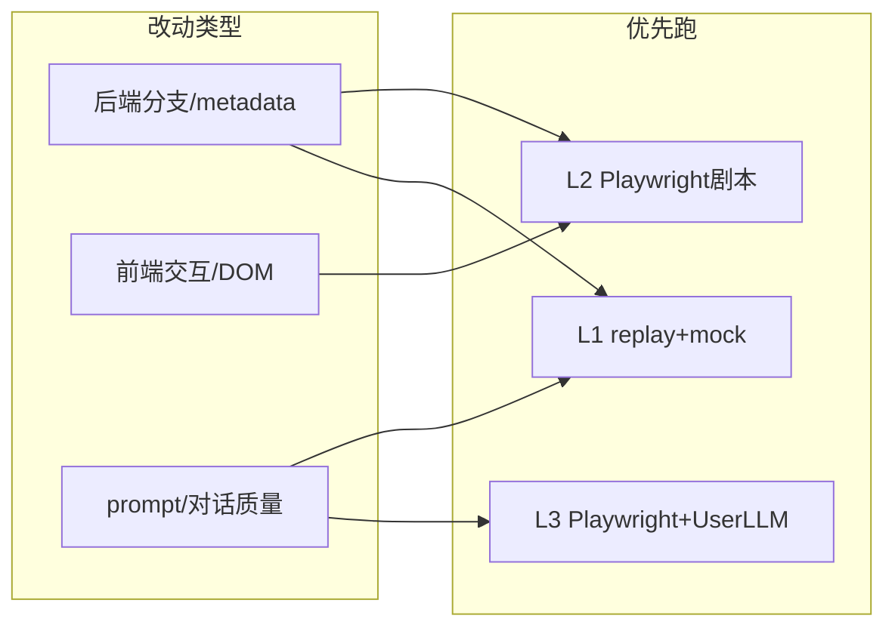
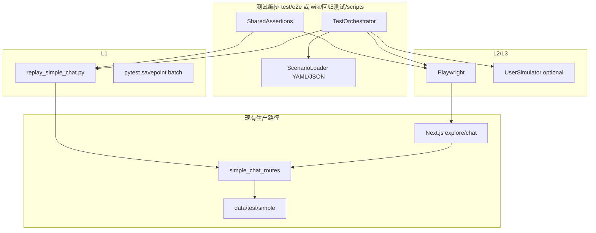
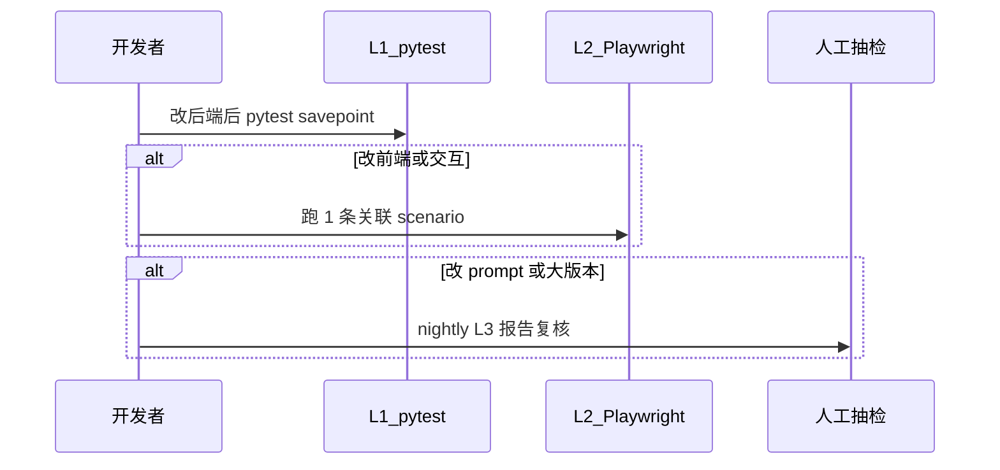

# AI 模拟用户对话 · 自动化测试详细计划

> **文档性质**：实施前设计稿（讨论定稿用，非已实现功能）  
> **状态**：待排期  
> **关联讨论**：Cursor Plan「AI 对话自动化测试」  
> **最后更新**：2026-05-23  

---

## 1. 背景与问题

### 1.1 现状痛点

每次改动对话逻辑、rumination 表格分支或右侧引导语顺序后，团队需要：

1. 在浏览器中从较早阶段重新走流程；
2. 多轮手工输入，直到触达目标环节（如第五轮假设步骤、深度讨论、结论卡）；
3. 凭肉眼判断 UI、引导语、metadata 是否符合预期。

该方式**反馈周期长**（常 30 分钟～数小时/条 bug），且难以在 PR 阶段重复执行。

### 1.2 目标（本计划要达成的能力）

| 目标 | 说明 |
|------|------|
| **缩短反馈环** | 针对单条 bug 或单个 STATE_CODE，5～15 分钟内得到可重复结果 |
| **模拟真实体验** | 优先通过浏览器操作（非仅 curl），覆盖 DOM 事件驱动的逻辑 |
| **可按「意志」对话** | 支持剧本约束下的多轮用户话术；进阶支持 User 模拟 LLM |
| **不替代现有快路径** | 保留 mock replay + pytest 作为 CI 主门禁 |
| **数据安全** | 默认不写生产激活码数据；沙箱 / fixture 隔离 |

### 1.3 非目标（第一期不做）

- 无人值守跑完全部五阶段 × 全部 rumination 子步（成本高、维护重）
- 把 User 模拟 LLM 嵌入生产后端
- 用自然语言全文匹配作为唯一断言
- 替代人工 U-* 视觉项（动画、hover 等）的全部验收

---

## 2. 仓库已有能力盘点

### 2.1 可直接复用（L1 逻辑层）

| 资产 | 路径 | 用途 |
|------|------|------|
| 回放脚本 | `src/backend/scripts/replay_simple_chat.py` | 调 `POST /simple-chat/message/stream`，单条/批量 |
| 存档点造数 | `src/backend/scripts/generate_simple_chat_savepoints.py` | `snapshot` / `emit-case` 固化 report |
| 假数据 fixture | `test/backend/fixtures/simple_chat_reports/*` | 稳定起点（pending、rumination opening 等） |
| 用例 JSON | `test/backend/fixtures/simple_chat_cases/*.json` | `start_state_code` / `end_state_code` / `mock` / `assertions` |
| pytest | `test/backend/test_simple_chat_replay_cases.py`、`test_savepoint_replay_batch.py` | CI 回归 |
| STATE 映射 | `wiki/回归测试/4-30旧数据结构迁移/savepoint_state_map.json` | STATE_CODE ↔ API |
| 用例矩阵文档 | `wiki/回归测试/4-30旧数据结构迁移/llm对话主流程测试用例.md` | 哪些必须 UI |
| Rumination API 回归 | `wiki/回归测试/scripts/run_rumination_regression.py` | `rumination-table-submit` 闸门场景 |
| 后端单元/集成 | `test/claude-test/backend/*`（137+ 用例） | 表结构、neg_gate、journey 等 |
| 沙箱 Fork | Admin `/admin/sandboxes/fork` → `data/test/simple/sandboxes/` | 真实上下文、隔离写入 |
| Fork 回放 | `replay_simple_chat.py --fork-from` | 命令行侧沙箱调试 |

### 2.2 明确缺口（L2/L3 需新建）

| 缺口 | 原因 |
|------|------|
| Playwright E2E | `test/claude-test/e2e/runner.py` 仅为占位 |
| 表格 blur / focus 触发引导 | 依赖 React 事件，API replay 不经过 |
| 弹窗「不再出现」 | 依赖 `localStorage` + 前端状态 |
| 双 LLM 用户驱动 | 无 Orchestrator |
| 统一断言库（API ↔ E2E） | 两套断言尚未抽公共模块 |

### 2.3 推荐分工：什么测在哪一层



---

## 3. 总体架构：三层金字塔

### 3.1 层级定义

| 层级 | 名称 | 执行频率 | 产品 LLM | 用户输入 | 浏览器 |
|------|------|----------|----------|----------|--------|
| **L1** | 逻辑回归 | 每次 PR / push | Mock 为主 | 固定 JSON `message` | 否 |
| **L2** | 体验回归 | 改前端后 / 每日 | Mock 或 Real（可配置） | 剧本：固定句 + DOM 操作 | 是 |
| **L3** | 探索回归 | nightly / 发版前 | Real | User LLM + 剧本约束 | 是 |

### 3.2 组件关系



**原则**：Orchestrator 只存在于测试仓库，**不进入** `src/backend/app` 业务路由。

---

## 4. L2/L3 详细设计（前端优先）

### 4.1 测试进程职责（TestOrchestrator）

1. **环境**：检测 `./start.sh start-dev` 或 docker；`baseURL` 默认 `http://localhost:3000`，API `http://localhost:8000`。
2. **身份**：专用测试账号 JWT 写入 `localStorage`（Playwright `addInitScript`）或走登录页一次。
3. **数据准备**（三选一，按场景标注）：
   - **A. fixture seed**：复制 `test/backend/fixtures/simple_chat_reports/...` → `data/test/simple`（与 replay 相同）；
   - **B. admin Fork**：`POST /admin/sandboxes/fork` 得 `sandbox_activation_code`；
   - **C. 真实码（仅本地）**：`--activation-code`（文档明确禁止 CI 默认使用）。
4. **导航**：`page.goto('/explore/chat/{phase}?...')`；rumination 若缺 deep link，第一版用：
   - Admin 调试能力 / `jumpToFilterStep`（若页面已暴露）；
   - 或 seed 时写好 `rumination_progress.json` 再打开页面。
5. **步骤执行**：按 Scenario 的 `steps[]` 顺序执行（见 4.3）。
6. **收集证据**：失败时截图、HAR、SSE 日志、沙箱目录 `record.json` 拷贝。
7. **断言**：调用 SharedAssertions（4.4）。

### 4.2 Playwright 工程建议目录（实施时创建）

```
test/e2e/
  playwright.config.ts
  fixtures/
    auth.ts              # 登录、token 注入
    sandbox.ts           # Fork / seed 帮助函数
  scenarios/
    values_pending_confirm.yaml
    rumination_step3_blur_guide.yaml
    rumination_pass_single_row.yaml
  lib/
    orchestrator.ts
    assertions.ts        # 与 Python 断言 schema 对齐
    sse_sniffer.ts       # 可选：监听 network 上的 stream
  specs/
    run_scenario.spec.ts # 参数化跑 scenarios/*
```

与 `test/claude-test/run_all.py` 集成：新增 `--type e2e`，调用 `npx playwright test`。

### 4.3 Scenario 文件规范（草案）

支持 YAML（人类可读）或 JSON（与现有 cases 统一）。**最小字段**：

```yaml
schema_version: 1
id: rumination_step3_blur_then_guide
title: 假设行编辑失焦后右侧主动引导
priority: P0
layer: L2                    # L2 | L3
state:
  start_state_code: "5-3-e"
  end_state_code: "5-3-f"
data:
  mode: fixture_seed           # fixture_seed | sandbox_fork
  fixture_report_dir: test/backend/fixtures/simple_chat_reports/mock_rumination_opening
  activation_code: ""          # seed 后由脚本填充
  phase: rumination
  thread_id: t_rum_chat_001
llm:
  product: mock                # mock | real
  user: script                 # script | llm | recorded
  mock_profile: default_rumination_continue   # 指向 fixtures 内 mock 名
steps:
  - action: goto
    url: "/explore/chat/rumination"
  - action: wait_for
    selector: "[data-testid=rumination-table]"
  - action: table_edit
    row: 0
    field: 假设
    value: "我想做独立咨询"
  - action: blur
    target: row_0
  - action: assert_dom
    contains_text: "是否填写好了"    # 右侧引导；实施时改为 testid
  - action: chat_send
    text: "确认，可以继续"
  - action: wait_sse_done
stop_when:
  - type: dom
    selector: "[data-step='4']"
  - type: api_history
    assertions:
      history_roles_contains: []
assertions:
  no_leak_tags: ["[STATE_JSON]", "[ROW_STATE_JSON]"]
  metadata:
    rumination_filter_step: 4
negative_cases: []             # 可选：变异步骤专测 bug
```

**`action` 枚举（第一期建议实现子集）**：

| action | 说明 |
|--------|------|
| `goto` | 打开 URL |
| `wait_for` / `click` / `fill` | 标准 Playwright |
| `table_edit` / `table_select` | 封装 rumination 表格 |
| `blur` | 点击表格外空白 |
| `chat_send` | 输入框 + 发送 |
| `chat_send_llm` | L3：走 User LLM 生成再发送 |
| `dialog_dismiss` | 弹窗「不再出现」 |
| `wait_sse_done` | 等流式结束（network 或 UI 停止 loading） |
| `assert_dom` / `assert_api` | 断言 |

### 4.4 共用断言（SharedAssertions）

与 `test/backend/fixtures/simple_chat_cases` 中 `assertions` **同 schema**，建议字段：

| 字段 | 检查方式 |
|------|----------|
| `history_roles_contains` | GET history 或读会话 JSON |
| `history_roles_not_contains` | 同上 |
| `metadata.{key}` | `record.json` / thread metadata |
| `no_leak_tags` | SSE 拼接串或 DOM 文本 |
| `end_state_code` | 对照 `savepoint_state_map.json` 推导 |
| `conclusion_card.keywords` | 结论文案结构（不测全文） |
| `rumination_progress.filter_step` | 读 `rumination_progress.json` |

**禁止**：`assert full_reply == "某段固定中文"`（双 LLM 下必 flaky）。

### 4.5 L3：User 模拟 LLM

**输入构造（每次一轮）**：

```
System: 你是测试中的用户扮演者。严格遵守 scenario.goal，不得编造表格中不存在的事实。
User:
  - goal: {scenario.goal}
  - persona: {scenario.persona}
  - must_not: {scenario.must_not}
  - table_snapshot: {从 DOM 或 API 抽取的当前行摘要}
  - last_assistant_message: {右侧最后一条 AI 可见文本}
  - recent_turns: {最近 6 轮 user/assistant}
```

**输出约束**：

- 单条用户消息，≤ 200 字（可配置）；
- 若含敏感词 / 超长 / 空 → **fallback** 到 `scenario.fallback_messages[]`；
- `temperature=0`；记录 prompt hash 便于复现。

**模型选型建议**：

| 角色 | 建议 | 理由 |
|------|------|------|
| User LLM | 便宜、快（如 deepseek-chat 或 glm-flash） | 调用次数多 |
| Product LLM | nightly 用真实；CI 用 mock | 成本控制 |

---

## 5. 与现有 replay 的协作流程

### 5.1 日常开发推荐流程



### 5.2 造数标准操作（存档点）

```bash
# 1. 从真实 report 快照（本地/沙箱）
python src/backend/scripts/generate_simple_chat_savepoints.py snapshot \
  --report-id <report_id> \
  --output-name snap_rumination_step3_001 \
  --apply

# 2. 生成/追加 E2E 用例条目（实施时扩展 emit-case）
# 3. L1 验证
pytest test/backend/test_savepoint_replay_batch.py -v -k snap_rumination

# 4. L2 引用同一 fixture 目录跑 Playwright
```

### 5.3 三种数据模式（与 replay README 一致）

| 模式 | 命令/配置 | 写生产数据 | 适用 |
|------|-----------|------------|------|
| fixture seed | `seed_fixture.report_dir` | 否 | CI、日常 |
| sandbox fork | `data.mode: sandbox_fork` | 否（仅沙箱） | 真实上下文调试 |
| 真实激活码 | `--activation-code` | **是** | 仅本地最后核验 |

---

## 6. 分阶段实施路线图

### Phase 0：准备（不写业务代码也可做）

- [ ] 拍板：E2E 专用测试账号、是否允许 Fork 进 CI
- [ ] 拍板：L3 仅 nightly，不进 PR 门禁
- [ ] 为高频 DOM 补 `data-testid`（可与功能开发分批，见 8.2）
- [ ] 从 [`5-20新的todo.md`](5-20新的todo.md) 选出第一期 5 条 P0 场景（见第 7 节）

### Phase 1：Playwright 基线（2～3 人天）

**交付**：

- `playwright.config.ts`；`npm install -D @playwright/test`
- `auth` fixture：登录或 token 注入
- 1 条 smoke：`打开 /explore` + 健康检查
- 文档：`test/e2e/README.md`（如何 `start-dev` 后跑）
- `claude-test/run_all.py --type e2e` 从 skipped → 可执行

**验收**：本地一条 spec 绿；CI 可选仅 manual workflow。

### Phase 2：L2 剧本 E2E（5～8 人天）

**交付**：

- Scenario loader + 3～5 条 YAML（第 7 节 P0）
- 表格操作封装（edit / select / blur / submit）
- 断言库 v1（DOM + history API）
- 失败产物：screenshot + trace

**验收**：覆盖至少 2 条当前手工最常测的 rumination/values 路径；单场景 < 10 分钟。

### Phase 3：存档点起跑（3～5 人天）

**交付**：

- seed 脚本可由 E2E `beforeAll` 调用（复用 replay 逻辑或 subprocess）
- 从 `start_state_code` 进入页面（无需从 values 第 1 题聊）
- 文档更新 `savepoint_coverage_registry.json` 的 e2e 列

**验收**：同一 bug 复现从「全流程 40min」降到「seed + 场景 8min」。

### Phase 4：L3 User LLM（5～7 人天）

**交付**：

- `chat_send_llm` action
- User LLM 配置（`.env.test`：`E2E_USER_LLM_PROVIDER` 等）
- 2 条 L3 场景：values 多轮含糊回答；rumination neg 深聊
- fallback + 结构化日志

**验收**：能稳定触发「重复提问」类检测（故意含糊）；nightly 报告可读。

### Phase 5：报告与清单集成（2～3 人天）

**交付**：

- E2E 结果并入 `test/claude-test` 报告 Markdown
- Task ID 映射（O-*, S-*, U-*）
- 失败一键打包日志目录

**总工期（Phase 1～5）**：约 **19～29 人天**（1 人全职量级）  
**rumination 全 7 步 + 五阶段全覆盖**：额外 **15～25 人天**

---

## 7. 第一期建议场景清单（对齐 5-20 todo）

| 编号 | 场景 ID | 来源 todo | 层级 | 要点 | 用户输入方式 |
|------|---------|-----------|------|------|--------------|
| 1 | `values_no_repeat_question` | #3 使命重复问 | L3 | 同一经历匹配多价值观后不再重复同问 | User LLM 含糊/重复 |
| 2 | `conclusion_card_keywords_only` | #4 结论卡含擅长 | L2+L1 | UI 看卡片；API 断言 keywords | 固定句 + mock conclusion |
| 3 | `rumination_guide_order` | #5 引导语顺序 | L2 | 弹窗 → 总览 → step opening | DOM 顺序断言 |
| 4 | `rumination_step3_blur_guide` | #6 表格外失焦引导 | L2 | blur 后右侧问「是否填好」 | 剧本 blur +「确认」 |
| 5 | `rumination_neg_deep_index` | #8 深度讨论条数/index | L2+L1 | 表格行 id vs 显示序号；注入条数 | 固定句 + API 读 metadata |
| 6 | `rumination_pass_single_row` | #10 pass 跳组 | L2 | pass 只跳一行非整组 | 剧本 pass |
| 7 | `dialog_dismiss_persist` | #2 弹窗不再出现 | L2 | localStorage + 完成并继续 | click 不再出现 |

**建议第一期只做 1、4、6、7 四条**（与当前最高痛苦 rumination/交互 最相关）；#3、#8 用 L1 扩 pytest 并行推进。

---

## 8. 前置依赖与工程约束

### 8.1 运行环境

- `./start.sh start-dev`（前端 3000 + 后端 8000）
- 测试账号 + 可激活的测试码（`TEST*` 前缀走 `data/test/simple`）
- CI：需 chromium + 前后端 service container（或单 job 内 start.sh）

### 8.2 前端可测性（建议分批补 testid）

| 区域 | 建议 testid |
|------|-------------|
| 聊天输入/发送 | `chat-input`, `chat-send` |
| 消息列表最后一条助手 | `chat-message-assistant-last` |
| Rumination 表格 | `rumination-table`, `rumination-row-{i}` |
| 步骤条 | `rumination-step-badge[data-step]` |
| 阶段弹窗 | `rumination-intro-dialog`, `dialog-dismiss-never` |

无 testid 时第一版可用 role/text，**维护成本高**，应在 Phase 2 前逐步补。

### 8.3 环境变量（实施时 `.env.e2e.example`）

```bash
E2E_BASE_URL=http://localhost:3000
E2E_API_URL=http://localhost:8000
E2E_TEST_EMAIL=
E2E_TEST_PASSWORD=
E2E_USER_LLM_PROVIDER=deepseek
E2E_USER_LLM_API_KEY=
E2E_PRODUCT_LLM_MODE=mock          # mock | real
E2E_SAVEPOINT_SEED_DIR=             # 可选覆盖
```

---

## 9. 风险登记与缓解

| ID | 风险 | 影响 | 缓解 |
|----|------|------|------|
| R1 | 双 LLM 非确定性 | 假红/假绿 | 结构化断言；L3 不进 PR 门禁 |
| R2 | User LLM 过于配合 | 测不到边界 bug | `negative_cases` + 录制变异句 |
| R3 | Selector 脆弱 | 维护成本 | testid；Page Object 封装 |
| R4 | 运行慢 | 开发不愿跑 | 存档点起跑；并行 shard |
| R5 | API 与 UI 行为不一致 | L1 绿 L2 红 | 改交互必跑关联 scenario |
| R6 | 费用 | 预算 | CI mock；User 小模型；nightly 限条数 |
| R7 | 沙箱/Fixture 漂移 | 过时数据 | snapshot 日期；定期从 Fork 刷新 |
| R8 | 泄漏 STATE_JSON 到 UI | 用户可见 bug | `no_leak_tags` 断言 |

---

## 10. 成本汇总

### 10.1 一次性开发

| Phase | 人天 |
|-------|------|
| 0 准备 | 0～1（会议+选型） |
| 1 基线 | 2～3 |
| 2 L2 剧本 | 5～8 |
| 3 存档点 | 3～5 |
| 4 L3 User LLM | 5～7 |
| 5 报告集成 | 2～3 |
| **合计** | **19～29** |
| 全覆盖加成 | +15～25 |

### 10.2 持续运维（每次大改）

- UI 重构：0.5～2 人天 / 次（selector）
- Prompt 大改：0.5～1 人天 / 次（scenario goal、mock）
- 新 rumination 子步：1～3 人天 / 子步（fixture + 场景）

### 10.3 单次 exécution 成本（粗算）

| 类型 | 时间 | LLM 费用 |
|------|------|----------|
| L1 全量 pytest savepoint | 1～3 min | 无（mock） |
| L2 单场景 | 3～10 min | 无～低 |
| L3 单场景 8 轮对话 | 5～15 min | 中（双真实时） |
| L3 nightly 20 场景 | 1～2 h | 按提供商计费 |

---

## 11. CI / 发布策略建议

| 触发 | 运行内容 |
|------|----------|
| PR | L1 全量 + L2 smoke（1 条，mock） |
| merge main | L1 + L2 核心集（5 条） |
| nightly cron | L2 全 P0 + L3 精选 |
| 发版 manual | L3 + 可选真实 product LLM |

**不建议**：PR 上默认跑 L3 双真实 LLM（慢 + flaky + 费用）。

---

## 12. 待拍板事项（实施前）

1. **登录与数据**：固定测试账号 + fixture seed，还是每次 Fork 新沙箱？
2. **L3 运行范围**：仅 nightly，还是允许本地 `--grep L3`？
3. **testid 投入**：是否与 5-20 功能修复同一迭代插入？
4. **负责人**：E2E 归属前端还是 QA/全栈？（影响 Page Object 维护）
5. **与「别的测试」关系**：本计划与 `claude-test` 后端用例、rumination_regression 脚本的分工是否按第 2.3 节执行？

---

## 13. 不建议做法（反模式）

1. 用双 LLM 全流程替代 mock replay → CI 不稳定  
2. User LLM 点击表格单元格 → flaky 极高  
3. 断言整段中文回复 → 无意义波动  
4. 生产激活码跑 CI → 数据污染风险  
5. 第一版追求「全自动覆盖所有环节穿透存档点」→ 范围失控  

---

## 14. 相关文档索引

| 文档 | 路径 |
|------|------|
| Replay 验收说明 | `test/backend/fixtures/simple_chat_cases/README.md` |
| 主流程 STATE 矩阵 | `wiki/回归测试/4-30旧数据结构迁移/llm对话主流程测试用例.md` |
| claude-test 框架 | `test/claude-test/README.md` |
| 当前业务 todo | `wiki/开发文档/5-20新的todo.md` |
| Rumination API 回归 | `wiki/回归测试/4-26修改rumination逻辑.md` |
| Admin 沙箱 | 前端 `admin/sandboxes`；后端 `sandbox_fork` |

---

## 15. 修订记录

| 日期 | 说明 |
|------|------|
| 2026-05-23 | 初稿：三层架构、分阶段路线、第一期场景、风险与成本 |

---

**下一步（仍属规划，非开发）**：评审第 12 节待拍板项 → 确认第一期 4 条场景 → 排期 Phase 1 起止日期。
