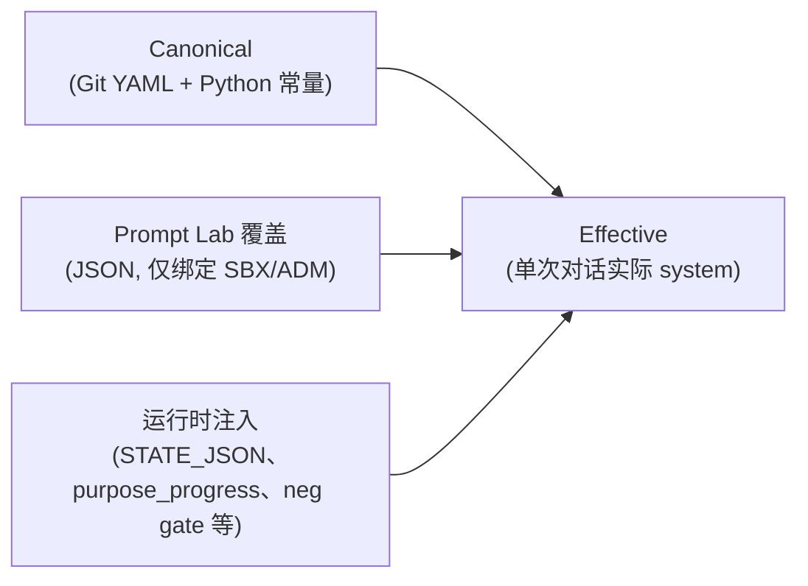
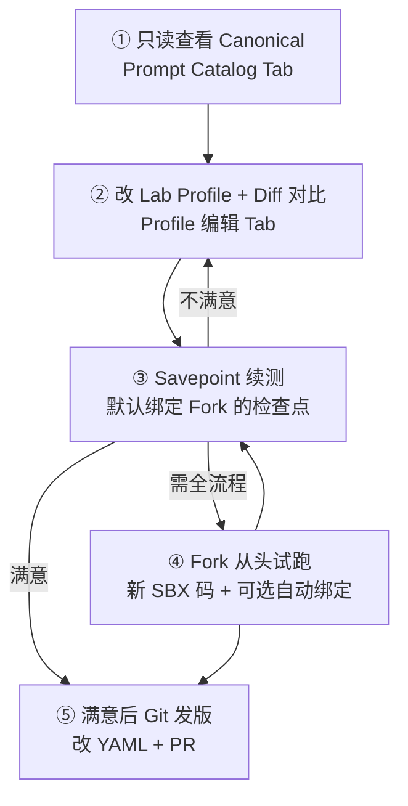

# Prompt Lab + Prompt Catalog 标准操作流程（SOP）

> **文档版本**：v1 + v2（与当前代码一致）  
> **最后对齐代码**：`src/frontend/app/(main)/admin/prompt-lab/page.tsx`、`src/backend/app/services/prompt_catalog.py`  
> **交叉参考**：[4.25-提示词记录](./4.25-提示词记录.md)、[CONTEXT.md](../../CONTEXT.md)、[ADMIN_SANDBOX_FORK](../../docs/历史文档/ADMIN_SANDBOX_FORK.md)

---

## 1. 文档概述

### 1.1 目的

为超级管理员提供 **Prompt Lab（沙箱提示词覆盖）** 与 **Prompt Catalog（只读提示词总览）** 的统一操作规范，涵盖：

- 标准调试工作流（查看 → 覆盖 → 对比 → 续测 / 试跑 → Git 发版）
- 功能边界与数据落盘位置
- API 与实现要点
- 自动化测试与手动验收清单

### 1.2 读者

| 角色 | 关注点 |
|------|--------|
| 产品 / 运营 | 阶段术语、试跑路径、与生产隔离 |
| 提示词工程（PE） | Catalog 浏览、diff、复制回填 Git |
| 后端 / 前端开发 | API、assembler、组件与存储路径 |
| QA | pytest 与手动 checklist |

### 1.3 版本范围

| 版本 | 能力摘要 | 入口 |
|------|----------|------|
| **v1** | Profile 多版本；绑定 SBX/ADM 激活码；覆盖 `simple_chat_system` 模板 + `extra_goal_hint` | `/admin/prompt-lab` → **Profile 编辑** |
| **v2** | 五阶段 + 沉淀 1–7 只读 Catalog；Layer Stack；中英切换；搜索/筛选；Canonical vs Override vs Effective diff；Savepoint 续测 / Fork 试跑面板 | 同页 → **Prompt Catalog** |
| **v2.1（规划）** | Lab 侧扩展覆盖 `chat_addon` 等（**当前未实现**，见 §11） |

**明确不在 v1/v2 范围**：LangGraph 节点提示词（`domain/prompts/templates/*.yaml` 中 ReAct 节点类模板）— Catalog 页头已说明「不含 LangGraph」。

---

## 2. 前置条件

### 2.1 身份与权限

| 条件 | 说明 |
|------|------|
| **超级管理员** | 所有 `/api/v1/admin/prompt-*`、`/admin/prompt-catalog` 等接口均调用 `_is_super_admin`；非白名单用户返回 `403 仅超级管理员可访问` |
| **白名单配置** | `.env` 中配置 `SUPER_ADMIN_USER_IDS` 和/或 `SUPER_ADMIN_EMAILS`（逗号分隔） |

### 2.2 环境变量（调试沙箱总开关）

沙箱相关能力受 **两层** 开关约束（见 `src/backend/app/utils/admin_policy.py`）：

| 变量 | 默认值 | 作用 |
|------|--------|------|
| `ADMIN_DEBUG_POLICY_ENABLED` | `False` | **总开关**；为 `False` 时，沙箱、Prompt Lab、Prompt Catalog 等全部不可用 |
| `ADMIN_SANDBOX_ENABLED` | `True` | 在总开关为 `True` 时，控制 SBX Fork、Savepoint、Prompt Lab/Catalog |

**典型开发 `.env` 片段**：

```bash
ADMIN_DEBUG_POLICY_ENABLED=True
ADMIN_SANDBOX_ENABLED=True
SUPER_ADMIN_EMAILS=your-admin@example.com
```

关闭任一层时，API 返回：`403 当前环境未开启管理员调试沙箱功能`。

### 2.3 工作区激活码类型

| 前缀/类型 | 用途 | Prompt Lab 绑定 |
|-----------|------|-----------------|
| 正式用户激活码 | 生产数据 | **不可**绑定 Profile |
| `SBX*`（Fork 沙箱） | 从正式码克隆的隔离试跑 | **可**绑定 |
| `ADM*`（常驻调试工作区） | 管理员长期调试 | **可**绑定 |

绑定接口会校验 `workspace_kind in {fork, resident}` 或 `is_sandbox=True`，否则 `400 仅支持绑定到管理员调试工作区激活码（SBX/ADM）`。

### 2.4 访问路径

- 前端：`http://<host>:3000/admin/prompt-lab`（侧栏：**Prompt Lab（sandbox）**）
- 需已登录且为超级管理员 JWT

---

## 3. 功能架构

### 3.1 三层提示词概念



| 术语 | 定义 | 是否可在线改 |
|------|------|----------------|
| **Canonical** | `simple_chat_system.yaml` 等 Git 内配置 | Catalog **只读**；改动走 Git |
| **Prompt Lab 覆盖** | `data/test/simple/admin_prompt_lab/` 下 profile 版本 | Profile 编辑 Tab |
| **Effective** | `build_system_prompt(...)` 在 mock 上下文下的拼装结果 | Catalog diff 中「Effective 预览」 |

### 3.2 与 Git / Sandbox / Savepoint 的关系

| 机制 | 存储 | 是否替代 Git |
|------|------|----------------|
| **Git** | 仓库 `src/backend/app/domain/...` | 生产唯一真相源 |
| **Sandbox Fork** | `data/test/simple/sandboxes/{fork_id}/` | 否；隔离试跑数据 |
| **Savepoint** | `data/test/simple/savepoints/{id}/` | 否；会话快照，便于续测 |
| **Prompt Lab** | `admin_prompt_lab/profiles.json`、`activation_bindings.json` | 否；沙箱临时覆盖 |

**设计原则：避免「Lab 变成第二个 Git」**

1. Lab 仅覆盖 **主对话 system 模板 + 可选 extra_goal_hint**，不版本化 step_copy、chat_addon、LangGraph 等。
2. Catalog 中 Canonical **不可在线编辑**；满意后应 **复制 merged 文本 → 改 YAML → Git PR**。
3. Profile 版本历史在 JSON 文件中，**不**进入 Alembic；生产用户永不读取 Lab 文件。
4. Savepoint / Fork 只动 `data/test/simple`，与正式 `data/simple/reports` 隔离。

### 3.3 运行时生效链路（simple_chat）

绑定激活码后，对话构建时（`simple_chat_routes.py` / `context_resolver.py`）调用：

`resolve_simple_chat_prompt_override(activation_code)` → 若有绑定且当前版本模板非空，则 `template_override` + `extra_goal_hint` 传入 `build_system_prompt`。

---

## 4. 页面结构

**路由**：`/admin/prompt-lab`  
**文件**：`src/frontend/app/(main)/admin/prompt-lab/page.tsx`

| Tab | 组件 | 功能 |
|-----|------|------|
| **Prompt Catalog**（默认） | `PromptCatalogViewer` | 只读总览 + diff + Savepoint + Fork |
| **Profile 编辑** | 页内表单 | Profile CRUD、版本、绑定激活码 |

**跨 Tab 状态**：`selectedProfileId` 在整页共享。Catalog 的 diff / Effective 预览会传入 `profileId`；若未选 profile，override 相关 UI 会提示「未选择 profile 或尚无 override」。

---

## 5. Prompt Catalog 使用指南

**组件**：`src/frontend/components/admin/PromptCatalogViewer.tsx`  
**数据**：`GET /api/v1/admin/prompt-catalog`

### 5.1 顶栏控件

| 控件 | 行为 |
|------|------|
| **中文 / EN** | `locale=zh|en`；影响 `step_copy`、沉淀 `chat_addon` 等双语段 |
| **Effective 预览 · {阶段}** | `preview_phase`；驱动 `simple_chat_system_diff.effective_preview` 与 Layer Stack 中 `active` 分支 |
| **刷新** | 重新请求 Catalog |

### 5.2 按阶段浏览（五阶段手风琴）

阶段顺序与 `PHASES` 一致：`values` → `strengths` → `interests` → `purpose` → `rumination`。

每阶段常见 **section**（由后端 `build_prompt_catalog` 组装）：

| section key | 分类 category | 内容 |
|-------------|---------------|------|
| `intro` / `outro` | intro / outro | `step_copy.yaml` 阶段引导语 |
| `init_fallback` | fallback | 各阶段 Init LLM 失败兜底 |
| `main_dialogue` | main | **Layer Stack**（Jinja 分支 + 运行时注入槽位） |
| `entry_init` | intro | 仅 rumination：entry_init system/user/fallback |
| `closing` | outro | 仅 rumination：终步收束 LLM / 短路径固定结语 |

### 5.3 沉淀子步 1–7

仅在 **rumination** 阶段展开「筛选子步 1–7」。每子步包含：

| section key | 说明 |
|-------------|------|
| `opening` | 固定开场（`opening_mode=fixed`）或 LLM 开场 system |
| `opening_user` | LLM 模式下的 user 模板（含表格 JSON） |
| `chat_addon` | 主对话追加片段（`RUMINATION_CHAT_STEP_ADDON_ZH/EN`） |
| `deep_chat` | 部分步骤的 neg gate 深入讨论文案 |

子步 **opening_mode** 来自 `STEP_OPENING_MODE`（如 step 3 为 `fixed`，测试断言含「假设生成」）。

### 5.4 Layer Stack（主对话）

`main_dialogue.layer_stack` 由后端 `_build_main_layer_stack` 生成：

1. **static**：从 `simple_chat_system.yaml` 解析的各 `phase` Jinja 分支（当前预览阶段 `active=true`）
2. **runtime**：`get_runtime_injection_catalog()` 中与本阶段匹配的注入层（默认折叠，含 trigger、`inject_after`、`source_path`）

前端 `LayerStackView` 支持：分类色条、嵌套 `` 高亮、`{{ variable }}` 悬停示例、按层复制。

### 5.5 变量 tag

- 后端 `parse_content_segments` 将 `{{ name }}` 标为 `variable`
- `variable_samples` 提供 mock（**非真实用户数据**），键含：`phase`、`question_bank`、`basic_info`、`prior_block`、`values_info`、`rumination_step_addon` 等
- 前端 `PromptContentRenderer` 渲染变量 chip，hover 显示示例

### 5.6 搜索与筛选

| 筛选项 | 字段 |
|--------|------|
| 关键词 | 正文、label、key、layer id、source_path |
| 阶段 | `phaseFilter` |
| 分类 | intro / main / fallback / runtime / addon / outro（`CATEGORY_LABELS`） |
| tag | section.key 或 layer.id |

搜索命中时：匹配阶段自动展开，区块 `forceOpen`，正文高亮。

### 5.7 复制与导出

| 操作 | 说明 |
|------|------|
| 区块 **复制** | `extractSectionCopyText` → 剪贴板 |
| **导出当前阶段 JSON** | 下载 `prompt-catalog-{phase}-{locale}.json` |
| **导出完整 Catalog** | 下载 `prompt-catalog-full-{locale}.json` |

### 5.8 simple_chat_system 只读对比（PromptDiffView）

当 API 返回 `simple_chat_system_diff` 时展示：

| 数据源 | 含义 |
|--------|------|
| Canonical YAML | Git 模板原文 |
| Lab Override | 当前选中 profile 的生效版本模板 |
| Effective 预览 | `build_system_prompt` + mock 变量 + override + 示例注入 |

模式：**并排 diff**（行级增删改色）或 **单视图**只读 textarea。  
`preview_phase` 下拉与顶栏「Effective 预览」联动。

---

## 6. Prompt Lab Profile 编辑

**Tab**：Profile 编辑  
**存储**：`data/test/simple/admin_prompt_lab/profiles.json`、`activation_bindings.json`

### 6.1 Profile 生命周期

1. **新建 Profile**：名称（必填）+ 描述（可选）→ `POST /admin/prompt-lab/profiles`
2. **编辑模板**：大文本框 `simple_chat_system` Jinja 模板；变量：`phase` / `question_bank` / `basic_info` / `prior_block`（页内 placeholder 说明）
3. **extra_goal_hint**（可选）：追加到 system 末尾，格式 `[管理员调试目标补充]\n...`
4. **保存为新版本并生效**：`POST .../versions`（自动设为 `current_version_id`）
5. **历史版本**：可「设为生效」→ `POST .../activate-version`

### 6.2 复制回填 Git

| 按钮 | API | 用途 |
|------|-----|------|
| 复制纯模板 | `GET .../export-current` → `template` | 只复制 Jinja 模板 |
| 复制当前生效版本（回填用） | `merged_for_copy` | 模板 + extra_goal_hint，便于粘贴进 `simple_chat_system.yaml` |

### 6.3 绑定 SBX/ADM 激活码

1. 输入激活码（自动转大写）→ **绑定当前 profile**
2. 要求 profile 已有生效版本，否则 `400 profile 尚无可用版本`
3. **已绑定列表**：表格展示 `activation_code`、`profile_id`、`updated_at`

绑定后，该码下 **simple-chat** 对话使用当前 profile 生效版本；正式码绑定会被拒绝。

---

## 7. 调试标准流程（SOP）

推荐顺序（沉淀/子步场景优先 **Savepoint 续测**）：



### 步骤 ① 只读查看 Canonical

1. 打开 **Prompt Catalog** Tab，locale 选中文或 EN。
2. 展开目标阶段，查看 `main_dialogue` Layer Stack 与沉淀子步 `chat_addon`。
3. 需要全文检索时用「搜索与筛选」。

### 步骤 ② 改 Lab Profile → diff 对比

1. 切换到 **Profile 编辑**，创建或选择 profile。
2. 修改模板 / `extra_goal_hint` → **保存为新版本并生效**。
3. 回到 **Prompt Catalog**，确认顶栏 Effective 预览阶段正确。
4. 在 **simple_chat_system · 只读对比** 中对比 Canonical vs Effective（或 Override）。
5. 在 **Profile 编辑** 绑定目标 `SBX/ADM` 激活码。

### 步骤 ③ Savepoint 续测（主路径）

**面板**：`SavepointSelectorPanel`（Catalog Tab 内）  
**Hook**：`useAdminSavepoints`（与 `/admin/sandboxes` 同源 `GET /admin/savepoints`）

| 选项 | 行为 |
|------|------|
| 默认 | 仅显示 **当前 profile 已绑定** 激活码下的检查点 |
| **看全部** | 与沙箱页相同的全量列表 |
| 筛选 | 名称 / savepoint_id / 激活码、phase |
| **从 Savepoint 续测** | 确认后 `POST /admin/savepoints/load` → 跳转 `/explore/chat/{phase}?code=...&thread_id=...` |

**创建 Savepoint**：在 `/admin/sandboxes` 页面对话中创建（本 SOP 页仅加载，不创建）。

### 步骤 ④ Fork 从头试跑

**面板**：`ForkFromScratchPanel`

1. 输入**正式**源激活码 → **Fork 从头试跑**
2. `POST /admin/sandboxes/fork` → 新 `SBX*` 码；若已选 profile 则自动 `bindPromptLabProfile`
3. 跳转 `/explore/activate?code=SBX...` 从头走阶段

详见 [ADMIN_SANDBOX_FORK](../../docs/历史文档/ADMIN_SANDBOX_FORK.md)。

### 步骤 ⑤ 满意后 Git 发版

1. Profile 编辑 → **复制当前生效版本（回填用）**
2. 更新 `src/backend/app/domain/prompts/templates/simple_chat_system.yaml`（及必要时 Python 常量）
3. 跑 pytest + 手动探索验收
4. Git commit / PR（Lab JSON **不必**提交生产配置）

---

## 8. API 参考

统一前缀：`/api/v1/admin`（需 Bearer JWT + 超级管理员 + `_assert_admin_sandbox_enabled`）

### 8.1 Prompt Catalog

| 方法 | 路径 | Query / Body | 响应 `data` 要点 |
|------|------|--------------|------------------|
| GET | `/prompt-catalog` | `locale=zh\|en`（默认 zh）<br>`profile_id`（可选）<br>`preview_phase=values\|...`（默认 values） | `phases[]`、`variable_samples`、`runtime_injection_catalog`、`simple_chat_system_diff`、`test_links` |

### 8.2 Prompt Lab

| 方法 | 路径 | 说明 |
|------|------|------|
| GET | `/prompt-lab/profiles` | Profile 列表摘要 |
| POST | `/prompt-lab/profiles` | body: `{ name, description? }` |
| GET | `/prompt-lab/profiles/{profile_id}` | 含 `versions[]` |
| GET | `/prompt-lab/profiles/{profile_id}/export-current` | `template`、`merged_for_copy` |
| POST | `/prompt-lab/profiles/{profile_id}/versions` | body: `{ simple_chat_system_prompt_template, extra_goal_hint? }` |
| POST | `/prompt-lab/profiles/{profile_id}/activate-version` | body: `{ version_id }` |
| GET | `/prompt-lab/bindings` | 绑定列表 |
| POST | `/prompt-lab/bindings` | body: `{ activation_code, profile_id }` |

### 8.3 Savepoint（Catalog 续测相关）

| 方法 | 路径 | 说明 |
|------|------|------|
| GET | `/savepoints` | 列表 |
| POST | `/savepoints/create` | 在沙箱页创建快照 |
| POST | `/savepoints/load` | body: `{ activation_code, savepoint_id }` |
| DELETE | `/savepoints` | body: `{ savepoint_id }` |

### 8.4 Sandbox Fork（Catalog 试跑相关）

| 方法 | 路径 | 说明 |
|------|------|------|
| POST | `/sandboxes/fork` | body: `{ source_activation_code }` |
| GET | `/sandboxes` | 沙箱列表 |
| DELETE | `/sandboxes?activation_code=` | 删除沙箱 |

前端封装见 `src/frontend/lib/api/admin.ts`。

---

## 9. 开发与实现说明

### 9.1 后端

| 模块 | 路径 | 职责 |
|------|------|------|
| Catalog 组装 | `app/services/prompt_catalog.py` | `build_prompt_catalog`、`extract_phase_branches`、`get_runtime_injection_catalog`、`_simple_chat_diff` |
| Lab 存储 | `app/utils/admin_prompt_lab.py` | JSON profile/版本/绑定；`resolve_simple_chat_prompt_override` |
| 路由守卫 | `app/api/v1/admin.py` | `_is_super_admin` + `_assert_admin_sandbox_enabled` |
| 对话注入 | `app/api/v1/simple_chat_routes.py`、`prompt_builder.py` | `template_override`、`extra_goal_hint` |

### 9.2 前端组件清单

| 组件 | 路径 |
|------|------|
| 页面 | `app/(main)/admin/prompt-lab/page.tsx` |
| Catalog 主视图 | `components/admin/PromptCatalogViewer.tsx` |
| Layer Stack | `components/admin/LayerStackView.tsx` |
| 正文渲染 | `components/admin/PromptContentRenderer.tsx` |
| Diff | `components/admin/PromptDiffView.tsx` |
| Savepoint | `components/admin/SavepointSelectorPanel.tsx` |
| Fork | `components/admin/ForkFromScratchPanel.tsx` |
| 筛选工具 | `lib/promptCatalogUtils.ts` |
| API 类型 | `lib/api/admin.ts` |

### 9.3 共享 Hook

`src/frontend/hooks/useAdminSavepoints.ts`：

- `fetchAdminSavepoints` / `reload`
- `loadSavepoint` → `loadSavepointAndNavigate`（与 sandboxes 页一致）
- `buildExploreChatUrl(phase, code, threadId)`

### 9.4 数据目录速查

| 数据 | 路径（相对 `data/test/simple` 或项目根） |
|------|------------------------------------------|
| Prompt Lab | `admin_prompt_lab/profiles.json`、`activation_bindings.json` |
| Savepoint | `savepoints/{savepoint_id}/` + `savepoints/index.json` |
| Sandbox Fork | `sandboxes/{fork_id}/`（见 sandbox_fork 实现） |

---

## 10. 测试方法

### 10.1 自动化（pytest）

```bash
# 项目根目录
pytest test/backend/test_prompt_catalog.py -v
```

覆盖要点：

- `get_variable_samples` 核心键
- `extract_phase_branches` 含 values/rumination 与变量段
- values 阶段 intro + main layer_stack + diff 含 `STATE_JSON`
- rumination step3 固定开场与 chat_addon
- `locale=en` 时 chat_addon 英文内容

### 10.2 手动测试 Checklist（v2 功能对齐）

| # | 步骤 | 预期 |
|---|------|------|
| 1 | 非 super_admin 访问 `/admin/prompt-lab` | 前端鉴权失败或 API 403 |
| 2 | `ADMIN_DEBUG_POLICY_ENABLED=False` 时刷新 Catalog | API 403 沙箱未开启 |
| 3 | Catalog 切换 EN + rumination step1 | chat_addon 为英文片段 |
| 4 | 搜索「STATE_JSON」 | 命中阶段展开、高亮 |
| 5 | 导出完整 JSON | 文件含五阶段 `phases` |
| 6 | 创建 profile → 改模板 → 绑定 SBX 码 | 绑定表出现记录 |
| 7 | Catalog 选同一 profile | diff 显示 Override；Effective ≠ Canonical（若改了模板） |
| 8 | 沙箱页创建 savepoint → Catalog「仅看绑定」 | 列表可见该码检查点 |
| 9 | Savepoint 续测 | 跳转 explore chat，上下文为快照状态 |
| 10 | Fork 正式码 → 新 SBX | 自动绑定 profile（若已选）；进入 activate |
| 11 | SBX 下对话 | system 使用 Lab 模板；生产同码不受影响 |
| 12 | 复制 merged → 写入 YAML → 重启后端 | 正式路径 Canonical 更新 |

---

## 11. v2.1 后续（规划）

当前 **已实现** 的 Lab 覆盖范围：

- `simple_chat_system_prompt_template`（整份 Jinja）
- `extra_goal_hint`

**未实现**、Catalog 已只读展示、适合 v2.1 扩展的方向：

| 项 | 现状 | 规划方向 |
|----|------|----------|
| 沉淀 `chat_addon` per step | 仅在 Catalog / `rumination_prompt_strings.py` | Lab 按 step 覆盖 + diff 子段 |
| `step_copy` intro/outro | Catalog 只读 | 一般仍走 Git + 前端 i18n（见 4.25 文档） |
| LangGraph 节点提示词 | 不在 Catalog | 独立工具或 v3 范围 |

实现 v2.1 时需同步：扩展 `admin_prompt_lab` schema、`resolve_*` 注入点、`prompt_catalog` diff 分段、前端编辑 UI 与 pytest。

---

## 12. 常见问题

| 现象 | 原因 | 处理 |
|------|------|------|
| API `403 当前环境未开启管理员调试沙箱功能` | `ADMIN_DEBUG_POLICY_ENABLED=False` 或 `ADMIN_SANDBOX_ENABLED=False` | 开发环境开启总开关 + 沙箱开关，重启后端 |
| API `403 仅超级管理员可访问` | 当前用户不在白名单 | 配置 `SUPER_ADMIN_EMAILS` / `SUPER_ADMIN_USER_IDS` |
| 绑定失败 `仅支持绑定到 SBX/ADM` | 用了正式激活码 | 先 Fork 或 ensure ADM 工作区 |
| Savepoint 列表为空（默认视图） | profile 未绑定 SBX/ADM | Profile 编辑里绑定，或 Catalog 开「看全部」 |
| diff 无 Override / 选项灰掉 | 未选 profile 或 profile 无生效版本 | Profile 编辑选 profile 并保存版本 |
| Effective 与线上一致但对话不对 | 未绑定到实际试跑码；或另有运行时注入 | 确认绑定码 = explore URL 的 `code`；查 Layer Stack 运行时层 |
| Fork 后对话线程不对 | 见 ADMIN_SANDBOX_FORK 默认 thread 选择逻辑 | 用 Savepoint 明确 `thread_id` 续测 |
| 改了 Lab 但 Catalog Canonical 未变 | 符合设计 | Canonical 仅 Git；用 diff 看 Override/Effective |
| 复制 merged 后 Git 仍不生效 | 未改 YAML 或未部署 | 改 `simple_chat_system.yaml` 并发布后端 |

---

## 附录 A：与 4.25 文档的分工

| 文档 | 用途 |
|------|------|
| [4.25-提示词记录](./4.25-提示词记录.md) | **源码级**文件路径、STATE_JSON、pending/conclusion 协议 |
| 本文 SOP | **操作级** Prompt Lab/Catalog、沙箱试跑、API、测试 |

改主模板生产配置：以 4.25 §6 索引为准；调试迭代：以本文 §7 流程为准。

---

## 附录 B：相关页面

| 页面 | 路径 | 关系 |
|------|------|------|
| 调试沙箱 Fork | `/admin/sandboxes` | 创建 Savepoint、管理 Fork 列表 |
| 探索对话 | `/explore/chat/[phase]` | 续测 / 试跑落地页 |
| 激活 | `/explore/activate?code=` | Fork 后入口 |
